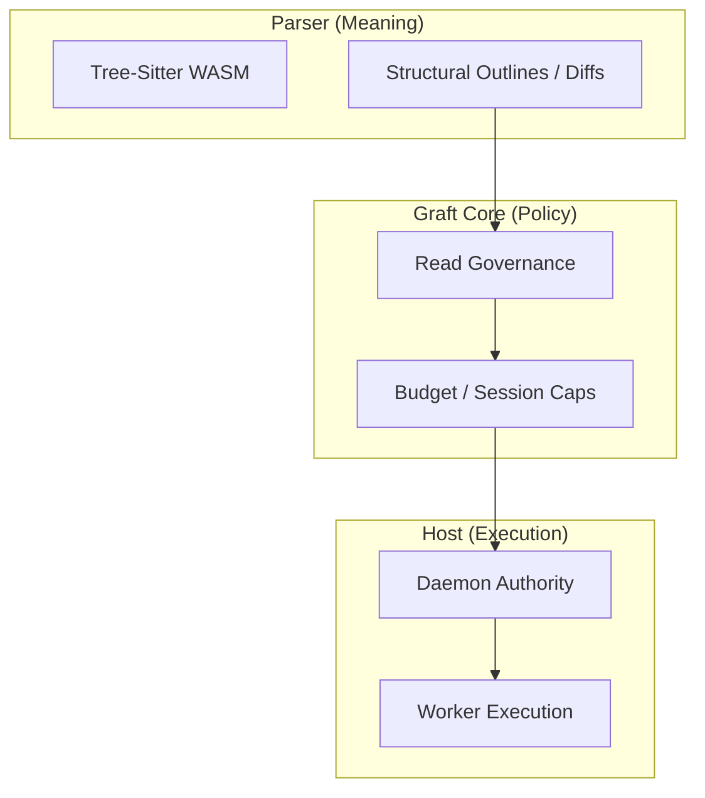

# ARCHITECTURE

Graft is an industrial-grade context governor converging on a strict Hexagonal (Ports and Adapters) architecture.

Repo truth today is narrower than a finished strict-hex claim:

- explicit ports and adapters exist
- foundational dependency guardrails are mechanically enforced
- primary adapters and composition roots are still mid-migration
- WARP is still becoming a first-class port boundary rather than an ambient capability

## Official Entry Points

Graft now has three official product entry points:

1. **API** — the direct package/library surface exported from the root
   package entry point
2. **CLI** — the operator and debugging surface
3. **MCP** — the agent transport surface

Repo truth today:

- API is first-class, not a side door
- CLI and MCP remain primary adapters
- not every capability is symmetric across all three entry points yet
- every capability should explicitly declare which entry points it is
  available on and, for API, whether the exposure is a direct typed
  surface or an MCP-style tool bridge

The convergence target is:

- one application core
- three thin primary adapters
- explicit surface metadata and invariants
- capability parity where parity is intended, with narrow documented
  exceptions where it is not

## Repo Topology

The source tree should make the three entry points visible:

- `src/api/` is the API primary adapter home
- `src/cli/` is the CLI primary adapter home
- `src/mcp/` is the MCP primary adapter home

The package export root is:

- `src/index.ts`

That root file is intentionally thinner than the adapter homes. It is
the public package entrypoint, not the place where API behavior should
accumulate.

Supporting roles stay explicit too:

- `src/hooks/` is an adjunct entrypoint for local automation and
  governance, not one of the three official product surfaces
- `src/operations/`, `src/policy/`, `src/session/`, `src/git/`,
  `src/metrics/`, and `src/release/` are the current application/core
  areas
- `src/contracts/`, `src/ports/`, `src/guards/`, and `src/format/`
  carry foundational contracts and helpers
- `src/adapters/`, `src/parser/`, and `src/warp/` remain secondary
  adapters or infrastructure bindings

See [docs/repo-topology.md](./docs/repo-topology.md) for the repo-local
topology contract.

## Core Boundary

The Graft core is TypeScript. Platform-specific concerns are intended to enter through explicit secondary ports:

| Port | Responsibility | Official Adapter |
| :--- | :--- | :--- |
| **`FileSystem`** | Path resolution, file reads, directory creation | `nodeFs` |
| **`JsonCodec`** | Canonical JSON shaping and serialization | `CanonicalJsonCodec` |
| **`GitClient`** | Git history enumeration and status observation | `nodeGit` |
| **`ProcessRunner`** | Shell execution and diagnostic capture | `nodeProcessRunner` |

Primary adapters should sit above that core boundary:

| Primary Adapter | Responsibility |
| :--- | :--- |
| **API** | Direct typed package surface for in-process integrations |
| **CLI** | Human/operator command surface and scripting |
| **MCP** | Agent-facing transport surface with receipts and schemas |

The architecture rule is that none of these primary adapters own
business flow. They validate input, call application services, and
shape edge-specific output.

## Pipeline: From File to Governance

## Layered Worldline Model

Graft models repository state through three distinct layers:

1. **`commit_worldline`**: Durable structural history grounded in Git commits.
2. **`ref_view`**: Branch and reference comparisons over durable history.
3. **`workspace_overlay`**: The current dirty working tree and reactive edit signals.

## WARP: Structural Worldline Memory

### Write Path (Indexer)
The write path turns Git history into structural worldline facts by extracting AST outlines and writing them into the WARP graph.

### Read Path (Observers)
The read path uses the **Observer Law**: projections are read through lenses (e.g., `graft_diff`, `code_show`) rather than traversing graph internals directly.

## Execution Authority: The Daemon

The Daemon is the system-wide authority for multi-repo coordination. It manages:
- **Authorization**: Workspace and session binding.
- **Scheduling**: Job queueing and fairness.
- **Resources**: Shared worker pools for heavy indexing and parsing tasks.

---
**The goal is to move the repository from a collection of bytes to a provenance-aware professional bedrock.**
