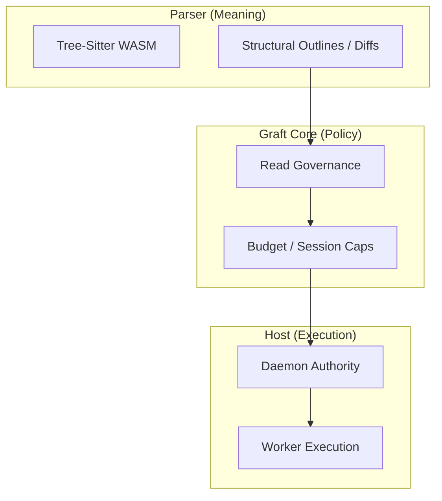

# ARCHITECTURE

Graft is an industrial-grade context governor organized around a strict Hexagonal (Ports and Adapters) architecture.

## Core Boundary

The Graft core is pure TypeScript. All platform-specific concerns are isolated behind primary ports:

| Port | Responsibility | Official Adapter |
| :--- | :--- | :--- |
| **`FileSystem`** | Path resolution, file reads, directory creation | `nodeFs` |
| **`JsonCodec`** | Canonical JSON shaping and serialization | `CanonicalJsonCodec` |
| **`GitClient`** | Git history enumeration and status observation | `nodeGit` |
| **`ProcessRunner`** | Shell execution and diagnostic capture | `nodeProcessRunner` |

## Pipeline: From File to Governance

## Layered Worldline Model

Graft models repository state through three distinct layers:

1. **`commit_worldline`**: Durable structural history grounded in Git commits.
2. **`ref_view`**: Branch and reference comparisons over durable history.
3. **`workspace_overlay`**: The current dirty working tree and reactive edit signals.

## WARP: Structural Worldline Memory

### Write Path (Indexer)
The write path turns Git history into structural worldline facts by extracting AST outlines and writing them into the WARP graph.

### Read Path (Observers)
The read path uses the **Observer Law**: projections are read through lenses (e.g., `graft_diff`, `code_show`) rather than traversing graph internals directly.

## Execution Authority: The Daemon

The Daemon is the system-wide authority for multi-repo coordination. It manages:
- **Authorization**: Workspace and session binding.
- **Scheduling**: Job queueing and fairness.
- **Resources**: Shared worker pools for heavy indexing and parsing tasks.

---
**The goal is to move the repository from a collection of bytes to a provenance-aware professional bedrock.**
