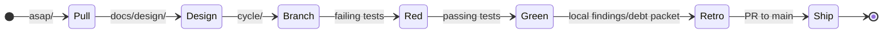

# METHOD

The Graft work doctrine: A backlog, a loop, and honest bookkeeping.

## Principles

- **The agent and the human sit at the same table.** Both matter. Both are named in every design. Default to the agent surface first.
- **The filesystem is the coordination layer.** Directories are priorities; filenames are identities; moves are decisions.
- **Tests are the executable spec.** Design names the problem; tests prove the answer.
- **Reproducibility is the definition of done.** Results must be re-runnable proof, not static artifacts.
- **Design packets come first.** Every implementation cycle starts by making
  the design packet explicit before RED/GREEN work begins.

## Structure

| Signpost | Role |
| :--- | :--- |
| **`README.md`** | Public front door and project identity. |
| **`GUIDE.md`** | Orientation and productive-fast path. |
| **`BEARING.md`** | Current direction and active tensions. |
| **`VISION.md`** | Core tenets and the provenance-aware mission. |
| **`ARCHITECTURE.md`** | Authoritative structural reference. |
| **`AGENTS.md`** | Context recovery protocol for AI and humans. |
| **`METHOD.md`** | Repo work doctrine (this document). |

## Backlog Lanes

| Lane | Purpose |
| :--- | :--- |
| **`asap/`** | Imminent work; pull into the next cycle. |
| **`up-next/`** | Queued after `asap/`. |
| **`v0.8.0/`** | Shaped candidates for the v0.8.0 release lane; scope formation only, not a release packet or tag promise. |
| **`cool-ideas/`** | Uncommitted experiments. |
| **`bad-code/`** | Technical debt that must be addressed. |
| **`inbox/`** | Raw ideas. |

## The Cycle Loop

1. **Pull**: Select the backlog item from `asap/` or `up-next/`.
2. **Design**: Create or update the `docs/design/` packet first. The packet
   must name the hill, acceptance criteria, playback questions, non-goals, and
   the expected test strategy before implementation begins.
3. **Branch**: Create `cycle/<cycle_name>`.
4. **Red**: Write failing tests based on the design's playback questions.
5. **Green**: Implement the solution until tests pass.
6. **Retro**: Complete the local retro before publishing. Capture findings,
   validation evidence, follow-on debt, and any required local retro artifacts;
   commit them with the cycle work.
7. **Ship**: Open a PR to `main` only after the local retro is complete,
   committed, and validated. Update `BEARING.md` and `CHANGELOG.md` after merge.

## Pull Request Opening Gate

A pull request is not the retro. Do not open a PR while the local cycle is still
waiting on retro work.

Before opening a PR:

1. Complete the local retro packet for the cycle.
2. Capture or reference the validation evidence that supports the retro.
3. File any follow-on `bad-code/` or `cool-ideas/` cards required by the retro.
4. Commit the retro and backlog artifacts with the implementation branch.
5. Run the validation appropriate to the changed surface.

If the retro automation is unavailable, write the retro locally by hand and
commit it before opening the PR. The PR may review the retro, but it must not be
the first place the retro exists.

## Naming Convention
Backlog and cycle files follow: `<LEGEND>_<slug>.md`
Example: `WARP_strand-collapse-witness.md`
