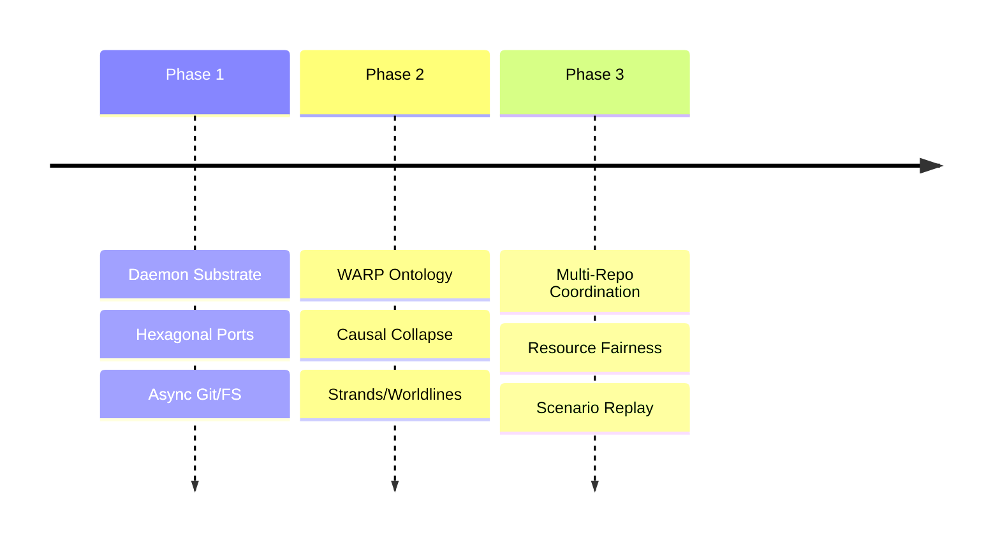

# BEARING

Current direction and active tensions. Historical ship data is in `CHANGELOG.md`.

## Active Gravity

### 1. Entrypoint Convergence
- Formalizing API, CLI, and MCP as equal first-class entry points.
- Extracting application services so those three surfaces stop owning
  business flow.
- Establishing baseline capability posture and parity expectations
  before more surface growth lands.

### 2. WARP Ontology & Causal Collapse
- Explicit definition of session, strand, and checkout epoch.
- Implementation of strand-aware causal collapse (admission of speculative work into canonical history).
- Strengthening of symbol identity and rename continuity for precise slicing.
- Migration from whole-graph read patterns (`getEdges()`, `getNodes()`) to
  slice-first reads (`traverse`, `QueryBuilder`, tick receipts). Blocked on
  git-warp's observer geometry ladder (Rung 2-4) for full resolution; interim
  mitigations applied where possible.

### 3. Multi-Repo Coordination
- Refinement of the Shared Daemon trust boundaries.
- System-wide resource pressure and fairness summaries across multiple repos.
- Authorization-filtered multi-repo overview surfaces.

### 4. Agentic Observability
- Implementation of the Deterministic Scenario Replay pipeline.
- Machine-readable between-commit activity views for agents and humans.

## Tensions

- **Daemon Authz Isolation**: Ensuring that transport-scoped sessions cannot "hop" to unauthorized workspace slices via ID guessing.
- **Git Subprocess Churn**: Frequent spawning of `git` for repo state observation in large repositories impacts latency.
- **Session Semantic Drift**: The term `session` remains too transport-scoped in the code; it needs to move toward a strand-scoped causal envelope.
- **Warp Level 1 Debt**: Much of the WARP integration is referenced as "future work" in docs but lacks explicit tracking in the code.
- **Whole-Graph Read Assumptions**: Several read paths (`getNodes()`, `getEdges()`) assume the full visible graph fits in JS memory. These are scalability bugs that will surface on larger repos. git-warp's observer geometry ladder (design 0035) plans slice-first APIs; graft tracks remaining call sites in `CORE_migrate-to-slice-first-reads`.

## Next Target

The immediate focus is **Entrypoint Convergence and Primary Adapter
Extraction**. The next steps are to settle the three-surface capability
model, keep pushing business flow out of the primary adapters, and
reorganize the repo so API, CLI, and MCP are structurally obvious
rather than merely implied.
