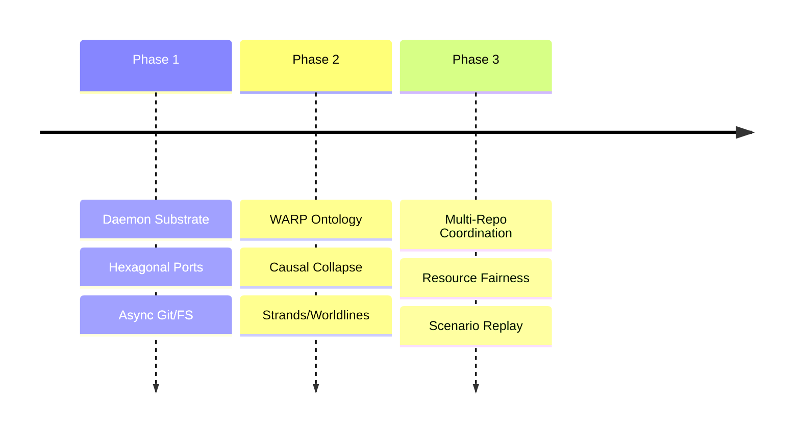

# BEARING

Current direction and active tensions. Historical ship data is in `CHANGELOG.md`.

## Active Gravity

### 1. Continuum-Shaped Structural Reading Port
- Defining `StructuralReadingPort` as the only Graft-facing structural read
  boundary.
- Keeping the current git-warp committed-history behavior behind that port
  while marking its evidence as translated/non-Continuum-native.
- Proving at least one fixture-backed or Echo-backed Continuum-native reading
  branch without making Graft a Continuum semantic owner.
- Routing API, CLI, MCP, and rendering paths through normalized Graft structural
  payloads rather than substrate-specific facts.

### 2. Entrypoint Convergence
- Formalizing API, CLI, and MCP as equal first-class entry points.
- Extracting application services so those three surfaces stop owning
  business flow.
- Establishing baseline capability posture and parity expectations
  before more surface growth lands.

### 3. WARP Ontology & Causal Collapse
- Explicit definition of session, strand, and checkout epoch.
- Implementation of strand-aware causal collapse (admission of speculative work into canonical history).
- Strengthening of symbol identity and rename continuity for precise slicing.
- Migration from whole-graph read patterns (`getEdges()`, `getNodes()`) to
  slice-first reads (`traverse`, `QueryBuilder`, tick receipts). The highest-risk
  WARP reference and precision paths have been mitigated; medium-severity
  local-history and newer structural-metric reads remain tracked.

### 4. Multi-Repo Coordination
- Refinement of the Shared Daemon trust boundaries.
- System-wide resource pressure and fairness summaries across multiple repos.
- Authorization-filtered multi-repo overview surfaces.

### 5. Agentic Observability
- Implementation of the Deterministic Scenario Replay pipeline.
- Machine-readable between-commit activity views for agents and humans.

## Tensions

- **Daemon Authz Isolation**: Ensuring that transport-scoped sessions cannot "hop" to unauthorized workspace slices via ID guessing.
- **Git Subprocess Churn**: Frequent spawning of `git` for repo state observation in large repositories impacts latency.
- **Session Semantic Drift**: The term `session` remains too transport-scoped in the code; it needs to move toward a strand-scoped causal envelope.
- **Warp Level 1 Debt**: Some WARP follow-on work is implemented ahead
  of the release bookkeeping that describes it. Release and METHOD
  truth surfaces need to be kept in step with the code.
- **Whole-Graph Read Assumptions**: Remaining read paths in
  local-history, persisted-local-history, and newer WARP structural
  metric helpers still call `getNodes()` / `getEdges()` in bounded or
  medium-risk contexts. git-warp's observer geometry ladder (design
  0035) plans slice-first APIs; graft tracks remaining call sites in
  `CORE_migrate-to-slice-first-reads`.

## Shipped Baseline

`v0.7.0` shipped the WARP, daemon-runtime, daemon-status, git-facing
enhance, governed-edit, path-boundary, and Dockerized validation spine.
`v0.7.1` followed with npm package hygiene: built `dist/` runtime
artifacts, no published `src/`, development-only `tsx`, and release
publish guards.
`v0.8.0` shipped Review Truth: structural PR summaries, provenance
signals, symbol history, removed-symbol evidence, structural
test-reference signals, review readiness, and broader language/config
parsing.

## Next Target

The immediate focus is the **Continuum-shaped structural reading port**, not a
runtime rewrite.

1. Keep `main` clean after the `v0.8.0` release.
2. Introduce `StructuralReadingPort` as Graft's single structural read boundary.
3. Put git-warp committed-history reads behind the port and label them as
   translated/non-Continuum-native evidence.
4. Prove the Continuum-native branch with fixture-backed or Echo-backed
   evidence before any adapter claims native witnesshood.
5. Do not add METHOD-specific backlog/status features to Graft. METHOD
   backlog lanes, cards, retros, dependency DAGs, and release truth
   surfaces belong in Method MCP / Method CLI.
6. Keep `WARP_lsp-enrichment` and `CORE_migrate-to-slice-first-reads`
   out of this slice. LSP enrichment remains valid optional scope;
   slice-first reads remain externally blocked until git-warp observer
   geometry APIs land.
7. Treat daemon live refresh and daemon control-plane actions as a
   separate daemon-operator lane, not part of this slice.
