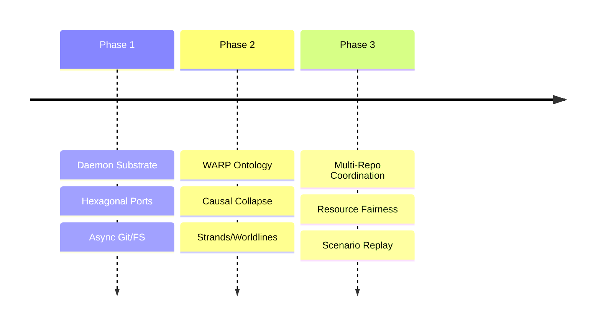

# BEARING

Current direction and active tensions. Historical ship data is in `CHANGELOG.md`.

## Active Gravity

### 1. WARP Ontology & Causal Collapse
- Explicit definition of session, strand, and checkout epoch.
- Implementation of strand-aware causal collapse (admission of speculative work into canonical history).
- Strengthening of symbol identity and rename continuity for precise slicing.

### 2. Multi-Repo Coordination
- Refinement of the Shared Daemon trust boundaries.
- System-wide resource pressure and fairness summaries across multiple repos.
- Authorization-filtered multi-repo overview surfaces.

### 3. Agentic Observability
- Implementation of the Deterministic Scenario Replay pipeline.
- Machine-readable between-commit activity views for agents and humans.

## Tensions

- **Daemon Authz Isolation**: Ensuring that transport-scoped sessions cannot "hop" to unauthorized workspace slices via ID guessing.
- **Git Subprocess Churn**: Frequent spawning of `git` for repo state observation in large repositories impacts latency.
- **Session Semantic Drift**: The term `session` remains too transport-scoped in the code; it needs to move toward a strand-scoped causal envelope.
- **Warp Level 1 Debt**: Much of the WARP integration is referenced as "future work" in docs but lacks explicit tracking in the code.

## Next Target

The immediate focus is **Daemon Infrastructure Decomposition**. Moving management of workers, schedulers, and authz out of the main server module to improve security and maintainability.
