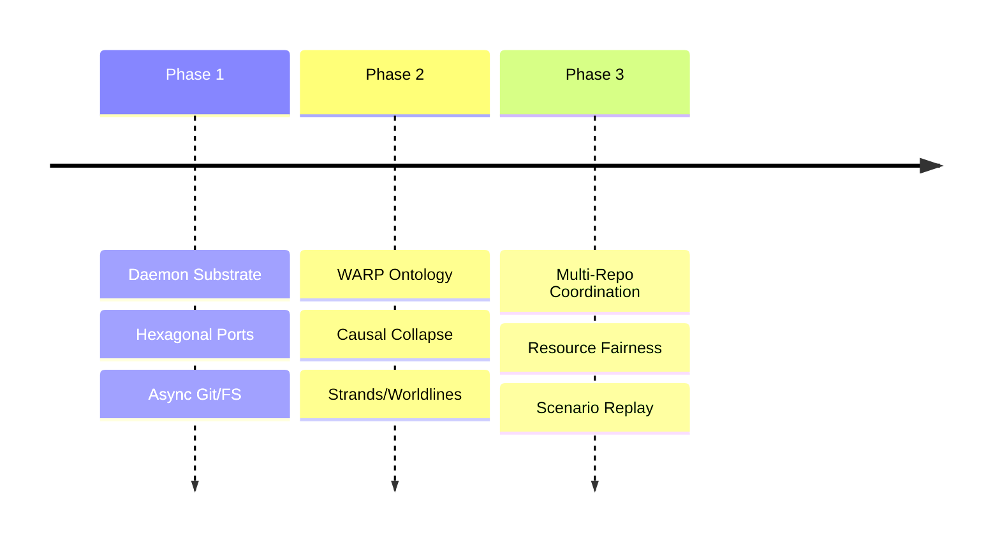

# BEARING

Current direction and active tensions. Historical ship data is in `CHANGELOG.md`.

## Active Gravity

### 1. Entrypoint Convergence
- Formalizing API, CLI, and MCP as equal first-class entry points.
- Extracting application services so those three surfaces stop owning
  business flow.
- Establishing baseline capability posture and parity expectations
  before more surface growth lands.

### 2. WARP Ontology & Causal Collapse
- Explicit definition of session, strand, and checkout epoch.
- Implementation of strand-aware causal collapse (admission of speculative work into canonical history).
- Strengthening of symbol identity and rename continuity for precise slicing.
- Migration from whole-graph read patterns (`getEdges()`, `getNodes()`) to
  slice-first reads (`traverse`, `QueryBuilder`, tick receipts). The highest-risk
  WARP reference and precision paths have been mitigated; medium-severity
  local-history and newer structural-metric reads remain tracked.

### 3. Multi-Repo Coordination
- Refinement of the Shared Daemon trust boundaries.
- System-wide resource pressure and fairness summaries across multiple repos.
- Authorization-filtered multi-repo overview surfaces.

### 4. Agentic Observability
- Implementation of the Deterministic Scenario Replay pipeline.
- Machine-readable between-commit activity views for agents and humans.

## Tensions

- **Daemon Authz Isolation**: Ensuring that transport-scoped sessions cannot "hop" to unauthorized workspace slices via ID guessing.
- **Git Subprocess Churn**: Frequent spawning of `git` for repo state observation in large repositories impacts latency.
- **Session Semantic Drift**: The term `session` remains too transport-scoped in the code; it needs to move toward a strand-scoped causal envelope.
- **Warp Level 1 Debt**: Some WARP follow-on work is implemented ahead
  of the release bookkeeping that describes it. Release and METHOD
  truth surfaces need to be kept in step with the code.
- **Whole-Graph Read Assumptions**: Remaining read paths in
  local-history, persisted-local-history, and newer WARP structural
  metric helpers still call `getNodes()` / `getEdges()` in bounded or
  medium-risk contexts. git-warp's observer geometry ladder (design
  0035) plans slice-first APIs; graft tracks remaining call sites in
  `CORE_migrate-to-slice-first-reads`.

## Next Target

The immediate focus is **v0.7.0 release truth and stabilization**.

1. Keep release surfaces aligned: `package.json`, `CHANGELOG.md`,
   `docs/releases/v0.7.0.md`, METHOD release packet, and backlog lanes.
2. Verify the WARP-backed structural operation rewrites against the
   release bar: log, churn, blame, review, reference counting, and
   slice-first read posture.
3. Finish or reshape the remaining v0.7.0 backlog cards so each one
   names the real current state rather than pre-rewrite assumptions.
4. When git-warp's observer geometry ladder (Rung 2-4) ships, migrate
   the remaining medium-risk full-scan reads to slice-first APIs.
