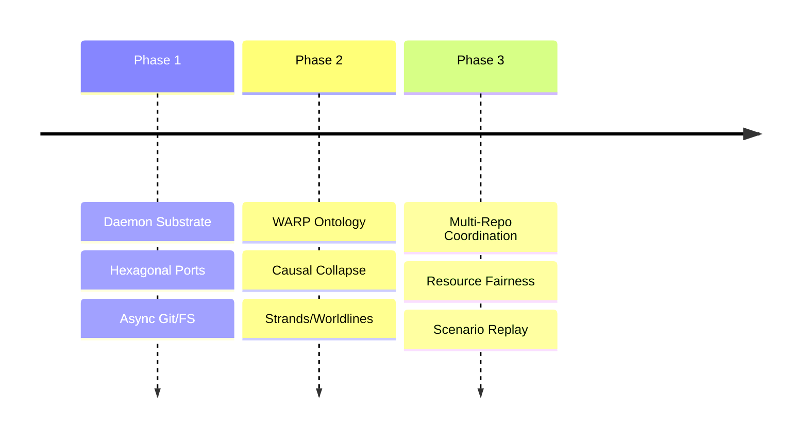

# BEARING

Current direction and active tensions. Historical ship data is in `CHANGELOG.md`.

## Active Gravity

### 1. Structural History Schema and Echo Migration
- Graft defines canonical structural history facts in GraphQL.
- Graft consumes the existing Wesley toolchain to derive TypeScript read
  models, validators, Echo-consumable contracts, SQL/storage artifacts, and
  drift witnesses from that schema.
- Echo becomes the primary causal-history substrate for Graft's structural
  history after parity is proven.
- git-warp is demoted to provenance-preserving legacy import and temporary
  fallback compatibility.
- Evidence labels distinguish `echo-native`, `git-warp-imported`, and
  `fallback-translated` facts.
- The landed `StructuralReadingPort` remains the Graft-facing read boundary,
  but its hand-authored payloads are transitional.

### 2. Entrypoint Convergence
- Formalizing API, CLI, and MCP as equal first-class entry points.
- Extracting application services so those three surfaces stop owning
  business flow.
- Establishing baseline capability posture and parity expectations
  before more surface growth lands.

### 3. WARP Ontology & Causal Collapse
- Explicit definition of session, strand, and checkout epoch.
- Implementation of strand-aware causal collapse (admission of speculative work into canonical history).
- Strengthening of symbol identity and rename continuity for precise slicing.
- Migration from whole-graph read patterns (`getEdges()`, `getNodes()`) to
  slice-first reads (`traverse`, `QueryBuilder`, tick receipts). The highest-risk
  WARP reference and precision paths have been mitigated; medium-severity
  local-history and newer structural-metric reads remain tracked.

### 4. Multi-Repo Coordination
- Refinement of the Shared Daemon trust boundaries.
- System-wide resource pressure and fairness summaries across multiple repos.
- Authorization-filtered multi-repo overview surfaces.

### 5. Agentic Observability
- Implementation of the Deterministic Scenario Replay pipeline.
- Machine-readable between-commit activity views for agents and humans.

## Tensions

- **Daemon Authz Isolation**: Ensuring that transport-scoped sessions cannot "hop" to unauthorized workspace slices via ID guessing.
- **git-warp Substrate Strain**: Very large histories and ref sets push
  git-warp through Git performance limits; Graft should move normal operation
  to Echo after schema-backed parity rather than hand-translating git-warp's
  graph model into Echo.
- **Session Semantic Drift**: The term `session` remains too transport-scoped in the code; it needs to move toward a strand-scoped causal envelope.
- **Warp Level 1 Debt**: Some WARP follow-on work is implemented ahead
  of the release bookkeeping that describes it. Release and METHOD
  truth surfaces need to be kept in step with the code.
- **Whole-Graph Read Assumptions**: Remaining read paths in
  local-history, persisted-local-history, and newer WARP structural
  metric helpers still call `getNodes()` / `getEdges()` in bounded or
  medium-risk contexts. git-warp's observer geometry ladder (design
  0035) plans slice-first APIs; graft tracks remaining call sites in
  `CORE_migrate-to-slice-first-reads`.

## Shipped Baseline

`v0.7.0` shipped the WARP, daemon-runtime, daemon-status, git-facing
enhance, governed-edit, path-boundary, and Dockerized validation spine.
`v0.7.1` followed with npm package hygiene: built `dist/` runtime
artifacts, no published `src/`, development-only `tsx`, and release
publish guards.
`v0.8.0` shipped Review Truth: structural PR summaries, provenance
signals, symbol history, removed-symbol evidence, structural
test-reference signals, review readiness, and broader language/config
parsing.

## Next Target

The immediate focus is **schema authority before substrate migration**. The
near-term work is locked as a Graft-only pre-Echo execution plan with a hard
Echo integration gate after generated-model parity is proven.

1. Keep `main` clean after the `v0.8.0` release.
2. Treat the Wesley-backed structural-history generation gate as the active
   quality invariant: generated TypeScript must be regenerated from GraphQL in
   CI through the pinned Wesley CLI and fail if hand-edited.
3. Pull the `asap/` cards that decompose
   [CORE_structural-history-schema-and-echo-migration](./method/backlog/up-next/CORE_structural-history-schema-and-echo-migration.md)
   into Graft-only pre-Echo slices.
4. Define Graft's canonical structural-history facts in GraphQL before adapting
   any additional git-warp model output.
5. Use the existing Wesley toolchain to derive TypeScript/Zod/read-models,
   Echo contracts, storage artifacts, and drift witnesses from that schema.
6. Preserve current public command behavior while validating Echo-backed outputs
   against current git-warp-backed outputs.
7. Treat git-warp evidence as `git-warp-imported` or `fallback-translated`,
   never as Continuum-native witnesshood.
8. Stop opening git-warp during normal Graft operation once parity is proven.
9. Do not add METHOD-specific backlog/status features to Graft. METHOD
   backlog lanes, cards, retros, dependency DAGs, and release truth
   surfaces belong in Method MCP / Method CLI.
10. Keep `WARP_lsp-enrichment` and `CORE_migrate-to-slice-first-reads`
   out of this slice. LSP enrichment remains valid optional scope;
   slice-first reads remain externally blocked until git-warp observer
   geometry APIs land.
11. Treat daemon live refresh and daemon control-plane actions as a separate
    daemon-operator lane, not part of this slice.

## Locked Slice Plan (Execution)

1. **Slice 0 — Hermetic Wesley check**
   Keep the closed Wesley hermetic gate active: deterministic
   regenerate-and-diff CI validation for
   `schemas/graft-structural-history.graphql` -> generated artifacts.

2. **Slice 1 — Evidence label alignment** (shipped, PR #64)
   [`CORE_structural-history-evidence-label-alignment`](./method/graveyard/CORE_structural-history-evidence-label-alignment.md)
   established `echo-native`, `git-warp-imported`, and
   `fallback-translated` evidence posture before runtime migration.

3. **Slice 2 — Echo package descriptor** (shipped, PR #65)
   [`CORE_graft-structural-history-echo-package-descriptor`](./method/graveyard/CORE_graft-structural-history-echo-package-descriptor.md)
   defined the deterministic structural-history package descriptor Graft
   expects Echo to install later.

4. **Slice 3 — Fake Echo-shaped TypeScript witness** (shipped; design
   packet
   [`CORE_graft-fake-echo-shaped-typescript-witness`](./design/CORE_graft-fake-echo-shaped-typescript-witness.md))
   proved the Graft-side app-safe Echo seam — kernel transport port,
   Wesley-generated LE codecs, typed client, Echo-backed reading adapter —
   against a deterministic fake, with authority-boundary guards.

5. **Slice 4 — StructuralReadingPort generated-model parity**
   Pull
   [`CORE_structural-reading-port-generated-model-parity`](./method/backlog/asap/CORE_structural-reading-port-generated-model-parity.md):
   map current `StructuralReadingPort` payloads to the generated model and
   preserve existing behavior while adding parity coverage.

6. **Echo integration gate**
   Stop before claiming real `echo-native` evidence unless Echo exposes the
   required TypeScript-facing runtime/client, retained-evidence posture, and
   versioned package compatibility surface.

7. **Trust defect remediation**
   Track `WARP_bijou-local-history-stale-after-branch-transition.md` as active
   high-priority follow-up if and only if stale local history is observed in
   dogfooding; otherwise it remains deferred behind slice 4.

8. **Follow-on architecture debt**
   Finish the remaining schema-facing debt:
   `CLEAN_remaining-structural-warp-reads-bypass-structural-reading-port.md`,
   then `CLEAN_technical-teardown-contract-ledger-can-stale-without-tests.md`.
