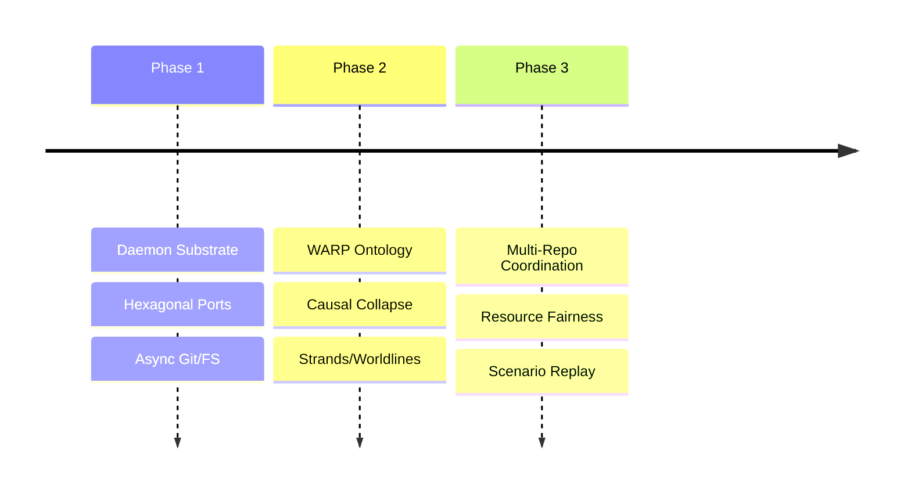

# BEARING

Current direction and active tensions. Historical ship data is in `CHANGELOG.md`.

```mermaid
timeline
    Phase 1 : Daemon Substrate : Hexagonal Ports : Async Git/FS
    Phase 2 : WARP Ontology : Causal Collapse : Strands/Worldlines
    Phase 3 : Multi-Repo Coordination : Resource Fairness : Scenario Replay
```

## Active Gravity

### 1. Structural History Schema and Echo Migration
- Graft defines canonical structural history facts in GraphQL.
- Graft consumes the existing Wesley toolchain to derive TypeScript read
  models, validators, Echo-consumable contracts, SQL/storage artifacts, and
  drift witnesses from that schema.
- Echo becomes the primary causal-history substrate for Graft's structural
  history after parity is proven.
- git-warp is demoted to provenance-preserving legacy import and temporary
  fallback compatibility.
- Evidence labels distinguish `echo-native`, `git-warp-imported`, and
  `fallback-translated` facts.
- The landed `StructuralReadingPort` remains the Graft-facing read boundary,
  but its hand-authored payloads are transitional.

### 2. Entrypoint Convergence
- Formalizing API, CLI, and MCP as equal first-class entry points.
- Extracting application services so those three surfaces stop owning
  business flow.
- Establishing baseline capability posture and parity expectations
  before more surface growth lands.

### 3. WARP Ontology & Causal Collapse
- Explicit definition of session, strand, and checkout epoch.
- Implementation of strand-aware causal collapse (admission of speculative work into canonical history).
- Strengthening of symbol identity and rename continuity for precise slicing.
- Migration from whole-graph read patterns (`getEdges()`, `getNodes()`) to
  slice-first reads (`traverse`, `QueryBuilder`, tick receipts). The highest-risk
  WARP reference and precision paths have been mitigated; medium-severity
  local-history and newer structural-metric reads remain tracked.

### 4. Multi-Repo Coordination
- Refinement of the Shared Daemon trust boundaries.
- System-wide resource pressure and fairness summaries across multiple repos.
- Authorization-filtered multi-repo overview surfaces.

### 5. Agentic Observability
- Implementation of the Deterministic Scenario Replay pipeline.
- Machine-readable between-commit activity views for agents and humans.

## Tensions

- **Daemon Authz Isolation**: Ensuring that transport-scoped sessions cannot "hop" to unauthorized workspace slices via ID guessing.
- **git-warp Substrate Strain**: Very large histories and ref sets push
  git-warp through Git performance limits; Graft should move normal operation
  to Echo after schema-backed parity rather than hand-translating git-warp's
  graph model into Echo.
- **Session Semantic Drift**: The term `session` remains too transport-scoped in the code; it needs to move toward a strand-scoped causal envelope.
- **Warp Level 1 Debt**: Some WARP follow-on work is implemented ahead
  of the release bookkeeping that describes it. Release and METHOD
  truth surfaces need to be kept in step with the code.
- **Whole-Graph Read Assumptions**: Remaining read paths in
  local-history, persisted-local-history, and newer WARP structural
  metric helpers still call `getNodes()` / `getEdges()` in bounded or
  medium-risk contexts. git-warp's observer geometry ladder (design
  0035) plans slice-first APIs; graft tracks remaining call sites in
  `CORE_migrate-to-slice-first-reads`.

## Shipped Baseline

`v0.7.0` shipped the WARP, daemon-runtime, daemon-status, git-facing
enhance, governed-edit, path-boundary, and Dockerized validation spine.
`v0.7.1` followed with npm package hygiene: built `dist/` runtime
artifacts, no published `src/`, development-only `tsx`, and release
publish guards.
`v0.8.0` shipped Review Truth: structural PR summaries, provenance
signals, symbol history, removed-symbol evidence, structural
test-reference signals, review readiness, and broader language/config
parsing.

## Next Target

The immediate focus is **the first complete retained workspace observation**.
The generated structural-history schema/model/codec contract, including
`UNPINNED_COMMITTED`, is landed. PR #242 also established the
`AdmittedWorkspaceReadView` authority seam. Production composition roots still
construct `LiveWorkspaceReadSource`: Graft does not yet declare an observation
through Edict, retain its request and settlement in Echo, or replay analysis
after restart without filesystem reads.

Before that vertical, close one narrow authority preflight:

1. Prove issue #238 against two dirty worktrees of the same repository in both
   directions.
2. Expose requested and canonical resolved roots plus workspace identity in
   routed responses and receipts.
3. Fail closed on missing, unauthorized, or identity-mismatched roots.
4. Do not expand #238 into a routing rewrite or adjacent cleanup campaign.

Then resume issue #228 as **First Retained Workspace Observation**:

1. Declare Graft-owned Edict operation `ObserveWorkspaceSnapshot`.
2. Use an unknown-basis request: the request authorizes an observation and the
   settlement witnesses the bytes actually observed.
3. Retain the admitted request before the first filesystem read.
4. Retain the schema-bound settlement before the first Graft analysis read.
5. Construct `AdmittedWorkspaceReadView` only from that retained settlement.
6. Prove `file_outline` live output equals restarted replay output with zero
   filesystem reads and zero git-warp opens during replay.
7. Return a typed refusal or explicit incompleteness when a coherent snapshot
   cannot be formed; never retain a temporally mixed observation as a snapshot.

## Locked Slice Plan (Execution)

1. **Slice 0 — Hermetic Wesley check**
   Keep the closed Wesley hermetic gate active: deterministic
   regenerate-and-diff CI validation for
   `schemas/graft-structural-history.graphql` -> generated artifacts.

2. **Slice 1 — Evidence label alignment** (shipped, PR #64)
   [`CORE_structural-history-evidence-label-alignment`](./method/graveyard/CORE_structural-history-evidence-label-alignment.md)
   established `echo-native`, `git-warp-imported`, and
   `fallback-translated` evidence posture before runtime migration.

3. **Slice 2 — Echo package descriptor** (shipped, PR #65)
   [`CORE_graft-structural-history-echo-package-descriptor`](./method/graveyard/CORE_graft-structural-history-echo-package-descriptor.md)
   defined the deterministic structural-history package descriptor Graft
   expects Echo to install later.

4. **Slice 3 — Fake Echo-shaped TypeScript witness** (shipped; design
   packet
   [`CORE_graft-fake-echo-shaped-typescript-witness`](./design/CORE_graft-fake-echo-shaped-typescript-witness.md))
   proved the Graft-side app-safe Echo seam — kernel transport port,
   Wesley-generated LE codecs, typed client, Echo-backed reading adapter —
   against a deterministic fake, with authority-boundary guards.

5. **Slice 4 — StructuralReadingPort generated-model parity** (shipped)
   [`CORE_structural-reading-port-generated-model-parity`](./method/graveyard/CORE_structural-reading-port-generated-model-parity.md)
   map current `StructuralReadingPort` payloads to the generated model and
   preserve existing behavior while adding parity coverage.

6. **Slice 5 — Unpinned committed-history basis kind** (shipped)
   [`CORE_unpinned-basis-kind-for-structural-history`](./design/CORE_unpinned-basis-kind-for-structural-history.md):
   schema v0.2 names committed-history readings with no `ref` and no `head`
   as `UNPINNED_COMMITTED`, keeping `GIT_REF` reserved for bases with a
   present `refName`.

7. **Requested-worktree authority preflight** (active; issue #238)
   Prove explicit routed reads against two worktrees of one repository and make
   requested/resolved identity inspectable and fail-closed.

8. **First retained workspace observation** (next; issue #228)
   Complete the Edict request -> Echo retention -> authorized observation ->
   settlement retention -> admitted read -> restart -> zero-read replay
   vertical using the unknown-basis request protocol.

9. **One structural-history migration** (after restart proof)
   Move one history/blame surface behind `StructuralReadingPort`, retaining
   explicit `echo-native`, `git-warp-imported`, and `fallback-translated`
   evidence postures until parity is executable proof.

10. **Held work**
    Keep PR #233 to a time-boxed landed/unique/research/obsolete inventory and
    close or split it without making salvage a prerequisite for the Echo
    vertical. Keep daemon dashboards, broader language analysis, live-frontier
    work, git-warp import, and generic Continuum redesign outside these slices.
