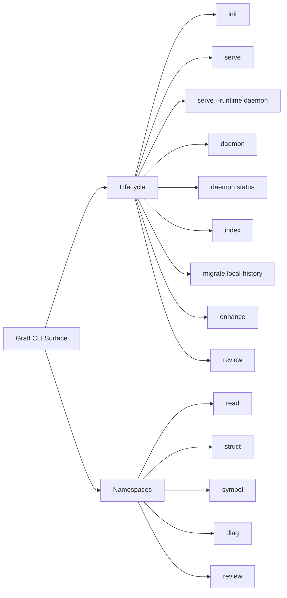

# CLI

The Graft command surface is a composite of published binaries and repo-local operator scripts.



## What it is for
- bootstrap and setup via `graft init`
- repo-local stdio MCP via `graft serve`
- daemon-backed stdio MCP via `graft serve --runtime daemon`
- read-only daemon status inspection via `graft daemon status`
- bounded, lazy WARP refresh via `graft index --path <path>`
- one-time legacy import via `graft migrate local-history`
- human-facing structural review summaries via `graft review`
- review-loop readiness via `graft review cooldown`
- structural/reference test coverage maps via `graft struct test-coverage`
- dead-symbol cleanup candidates via `graft struct dead-symbols`
- Git-facing structural review summaries via `git graft enhance`
- local debugging and dogfooding of MCP peer commands
- human-facing inspection of bounded state such as:
  - `graft diag activity`
  - `graft diag local-history-dag`
  - `graft diag doctor`
  - `graft doctor --sludge`
  - `graft diag stats`
  - `graft symbol history`
  - `graft symbol difficulty`

## Core namespaces
- `read` — bounded reads and change checks
- `struct` — structural diff / since / map / review / test-coverage / dead-symbols
- `symbol` — precision show / find / blame / history / difficulty
- `review` — structural review and review-loop readiness
- `diag` — activity, local-history-dag, doctor, explain, stats, capture

## Release-facing commands
```bash
graft serve
graft serve --runtime daemon
graft daemon status
graft daemon status --socket /path/to/mcp.sock
graft index --path src/app.ts --json
graft migrate local-history --json
graft diag activity --json
graft diag local-history-dag --json
graft diag doctor --json
graft doctor --sludge --json
graft review --base HEAD~1
graft review --base origin/main --head HEAD --json
graft review cooldown --pr 48
graft review cooldown --comments-file comments.json --now 2026-05-05T15:10:00.000Z --json
graft symbol find 'create*' --json
graft symbol history createUser --path src/users.ts
graft symbol difficulty createUser --path src/users.ts --json
graft struct diff --json
graft struct test-coverage --src src --tests test
graft struct test-coverage --src src --tests test --json
graft struct dead-symbols --limit 20
graft struct dead-symbols --limit 20 --json
git graft enhance --since HEAD~1
git-graft enhance --since HEAD~1
git-graft enhance --since HEAD~1 --json
```

## Repo-local invocation
When working from this checkout, use one of these forms:

```bash
pnpm graft diag activity
./bin/graft.js diag activity
```

Bare `graft ...` only works when the package is installed or linked onto your `PATH`.

`graft review --base <ref> [--head <ref>] [--json]` renders the
repo-local structural review summary backed by the same `graft_review`
model as MCP and `graft struct review`. Human output separates
structural files from formatting, test, docs, and config churn. JSON
output keeps the schema-validated `graft.cli.struct_review` payload for
agents. GitHub PR-number resolution and comment posting are intentionally
outside this first slice; check out or fetch the PR branch and compare
refs locally.

`graft review cooldown [--pr <number>] [--comments-file <path>] [--now
<iso>] [--json]` reads PR comments, detects CodeRabbit rate-limit
markers, and reports whether another automated review request is ready,
still cooling down, or unknown. Without `--comments-file` it shells out
to `gh pr view [<number>] --json comments`; fixtures can use
`--comments-file` to validate the same logic without network or GitHub
state. Human output includes local timestamps; JSON output keeps the
schema-validated `graft.cli.review_cooldown` payload.

`graft struct test-coverage [--src <path>] [--tests <path>] [--json]`
renders a structural/reference coverage map for exported source symbols.
The default paths are `src` and `test`. Human output lists summary
counts, limitations, and per-symbol `covered` / `uncovered` status.
JSON output keeps the schema-validated
`graft.cli.struct_test_coverage` payload. This command does not run
tests or claim line, branch, statement, or execution coverage; imports
and mentions in test files can count as structural references.

`graft struct dead-symbols [--limit <n>] [--json]` lists symbols removed
from indexed WARP history and not subsequently re-added. Human output is
intended for cleanup and API-surface shrinkage review; JSON output keeps
the schema-validated `graft.cli.struct_dead_symbols` payload backed by
the `graft_dead_symbols` MCP peer.

`graft symbol history <symbol> [--path <path>] [--json]` renders the
same provenance-backed history as `graft symbol blame`, with a
timeline-first human view over creation, signature-change, per-version
path and line-range facts, and reference facts. JSON output remains the
schema-validated `graft.cli.symbol_blame` payload so the alias does not
create a second wire shape for the same WARP truth.

`git graft enhance --since <ref> [--head <ref>] [--json]` is the
installed Git external-command form for the release-facing structural
review aggregator. `git-graft enhance --since <ref>` is the direct
package binary form. Both route through the same top-level `enhance`
parser path. The command composes the shipped structural-since and
export-surface facts into a concise review summary, plus bounded
provenance hints for changed symbols when WARP blame data is available.
It does not wrap arbitrary Git subcommands or expand into unbounded
reference traversal or write-tool behavior.

`graft diag activity` is the current human-facing between-commit surface. It reports bounded local `artifact_history`, not canonical provenance, and now renders a textual operator summary by default. Use `--json` when you want the structured machine-readable form.

`graft diag local-history-dag` is a CLI-only debug surface over the repo-local WARP graph. It renders a bounded event-centric DAG for local history through Bijou's `dag()` component. In interactive terminals that means the Bijou DAG layout; in pipes or non-TTY contexts it degrades to Bijou's truthful pipe-mode graph listing.

`graft daemon status` is the read-only daemon status surface. It connects
to an already-running daemon, builds a deterministic status model from
existing daemon read tools, and renders daemon health, sessions,
workspace posture, monitors, scheduler pressure, and worker pressure.
Use `--socket <path>` to inspect a non-default daemon socket. This first
slice does not authorize, revoke, bind, rebind, pause, resume, start, or
stop daemon resources.

`graft index` follows the lazy-index policy. Use `--path <path>` to refresh a
specific tracked source file at `HEAD`; read/search surfaces also opportunistically
refresh the files they touch. Unbounded whole-repo indexing is guarded and returns
a structured refusal when the request would write too many file patches at once.

## MCP Runtime Selection

`graft serve` is repo-local stdio MCP. The launched process owns one
repo-local workspace rooted at the current checkout.

`graft serve --runtime daemon` is daemon-backed stdio MCP. The launched
process is a bridge to the local daemon `/mcp` surface. If the daemon is
not already healthy, the bridge starts it and waits for readiness. Add
`--no-autostart` to fail instead of starting a daemon, and add
`--socket <path>` to target a non-default daemon socket.

Generated MCP config uses the same distinction:

```bash
graft init --write-codex-mcp
graft init --mcp-runtime daemon --write-codex-mcp
```

The first command emits `args = ["-y", "@flyingrobots/graft", "serve"]`.
The second emits
`args = ["-y", "@flyingrobots/graft", "serve", "--runtime", "daemon"]`.

## Related docs
- [README](../README.md)
- [Setup Guide](./SETUP.md)
- [MCP Guide](./MCP.md)
- [Advanced Guide](./ADVANCED_GUIDE.md)
- [Architecture](../ARCHITECTURE.md)
