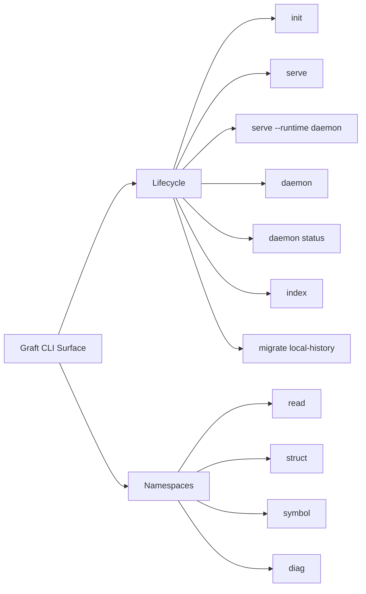

# CLI

The Graft command surface is a composite of published binaries and repo-local operator scripts.



## What it is for
- bootstrap and setup via `graft init`
- repo-local stdio MCP via `graft serve`
- daemon-backed stdio MCP via `graft serve --runtime daemon`
- read-only daemon status inspection via `graft daemon status`
- bounded, lazy WARP refresh via `graft index --path <path>`
- one-time legacy import via `graft migrate local-history`
- local debugging and dogfooding of MCP peer commands
- human-facing inspection of bounded state such as:
  - `graft diag activity`
  - `graft diag local-history-dag`
  - `graft diag doctor`
  - `graft doctor --sludge`
  - `graft diag stats`
  - `graft symbol difficulty`

## Core namespaces
- `read` — bounded reads and change checks
- `struct` — structural diff / since / map
- `symbol` — precision show / find / blame / difficulty
- `diag` — activity, local-history-dag, doctor, explain, stats, capture

## Release-facing commands
```bash
graft serve
graft serve --runtime daemon
graft daemon status
graft daemon status --socket /path/to/mcp.sock
graft index --path src/app.ts --json
graft migrate local-history --json
graft diag activity --json
graft diag local-history-dag --json
graft diag doctor --json
graft doctor --sludge --json
graft symbol find 'create*' --json
graft symbol difficulty createUser --path src/users.ts --json
graft struct diff --json
```

## Repo-local invocation
When working from this checkout, use one of these forms:

```bash
pnpm graft diag activity
./bin/graft.js diag activity
```

Bare `graft ...` only works when the package is installed or linked onto your `PATH`.

`graft diag activity` is the current human-facing between-commit surface. It reports bounded local `artifact_history`, not canonical provenance, and now renders a textual operator summary by default. Use `--json` when you want the structured machine-readable form.

`graft diag local-history-dag` is a CLI-only debug surface over the repo-local WARP graph. It renders a bounded event-centric DAG for local history through Bijou's `dag()` component. In interactive terminals that means the Bijou DAG layout; in pipes or non-TTY contexts it degrades to Bijou's truthful pipe-mode graph listing.

`graft daemon status` is the read-only daemon status surface. It connects
to an already-running daemon, builds a deterministic status model from
existing daemon read tools, and renders daemon health, sessions,
workspace posture, monitors, scheduler pressure, and worker pressure.
Use `--socket <path>` to inspect a non-default daemon socket. This first
slice does not authorize, revoke, bind, rebind, pause, resume, start, or
stop daemon resources.

`graft index` follows the lazy-index policy. Use `--path <path>` to refresh a
specific tracked source file at `HEAD`; read/search surfaces also opportunistically
refresh the files they touch. Unbounded whole-repo indexing is guarded and returns
a structured refusal when the request would write too many file patches at once.

## MCP Runtime Selection

`graft serve` is repo-local stdio MCP. The launched process owns one
repo-local workspace rooted at the current checkout.

`graft serve --runtime daemon` is daemon-backed stdio MCP. The launched
process is a bridge to the local daemon `/mcp` surface. If the daemon is
not already healthy, the bridge starts it and waits for readiness. Add
`--no-autostart` to fail instead of starting a daemon, and add
`--socket <path>` to target a non-default daemon socket.

Generated MCP config uses the same distinction:

```bash
graft init --write-codex-mcp
graft init --mcp-runtime daemon --write-codex-mcp
```

The first command emits `args = ["-y", "@flyingrobots/graft", "serve"]`.
The second emits
`args = ["-y", "@flyingrobots/graft", "serve", "--runtime", "daemon"]`.

## Related docs
- [README](../README.md)
- [Setup Guide](./SETUP.md)
- [MCP Guide](./MCP.md)
- [Advanced Guide](./ADVANCED_GUIDE.md)
- [Architecture](../ARCHITECTURE.md)
