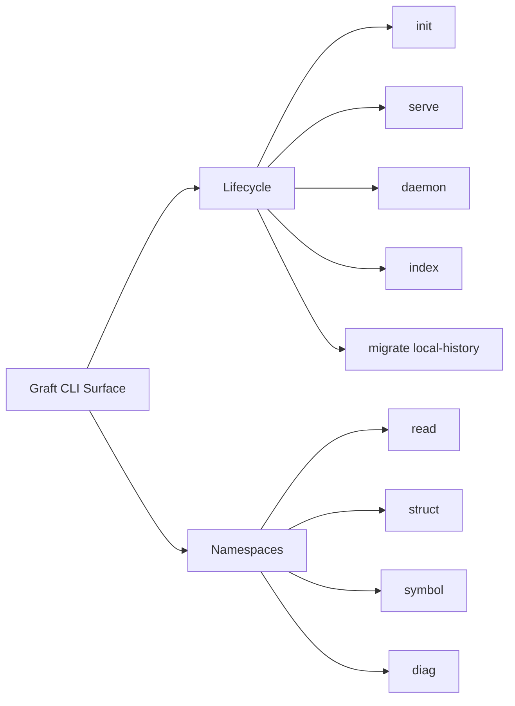

# CLI

The Graft command surface is a composite of published binaries and repo-local operator scripts.



## What it is for
- bootstrap and setup via `graft init`
- one-time legacy import via `graft migrate local-history`
- local debugging and dogfooding of MCP peer commands
- human-facing inspection of bounded state such as:
  - `graft diag activity`
  - `graft diag local-history-dag`
  - `graft diag doctor`
  - `graft diag stats`

## Core namespaces
- `read` — bounded reads and change checks
- `struct` — structural diff / since / map
- `symbol` — precision show / find
- `diag` — activity, local-history-dag, doctor, explain, stats, capture

## Release-facing commands
```bash
graft migrate local-history --json
graft diag activity --json
graft diag local-history-dag --json
graft diag doctor --json
graft symbol find 'create*' --json
graft struct diff --json
```

## Repo-local invocation
When working from this checkout, use one of these forms:

```bash
pnpm graft diag activity
./bin/graft.js diag activity
```

Bare `graft ...` only works when the package is installed or linked onto your `PATH`.

`graft diag activity` is the current human-facing between-commit surface. It reports bounded local `artifact_history`, not canonical provenance, and now renders a textual operator summary by default. Use `--json` when you want the structured machine-readable form.

`graft diag local-history-dag` is a CLI-only debug surface over the repo-local WARP graph. It renders a bounded event-centric DAG for local history through Bijou's `dag()` component. In interactive terminals that means the Bijou DAG layout; in pipes or non-TTY contexts it degrades to Bijou's truthful pipe-mode graph listing.

## Related docs
- [README](../README.md)
- [Setup Guide](./SETUP.md)
- [MCP Guide](./MCP.md)
- [Advanced Guide](./ADVANCED_GUIDE.md)
- [Architecture](../ARCHITECTURE.md)
