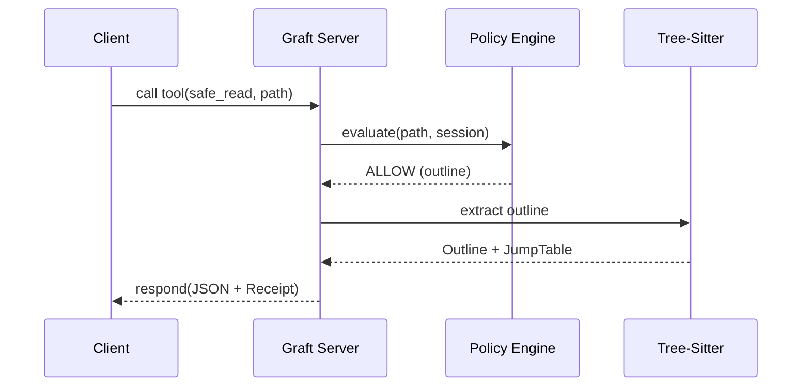

# MCP

Graft is a high-fidelity tool provider for the Model Context Protocol (MCP).



## Startup

### Repo-local stdio MCP
```bash
npx @flyingrobots/graft serve
```

This is the default repo-local MCP posture. The current checkout is the
active workspace, so there is no separate daemon authorization or
binding step.

### Daemon-backed stdio MCP
```bash
npx @flyingrobots/graft serve --runtime daemon
```

This keeps compatibility with MCP clients that can launch only a stdio
command while routing MCP traffic to the local daemon `/mcp` surface.
The bridge auto-starts the daemon when it is missing, waits for
`/healthz`, then proxies stdio traffic to the daemon. Use
`--no-autostart` to require an already-running daemon:

```bash
npx @flyingrobots/graft serve --runtime daemon --no-autostart
```

Daemon-backed sessions start unbound. Repository-scoped tools fail
until the session is authorized and bound through the workspace control
plane.

### Local Daemon
```bash
npx @flyingrobots/graft daemon
```

Daemon sessions start `unbound`. Once a client is connected to the
daemon MCP surface, repository-scoped work follows this control-plane
flow:

1. `workspace_authorize` with the target `cwd`
2. `workspace_bind` with the target `cwd`
3. then call repository-scoped tools such as `safe_read`, `graft_since`,
   or `code_show`

## Key Tool Groups
- **Bounded Reads**: `safe_read`, `file_outline`, `read_range`, `changed_since`
- **Structural History**: `graft_diff`, `graft_since`, `graft_map`
- **Structural Metrics**: `graft_churn`, `graft_difficulty`
- **Precision**: `code_show`, `code_find`, `code_refs`
- **Activity & Footing**: `activity_view`, `causal_status`, `causal_attach`, `doctor`
- **Daemon Control Plane**: `workspace_authorizations`, `workspace_authorize`, `workspace_bind`, `workspace_status`, `workspace_rebind`, `workspace_revoke`, `daemon_status`, `daemon_repos`, `daemon_sessions`, `daemon_monitors`, `monitor_*`

## Current Truth
- MCP is the primary agent surface.
- `graft serve` is repo-local stdio; `graft serve --runtime daemon` is
  the daemon-backed stdio bridge.
- Responses carry versioned `_schema` metadata and `_receipt` decision data.
- `activity_view` provides bounded local `artifact_history` anchored to Git `HEAD`.

## Related docs
- [README](../README.md)
- [Setup Guide](./SETUP.md)
- [CLI Guide](./CLI.md)
- [Advanced Guide](./ADVANCED_GUIDE.md)
- [Architecture](../ARCHITECTURE.md)
- [Security Model](./strategy/security-model.md)
- [Causal Provenance](./strategy/causal-provenance.md)
