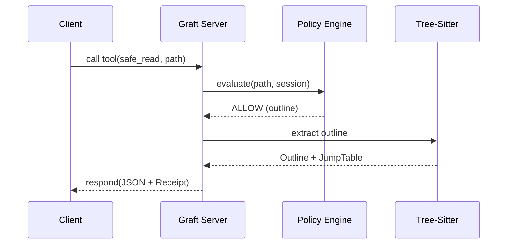

# MCP

Graft is a high-fidelity tool provider for the Model Context Protocol (MCP).



## Startup

### Stdio MCP
```bash
npx @flyingrobots/graft serve
```

### Local Daemon
```bash
npx @flyingrobots/graft daemon
```

## Key Tool Groups
- **Bounded Reads**: `safe_read`, `file_outline`, `read_range`, `changed_since`
- **Structural History**: `graft_diff`, `graft_since`, `graft_map`
- **Precision**: `code_show`, `code_find`, `code_refs`
- **Activity & Footing**: `activity_view`, `causal_status`, `causal_attach`, `doctor`
- **Daemon Control Plane**: `daemon_status`, `daemon_repos`, `daemon_sessions`, `monitor_*`

## Current Truth
- MCP is the primary agent surface.
- Responses carry versioned `_schema` metadata and `_receipt` decision data.
- `activity_view` provides bounded local `artifact_history` anchored to Git `HEAD`.

## Related docs
- [README](../README.md)
- [Setup Guide](./SETUP.md)
- [CLI Guide](./CLI.md)
- [Advanced Guide](./ADVANCED_GUIDE.md)
- [Architecture](../ARCHITECTURE.md)
