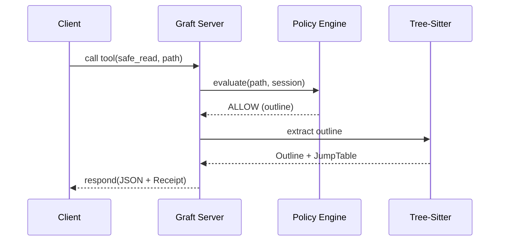

# MCP

Graft is a high-fidelity tool provider for the Model Context Protocol (MCP).


```mermaid
sequenceDiagram
    participant Client
    participant Server as Graft Server
    participant Policy as Policy Engine
    participant Parser as Tree-Sitter
    Client->>Server: call tool(safe_read, path)
    Server->>Policy: evaluate(path, session)
    Policy-->>Server: ALLOW (outline)
    Server->>Parser: extract outline
    Parser-->>Server: Outline + JumpTable
    Server-->>Client: respond(JSON + Receipt)
```

## Startup

### Repo-local stdio MCP
```bash
npx @flyingrobots/graft serve
```

This is the default repo-local MCP posture. The current checkout is the
active workspace, so there is no separate daemon authorization or
binding step.

### Daemon-backed stdio MCP
```bash
npx @flyingrobots/graft serve --runtime daemon
```

This keeps compatibility with MCP clients that can launch only a stdio
command while routing MCP traffic to the local daemon `/mcp` surface.
The bridge auto-starts the daemon when it is missing, waits for
`/healthz`, then proxies stdio traffic to the daemon. Use
`--no-autostart` to require an already-running daemon:

```bash
npx @flyingrobots/graft serve --runtime daemon --no-autostart
```

Daemon-backed sessions start unbound. Repository-scoped tools fail
until the session is authorized and bound through the workspace control
plane.

### Local Daemon
```bash
npx @flyingrobots/graft daemon
```

Daemon sessions start `unbound`. Once a client is connected to the
daemon MCP surface, repository-scoped work normally follows this
agent-facing flow:

1. `workspace_open` with the target `cwd`
2. optionally `workspace_list_opened` to inspect opened paths and the
   active workspace
3. then call repository-scoped tools such as `safe_read`, `graft_since`,
   or `code_show`

For concurrent multi-repo use inside one daemon-backed MCP session,
repo tools that support routing also accept `cwd`: `safe_read`,
`file_outline`, `read_range`, `changed_since`, `graft_diff`,
`graft_since`, `graft_map`, `code_show`, `code_find`, and `code_refs`.
That `cwd` is resolved server-side as a per-call route and does not
mutate the active workspace.

`workspace_authorize` and `workspace_bind` remain available as lower-level
daemon control-plane tools.

## Key Tool Groups
- **Bounded Reads**: `safe_read`, `file_outline`, `read_range`, `changed_since`
- **Governed Edits**: `graft_edit`
- **Structural History**: `graft_diff`, `graft_since`, `graft_map`,
  `graft_review`, `graft_test_coverage`, `graft_dead_symbols`
- **Structural Metrics**: `graft_churn`, `graft_difficulty`
- **Precision**: `code_show`, `code_find`, `code_refs`
- **Activity & Footing**: `activity_view`, `causal_status`, `causal_attach`, `doctor`
- **Workspace Routing**: `workspace_open`, `workspace_list_opened`, `workspace_status`
- **Daemon Control Plane**: `workspace_authorizations`, `workspace_authorize`, `workspace_bind`, `workspace_rebind`, `workspace_revoke`, `daemon_status`, `daemon_repos`, `daemon_sessions`, `daemon_monitors`, `monitor_*`

## Current Truth
- MCP is the primary agent surface.
- `graft serve` is repo-local stdio; `graft serve --runtime daemon` is
  the daemon-backed stdio bridge.
- MCP responses carry version-2 `_schema` metadata and a compact `_receipt` by
  default. Every tool accepts the common optional input
  `receipt: "compact" | "full"`; use `"full"` only when the complete audit and
  cumulative-accounting envelope is required.
- Compact receipts contain only `mode`, `receiptId`, `seq`, `reason`,
  `latencyMs`, and the exact encoded `returnedBytes`. The `receiptId` correlates
  with the runtime-observability log; it is not a fetch handle. `stats` is the
  explicit cumulative-counter surface.
- Tripwire warnings remain top-level response data in both receipt modes.
- CLI peer commands intentionally request full MCP receipts and project them
  into their unchanged version-1 CLI JSON contracts.
- `doctor` and `activity_view` default to strict summary responses. Each default
  response, including its compact receipt, is bounded below 2 KiB. Pass
  `detail: "full"` on the original MCP call for the exhaustive diagnostic view.
- The doctor summary reports overall evidence posture, active workspace
  identity, structural- and local-history readiness, named `degradedReasons`,
  and one recommended next action. `unknown` readiness remains unknown; it is
  not silently promoted to ready. Consequently, `health: "degraded"` can mean
  that evidence is incomplete, not that the runtime itself failed.
- A requested doctor sludge scan is an explicit exhaustive diagnostic and
  therefore returns full detail even if `detail: "summary"` is also supplied.
- The activity summary preserves its Git anchor, matching-item counts,
  truncation truth, group counts, evidence gaps, and whether item detail is
  available, but omits `activeCausalWorkspace` and individual event bodies.
  Long refs and narrative fields are bounded; `anchor.headRefTruncated` is true
  when the summary abbreviates a ref, while the exact commit SHA remains
  present. Use `detail: "full"` to retrieve complete refs and activity items.
- CLI doctor and activity peers explicitly request full detail as well as full
  receipts, preserving their existing human rendering and version-1 JSON
  contracts while MCP remains summary-first.

## Related docs
- [README](../README.md)
- [Setup Guide](./SETUP.md)
- [CLI Guide](./CLI.md)
- [Advanced Guide](./ADVANCED_GUIDE.md)
- [Architecture](../ARCHITECTURE.md)
- [Security Model](./strategy/security-model.md)
- [Causal Provenance](./strategy/causal-provenance.md)
