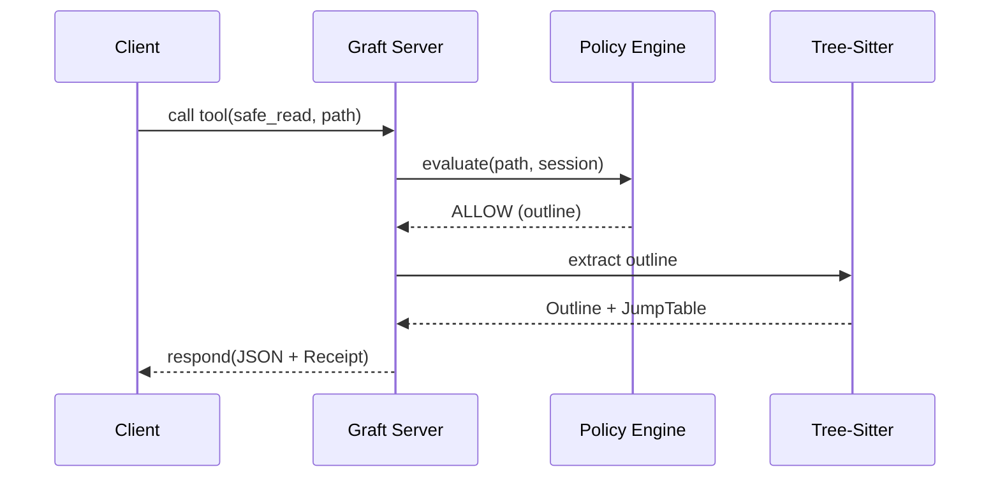

# MCP

Graft is a high-fidelity tool provider for the Model Context Protocol (MCP).


```mermaid
sequenceDiagram
    participant Client
    participant Server as Graft Server
    participant Policy as Policy Engine
    participant Parser as Tree-Sitter
    Client->>Server: call tool(safe_read, path)
    Server->>Policy: evaluate(path, session)
    Policy-->>Server: ALLOW (outline)
    Server->>Parser: extract outline
    Parser-->>Server: Outline + JumpTable
    Server-->>Client: respond(JSON + Receipt)
```

## Startup

### Repo-local stdio MCP

```bash
npx @flyingrobots/graft serve
```

This is the default repo-local MCP posture. The current checkout is the
active workspace, so there is no separate daemon authorization or
binding step.

### Daemon-backed stdio MCP

```bash
npx @flyingrobots/graft serve --runtime daemon
```

This keeps compatibility with MCP clients that can launch only a stdio
command while routing MCP traffic to the local daemon `/mcp` surface.
The bridge auto-starts the daemon when it is missing, waits for
`/healthz`, then proxies stdio traffic to the daemon. Use
`--no-autostart` to require an already-running daemon:

```bash
npx @flyingrobots/graft serve --runtime daemon --no-autostart
```

Daemon-backed sessions start unbound. A routed repository tool with an explicit
`cwd` opens and uses that exact Git worktree on its first call. A repository
tool without `cwd` still requires an active workspace binding.

### Local Daemon

```bash
npx @flyingrobots/graft daemon
```

Daemon sessions start `unbound`. Once a client is connected to the daemon MCP
surface, the shortest agent-facing flow is:

1. call a routed repository tool such as `safe_read` with an explicit `cwd`
   anywhere inside the target Git worktree
2. let Graft resolve and open the canonical containing worktree with the
   default daemon capability profile
3. optionally call `workspace_list_opened` to inspect the opened paths; the
   routed call does not activate or rebind the session

For concurrent multi-repo use inside one daemon-backed MCP session,
repo tools that support routing also accept `cwd`: `safe_read`,
`file_outline`, `read_range`, `changed_since`, `graft_diff`,
`graft_since`, `graft_map`, `code_show`, `code_find`, and `code_refs`.
That `cwd` is resolved server-side as a per-call route and does not
mutate the active workspace.

Workspace precedence is fail-closed: a non-empty explicit `cwd` is resolved
first and opens only the exact containing Git worktree. Graft never substitutes
the active session workspace or a daemon default when that resolution fails.
When `cwd` is omitted, the active session binding remains the workspace
authority. A non-Git path still fails with its typed resolution error.
Routed responses expose the resulting evidence twice for auditability:
`_workspace` on the response and `_receipt.workspace` in the receipt contain
the absolute `requestedRoot`, canonical `resolvedRoot`, `repoId`, and
`worktreeId`. Optional identity hints on bind/rebind are consistency checks;
they must match the Git-resolved identity and never override it. Because those
fields expand strict machine-readable outputs, previously-version-1 routed MCP
tools and their direct CLI peers advertise output schema version `2.0.0`.
`file_outline` and `read_outline`, which already used version `2.0.0`, advance
to `3.0.0`.

`workspace_authorize` and `workspace_bind` remain available as lower-level
daemon control-plane tools. Use `workspace_open` when the caller wants to
activate a worktree or configure capabilities such as `runCapture`; automatic
opening always uses the default profile and does not activate the worktree.

WARP graph persistence is separate from the source repository. Graft creates
private bare sidecars under
`~/.graft/graphs/<project>/<worktree>/<actor>/warp.git`, with deterministic
identity suffixes on the readable path components. Repository, worktree, and
actor identity all participate in the key, so linked worktrees and independent
sessions cannot receive the same working graph.

## Key Tool Groups

- **Bounded Reads**: `safe_read`, `file_outline`, `read_range`, `changed_since`
- **Governed Edits**: `graft_edit`
- **Structural History**: `graft_diff`, `graft_since`, `graft_map`,
  `graft_review`, `graft_import_diagnostics`, `graft_test_coverage`,
  `graft_dead_symbols`
- **Structural Metrics**: `graft_churn`, `graft_difficulty`
- **Precision**: `code_show`, `code_find`, `code_refs`
- **Activity & Footing**: `activity_view`, `causal_status`, `causal_attach`, `doctor`
- **Workspace Routing**: `workspace_open`, `workspace_list_opened`, `workspace_status`
- **Daemon Control Plane**: `workspace_authorizations`, `workspace_authorize`, `workspace_bind`, `workspace_rebind`, `workspace_revoke`, `daemon_status`, `daemon_repos`, `daemon_sessions`, `daemon_monitors`, `monitor_*`

## Current Truth

- MCP is the primary agent surface.
- `graft serve` is repo-local stdio; `graft serve --runtime daemon` is
  the daemon-backed stdio bridge.
- Responses carry versioned `_schema` metadata and `_receipt` decision data.
- `activity_view` provides bounded local `artifact_history` anchored to Git `HEAD`.

## Related docs

- [README](../README.md)
- [Setup Guide](./SETUP.md)
- [CLI Guide](./CLI.md)
- [Advanced Guide](../ADVANCED_GUIDE.md)
- [Architecture](../ARCHITECTURE.md)
- [Security Model](./strategy/security-model.md)
- [Causal Provenance](./strategy/causal-provenance.md)
