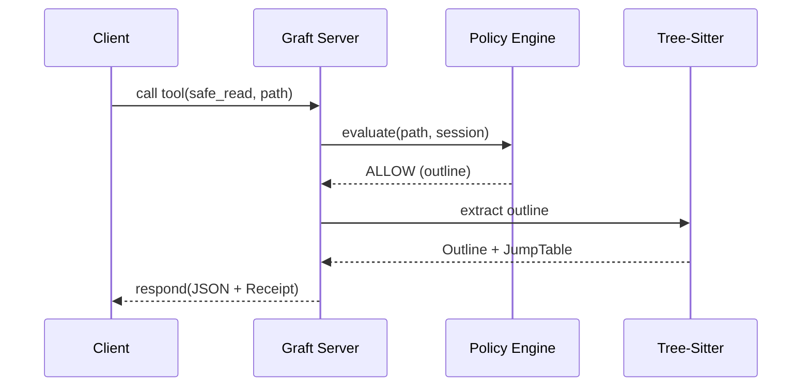

# MCP

Graft is a high-fidelity tool provider for the Model Context Protocol (MCP).


```mermaid
sequenceDiagram
    participant Client
    participant Server as Graft Server
    participant Policy as Policy Engine
    participant Parser as Tree-Sitter
    Client->>Server: call tool(safe_read, path)
    Server->>Policy: evaluate(path, session)
    Policy-->>Server: ALLOW (outline)
    Server->>Parser: extract outline
    Parser-->>Server: Outline + JumpTable
    Server-->>Client: respond(JSON + Receipt)
```

## Startup

### Repo-local stdio MCP
```bash
npx @flyingrobots/graft serve
```

This is the default repo-local MCP posture. The current checkout is the
active workspace, so there is no separate daemon authorization or
binding step.

### Daemon-backed stdio MCP
```bash
npx @flyingrobots/graft serve --runtime daemon
```

This keeps compatibility with MCP clients that can launch only a stdio
command while routing MCP traffic to the local daemon `/mcp` surface.
The bridge auto-starts the daemon when it is missing, waits for
`/healthz`, then proxies stdio traffic to the daemon. Use
`--no-autostart` to require an already-running daemon:

```bash
npx @flyingrobots/graft serve --runtime daemon --no-autostart
```

Daemon-backed sessions start unbound. Repository-scoped tools fail
until the session is authorized and bound through the workspace control
plane.

### Local Daemon
```bash
npx @flyingrobots/graft daemon
```

Daemon sessions start `unbound`. Once a client is connected to the
daemon MCP surface, repository-scoped work normally follows this
agent-facing flow:

1. `workspace_open` with the target `cwd`
2. optionally `workspace_list_opened` to inspect opened paths and the
   active workspace
3. then call repository-scoped tools such as `safe_read`, `graft_since`,
   or `code_show`

### WARP resident ownership

The daemon's `WarpResidentPool` application port exposes only owned
acquisition of logical `(repoId, writerId)` residents. Every successful
acquisition returns a unique, idempotently releasable capability, including
two acquisitions with the same owner metadata. The port has no ordinary raw
lookup, holder-ID release, sweep, or force-eviction operation.

The shared daemon pool retains at most **four handles** by default, including
opens in progress. Set `GRAFT_WARP_MAX_RESIDENTS` to an integer from 1 through
64 in the daemon's launch environment to change that limit. Invalid explicit
values reject construction before workers start. Repo-local MCP servers apply
the same default to their own pool. This is a handle bound for each pool, not
a byte budget for the whole daemon or its worker processes.

Operations in flight pin handles. Final release makes an entry idle and updates
its recency. A miss evicts the least recently used idle entry; if all slots are
pinned, the acquisition fails with `WarpResidentCapacityError` (internal code
`WARP_RESIDENT_CAPACITY`) without opening another graph. The existing tool
error surface reports the failure. Retry after another operation settles.
An optional graph-backed history observation can retain its existing
unavailable-evidence fallback. Pool consumers can select `maxIdleResidents: 0`
for eager eviction instead of warm reuse.

Current and opened workspace bindings retain routing metadata without graph
leases. Bound repository invocations own their captured route's capability
through handler, attribution, and failure settlement; scheduler admission
remains daemon-only. Binding setup and history operations outside an invocation
use temporary capabilities released in `finally`. A cross-repository rebind
parks the previous workspace and releases its lease before acquiring the
current graph, so its own lease scopes work with a single slot.
Session retirement and
rebind cannot revoke a capability still owned by an admitted invocation.

Eviction removes reconstructible process state without deleting source files,
Git objects, index records, authorization, or workspace membership. The next
acquisition reconstructs the graph through its resolved worktree root. An idle
entry whose construction root has changed is reopened through that new root.
Release makes memory eligible for collection; it does not promise an immediate
RSS decrease. Recency describes handle use, not current-source validation.

`/healthz` and `daemon_status` retain `activeWarpRepos` for unique repositories
and `activeWarpResidents` for logical writer-lane slots. Despite the existing
`active` field names, these counts include idle entries and opening
reservations. Inspecting these counts does not refresh cache recency. Detailed
owner inventory and source freshness evidence are separate capabilities.

For concurrent multi-repo use inside one daemon-backed MCP session,
repo tools that support routing also accept `cwd`: `safe_read`,
`file_outline`, `read_range`, `changed_since`, `graft_diff`,
`graft_since`, `graft_map`, `code_show`, `code_find`, and `code_refs`.
That `cwd` is resolved server-side as a per-call route and does not
mutate the active workspace.

Workspace precedence is fail-closed: a non-empty explicit `cwd` is resolved
first and must name an authorized Git worktree; Graft never substitutes the
active session workspace or a daemon default when that resolution fails. When
`cwd` is omitted, the active session binding remains the workspace authority.
Routed responses expose the resulting evidence twice for auditability:
`_workspace` on the response and `_receipt.workspace` in the receipt contain
the absolute `requestedRoot`, canonical `resolvedRoot`, `repoId`, and
`worktreeId`. Optional identity hints on bind/rebind are consistency checks;
they must match the Git-resolved identity and never override it. Because those
fields expand strict machine-readable outputs, previously-version-1 routed MCP
tools and their direct CLI peers advertise output schema version `2.0.0`.
`file_outline` and `read_outline`, which already used version `2.0.0`, advance
to `3.0.0`.

`workspace_authorize` and `workspace_bind` remain available as lower-level
daemon control-plane tools.

## Key Tool Groups
- **Bounded Reads**: `safe_read`, `file_outline`, `read_range`, `changed_since`
- **Governed Edits**: `graft_edit`
- **Structural History**: `graft_diff`, `graft_since`, `graft_map`,
  `graft_review`, `graft_import_diagnostics`, `graft_test_coverage`,
  `graft_dead_symbols`
- **Structural Metrics**: `graft_churn`, `graft_difficulty`
- **Precision**: `code_show`, `code_find`, `code_refs`
- **Activity & Footing**: `activity_view`, `causal_status`, `causal_attach`, `doctor`
- **Workspace Routing**: `workspace_open`, `workspace_list_opened`, `workspace_status`
- **Daemon Control Plane**: `workspace_authorizations`, `workspace_authorize`, `workspace_bind`, `workspace_rebind`, `workspace_revoke`, `daemon_status`, `daemon_repos`, `daemon_sessions`, `daemon_monitors`, `monitor_*`

## Current Truth
- MCP is the primary agent surface.
- `graft serve` is repo-local stdio; `graft serve --runtime daemon` is
  the daemon-backed stdio bridge.
- Responses carry versioned `_schema` metadata and `_receipt` decision data.
- `activity_view` provides bounded local `artifact_history` anchored to Git `HEAD`.

## Related docs
- [README](../README.md)
- [Setup Guide](./SETUP.md)
- [CLI Guide](./CLI.md)
- [Advanced Guide](./ADVANCED_GUIDE.md)
- [Architecture](../ARCHITECTURE.md)
- [Security Model](./strategy/security-model.md)
- [Causal Provenance](./strategy/causal-provenance.md)

### Daemon status schema in v0.14.0

`graft.mcp.daemon_status` advertises schema `2.0.0` for its strict output shape,
including required `activeWarpResidents`. Consumers selecting validators by
`_schema.version` must use v2. The text `graft daemon status` command has no
separately registered JSON schema and retains its `ok | degraded` projection.
