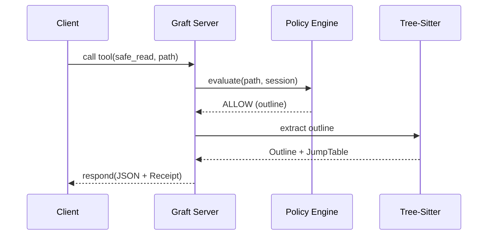

# MCP

Graft is a high-fidelity tool provider for the Model Context Protocol (MCP).


```mermaid
sequenceDiagram
    participant Client
    participant Server as Graft Server
    participant Policy as Policy Engine
    participant Parser as Tree-Sitter
    Client->>Server: call tool(safe_read, path)
    Server->>Policy: evaluate(path, session)
    Policy-->>Server: ALLOW (outline)
    Server->>Parser: extract outline
    Parser-->>Server: Outline + JumpTable
    Server-->>Client: respond(JSON + Receipt)
```

## Startup

### Repo-local stdio MCP
```bash
npx @flyingrobots/graft serve
```

This is the default repo-local MCP posture. The current checkout is the
active workspace, so there is no separate daemon authorization or
binding step.

### Daemon-backed stdio MCP
```bash
npx @flyingrobots/graft serve --runtime daemon
```

This keeps compatibility with MCP clients that can launch only a stdio
command while routing MCP traffic to the local daemon `/mcp` surface.
The bridge auto-starts the daemon when it is missing, waits for
`/healthz`, then proxies stdio traffic to the daemon. Use
`--no-autostart` to require an already-running daemon:

```bash
npx @flyingrobots/graft serve --runtime daemon --no-autostart
```

Daemon-backed sessions start unbound. Repository-scoped tools fail
until the session is authorized and bound through the workspace control
plane.

### Local Daemon
```bash
npx @flyingrobots/graft daemon
```

Daemon sessions start `unbound`. Once a client is connected to the
daemon MCP surface, repository-scoped work normally follows this
agent-facing flow:

1. `workspace_open` with the target `cwd`
2. optionally `workspace_list_opened` to inspect opened paths and the
   active workspace
3. then call repository-scoped tools such as `safe_read`, `graft_since`,
   or `code_show`

### WARP resident ownership

The daemon's `WarpResidentPool` application port exposes only owned
acquisition of logical `(repoId, writerId)` residents. Every successful
acquisition returns a unique, idempotently releasable capability, including
two acquisitions with the same owner metadata. The port has no ordinary raw
lookup, holder-ID release, sweep, or force-eviction operation.

Releasing a resident's final capability immediately drops that writer lane's
in-process strong reference. A leased sibling writer lane in the same
repository remains independent. A later acquisition reconstructs the dropped
resident from durable Git-backed WARP state.

Ownership follows the work that can still use the resident:

- current and routed workspace bindings own separate lazy capabilities after
  their first WARP-backed use;
- every bound daemon repository invocation owns a distinct capability until
  settlement, whether or not that tool enters the daemon scheduler; and
- internally captured read-attribution contexts release their own capability
  locally.

Rebind, routed-cache replacement, authorization rejection, session
close/error, and daemon shutdown dispose only their exact binding
capabilities. An admitted invocation therefore keeps its resident alive even
when the binding that admitted it is removed. Failed opens and failed binding
initialization roll back their unpublished capabilities. Shutdown fences new
session admission, drains already admitted initialization, and retires every
published session through the same idempotent owner.

`/healthz` and `daemon_status` report `activeWarpRepos` as the unique
repository count and `activeWarpResidents` as the logical writer-lane resident
count. These are aggregate shared-pool counts, not a resident-owner inventory
and not measurements of unrelated daemon memory.

For concurrent multi-repo use inside one daemon-backed MCP session,
repo tools that support routing also accept `cwd`: `safe_read`,
`file_outline`, `read_range`, `changed_since`, `graft_diff`,
`graft_since`, `graft_map`, `code_show`, `code_find`, and `code_refs`.
That `cwd` is resolved server-side as a per-call route and does not
mutate the active workspace.

Workspace precedence is fail-closed: a non-empty explicit `cwd` is resolved
first and must name an authorized Git worktree; Graft never substitutes the
active session workspace or a daemon default when that resolution fails. When
`cwd` is omitted, the active session binding remains the workspace authority.
Routed responses expose the resulting evidence twice for auditability:
`_workspace` on the response and `_receipt.workspace` in the receipt contain
the absolute `requestedRoot`, canonical `resolvedRoot`, `repoId`, and
`worktreeId`. Optional identity hints on bind/rebind are consistency checks;
they must match the Git-resolved identity and never override it. Because those
fields expand strict machine-readable outputs, previously-version-1 routed MCP
tools and their direct CLI peers advertise output schema version `2.0.0`.
`file_outline` and `read_outline`, which already used version `2.0.0`, advance
to `3.0.0`.

`workspace_authorize` and `workspace_bind` remain available as lower-level
daemon control-plane tools.

## Key Tool Groups
- **Bounded Reads**: `safe_read`, `file_outline`, `read_range`, `changed_since`
- **Governed Edits**: `graft_edit`
- **Structural History**: `graft_diff`, `graft_since`, `graft_map`,
  `graft_review`, `graft_import_diagnostics`, `graft_test_coverage`,
  `graft_dead_symbols`
- **Structural Metrics**: `graft_churn`, `graft_difficulty`
- **Precision**: `code_show`, `code_find`, `code_refs`
- **Activity & Footing**: `activity_view`, `causal_status`, `causal_attach`, `doctor`
- **Workspace Routing**: `workspace_open`, `workspace_list_opened`, `workspace_status`
- **Daemon Control Plane**: `workspace_authorizations`, `workspace_authorize`, `workspace_bind`, `workspace_rebind`, `workspace_revoke`, `daemon_status`, `daemon_repos`, `daemon_sessions`, `daemon_monitors`, `monitor_*`

## Current Truth
- MCP is the primary agent surface.
- `graft serve` is repo-local stdio; `graft serve --runtime daemon` is
  the daemon-backed stdio bridge.
- Responses carry versioned `_schema` metadata and `_receipt` decision data.
- `activity_view` provides bounded local `artifact_history` anchored to Git `HEAD`.

## Related docs
- [README](../README.md)
- [Setup Guide](./SETUP.md)
- [CLI Guide](./CLI.md)
- [Advanced Guide](./ADVANCED_GUIDE.md)
- [Architecture](../ARCHITECTURE.md)
- [Security Model](./strategy/security-model.md)
- [Causal Provenance](./strategy/causal-provenance.md)
