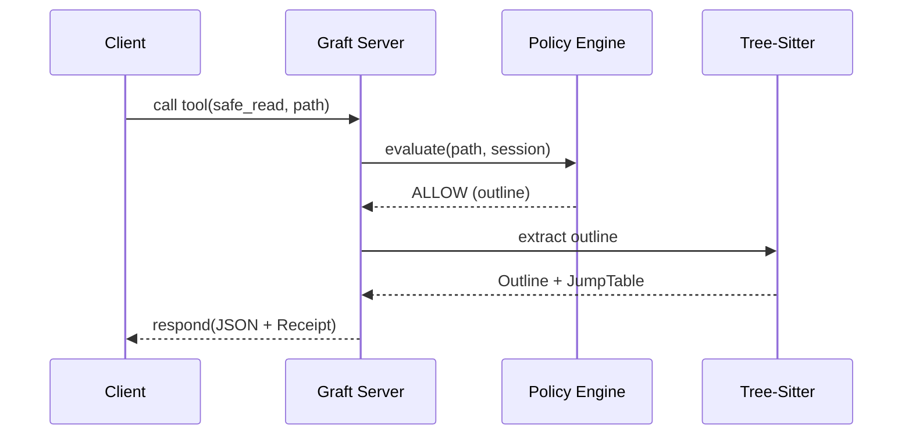

# MCP

Graft is a high-fidelity tool provider for the Model Context Protocol (MCP).


```mermaid
sequenceDiagram
    participant Client
    participant Server as Graft Server
    participant Policy as Policy Engine
    participant Parser as Tree-Sitter
    Client->>Server: call tool(safe_read, path)
    Server->>Policy: evaluate(path, session)
    Policy-->>Server: ALLOW (outline)
    Server->>Parser: extract outline
    Parser-->>Server: Outline + JumpTable
    Server-->>Client: respond(JSON + Receipt)
```

## Startup

### Repo-local stdio MCP
```bash
npx @flyingrobots/graft serve
```

This is the default repo-local MCP posture. The current checkout is the
active workspace, so there is no separate daemon authorization or
binding step.

### Daemon-backed stdio MCP
```bash
npx @flyingrobots/graft serve --runtime daemon
```

This keeps compatibility with MCP clients that can launch only a stdio
command while routing MCP traffic to the local daemon `/mcp` surface.
The bridge auto-starts the daemon when it is missing, waits for
`/healthz`, then proxies stdio traffic to the daemon. Use
`--no-autostart` to require an already-running daemon:

```bash
npx @flyingrobots/graft serve --runtime daemon --no-autostart
```

Daemon-backed sessions start unbound. Repository-scoped tools fail
until the session is authorized and bound through the workspace control
plane.

### Local Daemon
```bash
npx @flyingrobots/graft daemon
```

Daemon sessions start `unbound`. Once a client is connected to the
daemon MCP surface, repository-scoped work normally follows this
agent-facing flow:

1. `workspace_open` with the target `cwd`
2. optionally `workspace_list_opened` to inspect opened paths and the
   active workspace
3. then call repository-scoped tools such as `safe_read`, `graft_since`,
   or `code_show`

### Session lifecycle and abandoned-session cleanup

`DaemonSessionHost` bounds state retained by abandoned MCP sessions. This
lifecycle does not claim to bound every daemon cache or working set.

- **Idle eligibility** uses process-local monotonic elapsed time, never civil
  wall time. The default inactivity TTL is 30 minutes and the default scheduled
  sweep interval is 60 seconds.
- **Active request ownership** starts for an existing session before POST body
  parsing and lasts through handler settlement. Concurrent requests hold
  independent references; a session with any active reference is not idle.
- **Terminal cleanup** is one idempotent transition shared by idle expiry,
  transport close/error, explicit disconnect, and daemon shutdown. Every cause
  revokes the session's map and `DaemonControlPlane` registration and removes
  `<graftDir>/sessions/<sessionId>`. Idle expiry, transport error, and daemon
  shutdown ask the connected MCP protocol server to close and fall back to the
  HTTP transport when protocol close fails. When the transport's own close
  callback initiates termination, including explicit DELETE, the transport is
  already closed, so the transition skips duplicate protocol/transport close.
  There is no separate `GraftServer.close()` operation.
- **Explicit disconnect** is available through `DELETE /mcp` with the exact
  `mcp-session-id`.
- **Crash and cleanup recovery** begins only after the daemon has exclusive
  ownership of its configured root. Startup removes eligible prior-process
  session directories; every later sweep also retries eligible current-process
  orphans. Unknown files, links, malformed ownership records, and unsafe paths
  are preserved. A daemon using a custom endpoint never deletes an unmarked
  legacy UUID directory; only the default endpoint may perform that migration
  cleanup. The default endpoint is already bound, but returns HTTP 503, before
  that cleanup starts, so a legacy daemon cannot create live scratch inside the
  startup scan window.

The required programmatic sweep method,
`GraftDaemonServer.reapExpiredSessions()`, returns separate facts:

```text
SessionSweepResult
  sessionsRetired
  liveDirectoriesRemoved
  orphanDirectoriesRemoved
  cleanupFailures[]
    code
    sessionId | null
    path | null
    retryable
    message
  preservedEntries[]
    entryName
    path
    reason
  sweepFailure | null
```

Retiring a session does not imply that its directory was removed. Filesystem
and orphan-scan failures are marked retryable only when a later sweep executes
that operation again. Protocol and fallback transport-close failures are
reported separately as non-retryable. An invalid or regressing injected clock
refuses the whole sweep with `MONOTONIC_CLOCK_INVALID`, reports zero retired
sessions, and leaves the previous accepted elapsed-time sample unchanged.
Scheduled sweeps emit structured diagnostics for refused sweeps and cleanup
failures. Preserved unknown, malformed, non-directory, or link entries are also
reported with stable reason codes without touching their targets.

For concurrent multi-repo use inside one daemon-backed MCP session,
repo tools that support routing also accept `cwd`: `safe_read`,
`file_outline`, `read_range`, `changed_since`, `graft_diff`,
`graft_since`, `graft_map`, `code_show`, `code_find`, and `code_refs`.
That `cwd` is resolved server-side as a per-call route and does not
mutate the active workspace.

Workspace precedence is fail-closed: a non-empty explicit `cwd` is resolved
first and must name an authorized Git worktree; Graft never substitutes the
active session workspace or a daemon default when that resolution fails. When
`cwd` is omitted, the active session binding remains the workspace authority.
Routed responses expose the resulting evidence twice for auditability:
`_workspace` on the response and `_receipt.workspace` in the receipt contain
the absolute `requestedRoot`, canonical `resolvedRoot`, `repoId`, and
`worktreeId`. Optional identity hints on bind/rebind are consistency checks;
they must match the Git-resolved identity and never override it. Because those
fields expand strict machine-readable outputs, previously-version-1 routed MCP
tools and their direct CLI peers advertise output schema version `2.0.0`.
`file_outline` and `read_outline`, which already used version `2.0.0`, advance
to `3.0.0`.

`workspace_authorize` and `workspace_bind` remain available as lower-level
daemon control-plane tools.

## Key Tool Groups
- **Bounded Reads**: `safe_read`, `file_outline`, `read_range`, `changed_since`
- **Governed Edits**: `graft_edit`
- **Structural History**: `graft_diff`, `graft_since`, `graft_map`,
  `graft_review`, `graft_import_diagnostics`, `graft_test_coverage`,
  `graft_dead_symbols`
- **Structural Metrics**: `graft_churn`, `graft_difficulty`
- **Precision**: `code_show`, `code_find`, `code_refs`
- **Activity & Footing**: `activity_view`, `causal_status`, `causal_attach`, `doctor`
- **Workspace Routing**: `workspace_open`, `workspace_list_opened`, `workspace_status`
- **Daemon Control Plane**: `workspace_authorizations`, `workspace_authorize`, `workspace_bind`, `workspace_rebind`, `workspace_revoke`, `daemon_status`, `daemon_repos`, `daemon_sessions`, `daemon_monitors`, `monitor_*`

## Current Truth
- MCP is the primary agent surface.
- `graft serve` is repo-local stdio; `graft serve --runtime daemon` is
  the daemon-backed stdio bridge.
- Responses carry versioned `_schema` metadata and `_receipt` decision data.
- `activity_view` provides bounded local `artifact_history` anchored to Git `HEAD`.

## Related docs
- [README](../README.md)
- [Setup Guide](./SETUP.md)
- [CLI Guide](./CLI.md)
- [Advanced Guide](./ADVANCED_GUIDE.md)
- [Architecture](../ARCHITECTURE.md)
- [Security Model](./strategy/security-model.md)
- [Causal Provenance](./strategy/causal-provenance.md)
