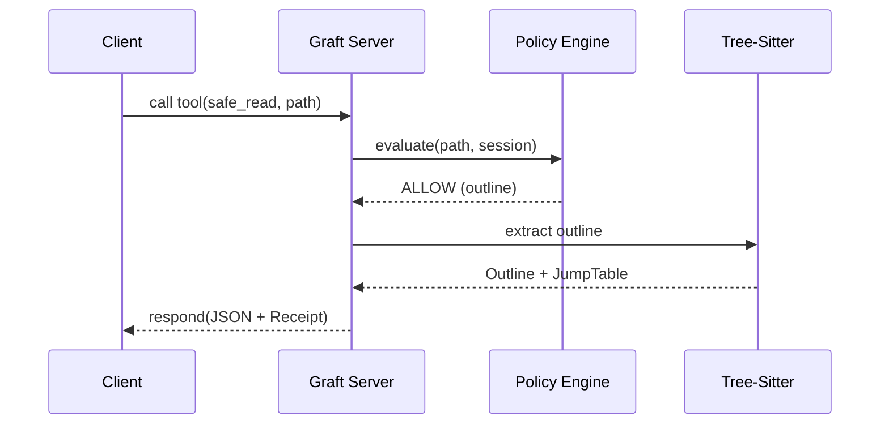

# MCP

Graft is a high-fidelity tool provider for the Model Context Protocol (MCP).


```mermaid
sequenceDiagram
    participant Client
    participant Server as Graft Server
    participant Policy as Policy Engine
    participant Parser as Tree-Sitter
    Client->>Server: call tool(safe_read, path)
    Server->>Policy: evaluate(path, session)
    Policy-->>Server: ALLOW (outline)
    Server->>Parser: extract outline
    Parser-->>Server: Outline + JumpTable
    Server-->>Client: respond(JSON + Receipt)
```

## Startup

### Repo-local stdio MCP

```bash
npx @flyingrobots/graft serve
```

This is the default repo-local MCP posture. The current checkout is the
active workspace, so there is no separate daemon authorization or
binding step.

### Daemon-backed stdio MCP

```bash
npx @flyingrobots/graft serve --runtime daemon
```

This keeps compatibility with MCP clients that can launch only a stdio
command while routing MCP traffic to the local daemon `/mcp` surface.
The bridge auto-starts the daemon when it is missing, waits for
`/healthz`, then proxies stdio traffic to the daemon. Use
`--no-autostart` to require an already-running daemon:

```bash
npx @flyingrobots/graft serve --runtime daemon --no-autostart
```

Daemon-backed sessions start unbound. A routed repository tool with an explicit
`cwd` opens and uses that exact Git worktree on its first call. A repository
tool without `cwd` still requires an active workspace binding.

### Local Daemon

```bash
npx @flyingrobots/graft daemon
```

The daemon keeps its per-user state under the Graft root, `~/.graft` by
default, in `daemon/` (on Unix its socket is `daemon/mcp.sock`). Set
`GRAFT_ROOT_PATH` to an absolute path to move the Graft root; a relative value
is refused. On Windows the value must start with a drive (`C:\`) or a UNC share
(`\\server\share`); `\graft` is refused, because its drive depends on the
process that reads it. Graft reads the home directory only to find that default, so
changing `GRAFT_ROOT_PATH` never requires changing `HOME`. On Windows the named
pipe keeps its previous name while `GRAFT_ROOT_PATH` is unset, and each
configured root gets its own pipe; spellings of one root that differ only in
ASCII letter case or separators share it.

Daemon sessions start `unbound`. Once a client is connected to the daemon MCP
surface, the shortest agent-facing flow is:

1. call a routed repository tool such as `safe_read` with an explicit `cwd`
   anywhere inside the target Git worktree
2. let Graft resolve and open the canonical containing worktree with the
   default daemon capability profile
3. optionally call `workspace_list_opened` to inspect the opened paths; the
   routed call does not activate or rebind the session

### Session lifecycle and abandoned-session cleanup

`DaemonSessionHost` bounds state retained by abandoned MCP sessions. This
lifecycle does not claim to bound every daemon cache or working set.

- **Idle eligibility** uses process-local monotonic elapsed time, never civil
  wall time. The default inactivity TTL is 30 minutes and the default scheduled
  sweep interval is 60 seconds.
- **Active request ownership** starts for an existing session before POST body
  parsing and lasts through handler settlement. Concurrent requests hold
  independent references; a session with any active reference is not idle.
- **Terminal cleanup** is one idempotent transition shared by idle expiry,
  transport close/error, explicit disconnect, and daemon shutdown. Every cause
  revokes the session's map and `DaemonControlPlane` registration, releases the
  session's WARP resident leases, and removes
  `<graftDir>/sessions/<sessionId>`. A new session whose initial request
  handling rejects is retired through the same transition. Idle expiry, transport error, and daemon
  shutdown ask the connected MCP protocol server to close and fall back to the
  HTTP transport when protocol close fails. When the transport's own close
  callback initiates termination, including explicit DELETE, the transport is
  already closed, so the transition skips duplicate protocol/transport close.
  Shutdown awaits active sweeps and transport-triggered terminations, but a
  sweep-owned termination contributes its cleanup result only through that
  sweep. There is no separate `GraftServer.close()` operation.
- **Explicit disconnect** is available through `DELETE /mcp` with the exact
  `mcp-session-id`.
- **Crash and cleanup recovery** begins only after the daemon has exclusive
  ownership of its configured root. Startup removes eligible prior-process
  session directories; every later sweep also retries eligible current-process
  orphans. A prior-process directory that startup cannot inspect or remove does
  not refuse startup: it is logged as `DAEMON_STARTUP_SESSION_CLEANUP_DEFERRED`
  with structured cleanup failures and remains debt for the next sweep. Unknown files, links, malformed ownership records, and unsafe paths
  are preserved. A daemon using a custom endpoint never deletes an unmarked
  legacy UUID directory; only the default endpoint may perform that migration
  cleanup. The default endpoint is already bound, but returns HTTP 503, before
  that cleanup starts, so a legacy daemon cannot create live scratch inside the
  startup scan window. Orphan discovery pins the original sessions-root handle
  and refuses the scan if the root's device/inode identity changes during
  enumeration, candidate inspection, or removal. Quarantined directories are
  deleted child by child: each entry is re-checked by device/inode before it is
  removed, links are unlinked without following them, and an entry replaced
  after enumeration stops the removal with `DAEMON_QUARANTINE_ENTRY_CHANGED`,
  leaving the rest in quarantine. Startup and every sweep finish a
  `.graft-removing-<session>-<uuid>` quarantine left by a crash or refusal when
  it is a real directory with a valid ownership marker for that session;
  otherwise it is preserved with a `QUARANTINE_*` reason. Node cannot delete by
  inode, so a window remains between each check and its deletion; using it
  needs a same-user process acting inside the private 0700 sessions root, which
  can already delete that user's files.

The required programmatic sweep method,
`GraftDaemonServer.reapExpiredSessions()`, returns separate facts:

```text
SessionSweepResult
  sessionsRetired
  liveDirectoriesRemoved
  orphanDirectoriesRemoved
  cleanupFailures[]
    code
    sessionId | null
    path | null
    retryable
    message
  preservedEntries[]
    entryName
    path
    reason
  sweepFailure | null
```

Retiring a session does not imply that its directory was removed. Filesystem
and orphan-scan failures are marked retryable only when a later sweep executes
that operation again. Protocol close, fallback transport close, and WARP lease
release (`SESSION_WARP_RELEASE_FAILED`) failures are reported separately as
non-retryable, as are live-session cleanup refusals for links or
non-directories that orphan discovery intentionally preserves and orphan
removals refused because the inspected directory was replaced
(`UNSAFE_DAEMON_SESSION_DIRECTORY`). An invalid or regressing injected clock
refuses the whole sweep with `MONOTONIC_CLOCK_INVALID`, reports zero retired
sessions, and leaves the previous accepted elapsed-time sample unchanged.
Scheduled sweeps emit structured diagnostics for refused sweeps and cleanup
failures. Preserved unknown, malformed, non-directory, or link entries are also
reported with stable reason codes without touching their targets. Scheduled
sweeps log the preserved set only when it changes; `reapExpiredSessions()`
always returns the full set.

### WARP resident ownership

The daemon's `WarpResidentPool` application port exposes only owned
acquisition of logical `(repoId, worktreeId, writerId)` residents, each backed
by that identity's isolated sidecar under the graph root. Every successful
acquisition returns a unique, idempotently releasable capability, including
two acquisitions with the same owner metadata. The port has no ordinary raw
lookup, holder-ID release, sweep, or force-eviction operation.

The shared daemon pool retains at most **four handles** by default, including
opens in progress. Set `GRAFT_WARP_MAX_RESIDENTS` to an integer from 1 through
64 in the daemon's launch environment to change that limit. Invalid explicit
values reject construction before workers start. Repo-local MCP servers apply
the same default to their own pool. This is a handle bound for each pool, not
a byte budget for the whole daemon or its worker processes.

Operations in flight pin handles. Final release makes an entry idle and updates
its recency. A miss evicts the least recently used idle entry; if all slots are
pinned, the acquisition fails with `WarpResidentCapacityError` (internal code
`WARP_RESIDENT_CAPACITY`) without opening another graph. The existing tool
error surface reports the failure. Retry after another operation settles.
An optional graph-backed history observation can retain its existing
unavailable-evidence fallback. Pool consumers can select `maxIdleResidents: 0`
for eager eviction instead of warm reuse.

Current and opened workspace bindings retain routing metadata without graph
leases. Bound repository invocations own their captured route's capability
through handler, attribution, and failure settlement; scheduler admission
remains daemon-only. Binding setup and history operations outside an invocation
use temporary capabilities released in `finally`. A cross-repository rebind
parks the previous workspace and releases its lease before acquiring the
current graph, so its own lease scopes work with a single slot.
Session retirement and
rebind cannot revoke a capability still owned by an admitted invocation.

Eviction removes reconstructible process state without deleting source files,
Git objects, index records, authorization, or workspace membership. The next
acquisition reconstructs the graph through its resolved worktree root. An idle
entry whose construction root has changed is reopened through that new root.
Release makes memory eligible for collection; it does not promise an immediate
RSS decrease. Recency describes handle use, not current-source validation.

`/healthz` and `daemon_status` retain `activeWarpRepos` for unique repositories
and `activeWarpResidents` for logical writer-lane slots. Despite the existing
`active` field names, these counts include idle entries and opening
reservations. Inspecting these counts does not refresh cache recency. Detailed
owner inventory and source freshness evidence are separate capabilities.

For concurrent multi-repo use inside one daemon-backed MCP session,
repo tools that support routing also accept `cwd`: `safe_read`,
`file_outline`, `read_range`, `changed_since`, `graft_diff`,
`graft_since`, `graft_map`, `code_show`, `code_find`, and `code_refs`.
That `cwd` is resolved server-side as a per-call route and does not
mutate the active workspace.

Workspace precedence is fail-closed: a non-empty explicit `cwd` is resolved
first and opens only the exact containing Git worktree. Graft never substitutes
the active session workspace or a daemon default when that resolution fails.
When `cwd` is omitted, the active session binding remains the workspace
authority. A non-Git path still fails with its typed resolution error.
Routed responses expose the resulting evidence twice for auditability:
`_workspace` on the response and `_receipt.workspace` in the receipt contain
the absolute `requestedRoot`, canonical `resolvedRoot`, `repoId`, and
`worktreeId`. Optional identity hints on bind/rebind are consistency checks;
they must match the Git-resolved identity and never override it. Because those
fields expand strict machine-readable outputs, previously-version-1 routed MCP
tools and their direct CLI peers advertise output schema version `2.0.0`.
`file_outline` and `read_outline`, which already used version `2.0.0`, advance
to `3.0.0`.

`workspace_authorize` and `workspace_bind` remain available as lower-level
daemon control-plane tools. Use `workspace_open` when the caller wants to
activate a worktree or configure capabilities such as `runCapture`; automatic
opening always uses the default profile and does not activate the worktree.

WARP graph persistence is separate from the source repository. Graft creates
private bare sidecars under
`<graft root>/graphs/<project>/<worktree>/<actor>/warp.git` (the Graft root is
`GRAFT_ROOT_PATH`, or `~/.graft` while it is unset), with deterministic
identity suffixes on the readable path components. Repository, worktree, and
actor identity all participate in the key, so linked worktrees and independent
sessions cannot receive the same working graph.

A graph root reached through a symlink, including the default under a
`GRAFT_ROOT_PATH` spelled through one (on macOS `/tmp` and `/var` are symlinks
to `/private/tmp` and `/private/var`), is resolved to its real path once, where
Graft first reads it, and every sidecar is stored under that real path. After
that, storage refuses a symlink anywhere in its tree, including the root itself
if it is swapped for a symlink while Graft runs.

## Key Tool Groups

- **Bounded Reads**: `safe_read`, `file_outline`, `read_range`, `changed_since`
- **Governed Edits**: `graft_edit`
- **Structural History**: `graft_diff`, `graft_since`, `graft_map`,
  `graft_review`, `graft_import_diagnostics`, `graft_test_coverage`,
  `graft_dead_symbols`
- **Structural Metrics**: `graft_churn`, `graft_difficulty`
- **Precision**: `code_show`, `code_find`, `code_refs`
- **Activity & Footing**: `activity_view`, `causal_status`, `causal_attach`, `doctor`
- **Workspace Routing**: `workspace_open`, `workspace_list_opened`, `workspace_status`
- **Daemon Control Plane**: `workspace_authorizations`, `workspace_authorize`, `workspace_bind`, `workspace_rebind`, `workspace_revoke`, `daemon_status`, `daemon_repos`, `daemon_sessions`, `daemon_monitors`, `monitor_*`

## Current Truth

- MCP is the primary agent surface.
- `graft serve` is repo-local stdio; `graft serve --runtime daemon` is
  the daemon-backed stdio bridge.
- Responses carry versioned `_schema` metadata and `_receipt` decision data.
- `activity_view` provides bounded local `artifact_history` anchored to Git `HEAD`.

## Related docs

- [README](../README.md)
- [Setup Guide](./SETUP.md)
- [CLI Guide](./CLI.md)
- [Advanced Guide](../ADVANCED_GUIDE.md)
- [Architecture](../ARCHITECTURE.md)
- [Security Model](./strategy/security-model.md)
- [Causal Provenance](./strategy/causal-provenance.md)

### Daemon status schema in v0.14.0

`graft.mcp.daemon_status` advertises schema `2.0.0` for its strict output shape,
including required `activeWarpResidents`. Consumers selecting validators by
`_schema.version` must use v2. The text `graft daemon status` command has no
separately registered JSON schema and retains its `ok | degraded` projection.
