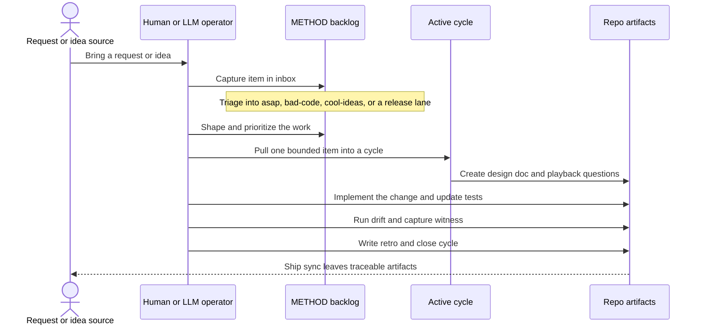

# Process

METHOD is a lightweight workflow for turning raw ideas into shaped,
verified, and reviewable changes. Capture work explicitly, move it
through the backlog on purpose, and close cycles with evidence.

## Task Lifecycle

## How METHOD Works

- Capture raw ideas before acting on them.
- Triage backlog items into the right lane instead of treating every task as urgent.
- Pull one bounded item into an active cycle with a design doc.
- Use playback questions to define the behavior that must be proven.
- Implement the change, update tests, and run drift so the design and tests still agree.
- Close the cycle with a witness and retro so future readers can inspect what actually happened.

## Working With an LLM

- Ask the LLM to read status, inspect backlog lanes, and summarize the current repo posture before changing files.
- Have the LLM capture or move backlog items rather than keeping work in chat only.
- Use the LLM to draft or refine the design doc, but keep the playback questions concrete and testable.
- Let the LLM implement code and run validation, then review the witness and retro before treating the cycle as done.
- Require the LLM to anchor strong claims to files, commands, tests, or generated artifacts in the repo.

## Working By Hand

- Capture the task in the backlog first, even if you already know how to solve it.
- Pull one cycle at a time and keep the design doc honest as the plan changes.
- Write or update tests from the playback questions, not from vague intent.
- Run the relevant validation before closing the cycle.
- Write a retro that explains what shipped, what evidence exists, and what follow-up work remains.
