# Graft: A Zero-to-Hero Technical Teardown

> **Purpose of this document:** A progressive, implementation-backed technical walkthrough of the Graft codebase. No prior knowledge assumed. Every concept is introduced before it is used. Diagrams are provided liberally. By the end, you will understand not only *what* Graft does, but *why* it was built this way and what trade-offs were made at each decision point.

Thresholds, line numbers, exact defaults, file paths, and dependency references in this teardown reflect the implementation snapshot for this repo revision and may change across releases.

## The Short Version

Git tells you what changed at commit.
Graft tells you what an agent observed before the commit: what was read, what was refused, what was outlined, which symbols were inspected, and how policy decisions and evidence shaped the change.

Graft is not an IDE. It is a governed structural read and provenance layer for coding agents.

This is a deep technical explainer for contributors and operators, not random-visitor first-contact messaging.

For quick onboarding and project positioning, start at `README.md`.

---

## Table of Contents

- [Source of Truth Alignment](#source-of-truth-alignment)
- [Scope and Non-Goals](#scope-and-non-goals)
1. [Domain Dictionary](#1-domain-dictionary)
2. [What Graft Is and Why It Exists](#2-what-graft-is-and-why-it-exists)
3. [The Three Official Surfaces](#3-the-three-official-surfaces)
4. [Bootstrapping vs. Runtime](#4-bootstrapping-vs-runtime)
5. [The Entry Point: Following `int main()`](#5-the-entry-point-following-int-main)
6. [Golden Path 1: `safe_read` — A Policy-Governed File Read](#6-golden-path-1-safe_read--a-policy-governed-file-read)
7. [Golden Path 2: `code_show` — Precision Symbol Lookup](#7-golden-path-2-code_show--precision-symbol-lookup)
8. [Golden Path 3: The Daemon Lifecycle](#8-golden-path-3-the-daemon-lifecycle)
9. [The Policy Engine: Where Decisions Are Made](#9-the-policy-engine-where-decisions-are-made)
10. [The Parser Layer: Tree-Sitter and Structural Outlines](#10-the-parser-layer-tree-sitter-and-structural-outlines)
11. [WARP: Structural Worldline Memory](#11-warp-structural-worldline-memory)
12. [Session Governance: The Governor and Tripwires](#12-session-governance-the-governor-and-tripwires)
13. [Anatomy of a Payload: Data Schemas In Motion](#13-anatomy-of-a-payload-data-schemas-in-motion)
14. [The Unhappy Paths: Error Handling and Refusals](#14-the-unhappy-paths-error-handling-and-refusals)
15. [Concurrency and Asynchronous Flows](#15-concurrency-and-asynchronous-flows)
16. [External Dependencies and System Borders](#16-external-dependencies-and-system-borders)
17. [Security Boundaries](#17-security-boundaries)
18. [Configuration and Environment Tuning](#18-configuration-and-environment-tuning)
19. [Architectural Trade-offs](#19-architectural-trade-offs)
20. [Contract Ledger (Golden Path)](#contract-ledger-golden-path)

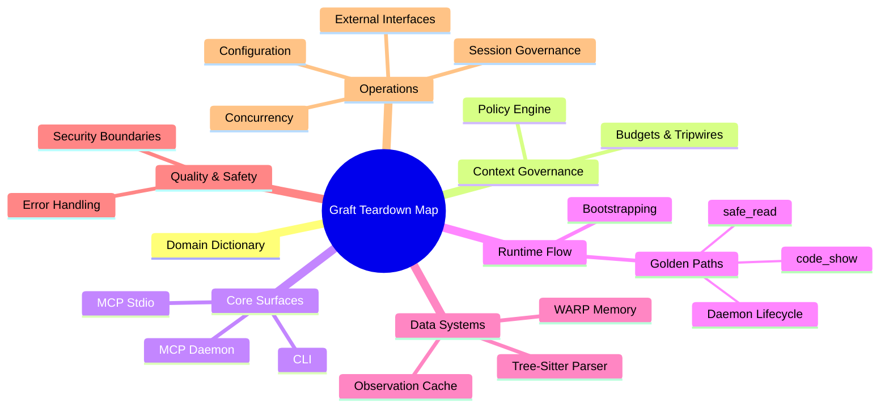
```mermaid
mindmap
  root((Graft Teardown Map))
    Domain Dictionary
    Context Governance
      Policy Engine
      Budgets & Tripwires
    Core Surfaces
      CLI
      MCP Stdio
      MCP Daemon
    Runtime Flow
      Bootstrapping
      Golden Paths
        safe_read
        code_show
        Daemon Lifecycle
    Data Systems
      Tree-Sitter Parser
      WARP Memory
      Observation Cache
    Quality & Safety
      Error Handling
      Security Boundaries
    Operations
      Session Governance
      External Interfaces
      Concurrency
      Configuration
```

---

## Source of Truth Alignment

Use these file-level anchors as the documentary authority when validating claims.

| Topic | Primary Evidence |
|-------|------------------|
| `safe_read` tool orchestration | [src/mcp/tools/safe-read.ts:19-44](../src/mcp/tools/safe-read.ts#L19), [src/operations/repo-workspace.ts:154-235](../src/operations/repo-workspace.ts#L154), [src/operations/safe-read.ts:34-117](../src/operations/safe-read.ts#L34) |
| Policy decisioning and result kinds | [src/policy/evaluate.ts:96-178](../src/policy/evaluate.ts#L96), [src/policy/types.ts:28-84](../src/policy/types.ts#L28) |
| Receipt emission and metadata | [src/mcp/receipt.ts:44-59](../src/mcp/receipt.ts#L44), [src/mcp/server-invocation.ts:175-202](../src/mcp/server-invocation.ts#L175) |
| Tripwires + session depth/budget signals | [src/session/tracker.ts:61-145](../src/session/tracker.ts#L61), [src/mcp/server-invocation.ts:242-249](../src/mcp/server-invocation.ts#L242) |
| Cache behavior (`cache_hit`, `diff`) | [src/operations/observation-cache.ts:91-138](../src/operations/observation-cache.ts#L91), [src/operations/repo-workspace.ts:164-204](../src/operations/repo-workspace.ts#L164) |
| `code_show` branching and return forms | [src/mcp/tools/code-show.ts:46-274](../src/mcp/tools/code-show.ts#L46) |
| Daemon startup + workspace authorization | [src/mcp/daemon-server.ts:50-173](../src/mcp/daemon-server.ts#L50), [src/mcp/daemon-control-plane.ts:122-160](../src/mcp/daemon-control-plane.ts#L122) |
| Repo-local path guard | [src/mcp/context.ts:116-123](../src/mcp/context.ts#L116), [src/mcp/context.ts:1-5](../src/mcp/context.ts#L1) |

## Scope and Non-Goals

This teardown focuses on runtime behavior that materially changes safety, cost, and signal quality for agent sessions.

Primary scope:
- policy input and projection selection
- safe read and symbol lookup contracts (`safe_read`, `code_show`)
- daemon session routing and authorization
- parser, WARP, and index behavior as returned by symbol/outlining surfaces
- receipt/tripwire telemetry on tool responses

Out of scope:
- pure developer ergonomics changes (argument descriptions, error wording, command wording)
- infra/platform-specific deployment mechanics and CI policy
- future optimization experiments that do not alter wire-visible behavior

---

## 1. Domain Dictionary

Before any code is discussed, establish a shared vocabulary. These terms appear throughout the codebase and this document.

| Term | Definition |
|------|-----------|
| **Agent** | An AI coding assistant (e.g., Claude, Copilot) that reads files and produces edits. Graft governs what agents are allowed to read. |
| **Context window** | The finite amount of text an AI model can hold in its "working memory" at one time. Graft exists to prevent this from being wasted. |
| **Projection** | The *form* in which a file's content is returned. Either `"content"` (full text), `"outline"` (structural skeleton), or `"refused"` (nothing). |
| **Outline** | A structural skeleton of a source file extracted from its AST: function names, class names, method signatures — but not implementation bodies. |
| **AST** | Abstract Syntax Tree. A tree representation of source code's grammatical structure, produced by a parser. Graft uses Tree-Sitter to build these. |
| **Policy** | A set of rules that determine which projection to return for a given file, based on file size, type, session depth, and budget. |
| **Session** | One continuous conversation between an agent and Graft's MCP server. Sessions track how many messages, tool calls, and bytes have been consumed. |
| **Budget** | An optional byte cap on how much raw file content an agent may consume in a session. When approaching the cap, Graft automatically downgrades projections. |
| **Tripwire** | A behavioral signal that fires when an agent is doing something suspicious (reading huge files late in a session, spinning in tool loops, etc.). |
| **WARP** | Graft's structural worldline memory layer. Git-backed AST outlines are stored per commit to enable symbol-level history queries without re-reading source. |
| **Worldline** | A sequence of structural states a file or symbol passes through across Git commits. The WARP graph stores these worldlines. |
| **Receipt** | A machine-readable metadata envelope attached to every tool call result, carrying latency, byte counts, policy decision, and cumulative session stats. |
| **MCP** | *Model Context Protocol*. An open protocol for tools that AI agents can call. Graft exposes all its capabilities as MCP tools. |
| **Daemon** | Graft's persistent background process. Manages multiple repos, keeps WARP graphs warm in memory, and handles background indexing. |
| **Repo-local mode** | A lightweight alternative to the daemon — a per-repo, in-process MCP server that reads one checkout. No persistent process. |
| **`.graftignore`** | A file (like `.gitignore`) listing patterns for files Graft should refuse to read. |
| **ObservationCache** | An in-memory deduplication store. If an agent reads the same file twice in a session, the second call returns a cached outline rather than re-parsing. |
| **Burden** | Graft's internal label for the "cost" of a tool call: `"read"` (file I/O), `"compute"` (AST parsing, WARP queries), `"non_read"` (metadata). |
| **Hexagonal Architecture** | An architectural pattern where business logic (the "core") is isolated from all I/O behind abstract interfaces called *ports*. Concrete implementations are called *adapters*. |

---

## 2. What Graft Is and Why It Exists

AI coding agents have a fundamental resource problem: they operate inside a **context window** — a fixed number of tokens (roughly, characters) they can see at once. When an agent reads source files naively (entire file, every time), it burns through that window fast. Large files crowd out earlier context, causing the agent to "forget" things it already read.

Graft solves this by acting as a **context governor** between the agent and the filesystem. Instead of returning raw file bytes unconditionally, Graft:

1. **Evaluates a policy** — is this file too big? Is the agent's session already deep?
2. **Returns the minimum structurally correct view** — full content for small files; a structural outline for large ones; a hard refusal for binaries, secrets, and lockfiles.
3. **Tracks everything** — bytes consumed, files read, symbols seen — and embeds this telemetry in every response so the agent can self-regulate.

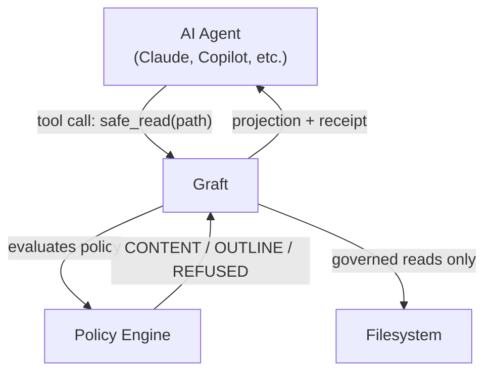
```mermaid
flowchart TD
    Agent["AI Agent<br />(Claude, Copilot, etc.)"] -->|"tool call: safe_read(path)"| Graft
    Graft -->|"evaluates policy"| Policy["Policy Engine"]
    Policy -->|"CONTENT / OUTLINE / REFUSED"| Graft
    Graft -->|"projection + receipt"| Agent
    Graft -->|"governed reads only"| FS["Filesystem"]
```

The key insight is that **an outline is often enough**. If an agent needs to know what functions exist in a 2,000-line file, it doesn't need all 2,000 lines — it needs the function names, their signatures, and their line numbers. Graft provides exactly that.

---

## 3. The Three Official Surfaces

Graft exposes the same core capabilities through three distinct surfaces. They share identical business logic; only their transport layer differs.

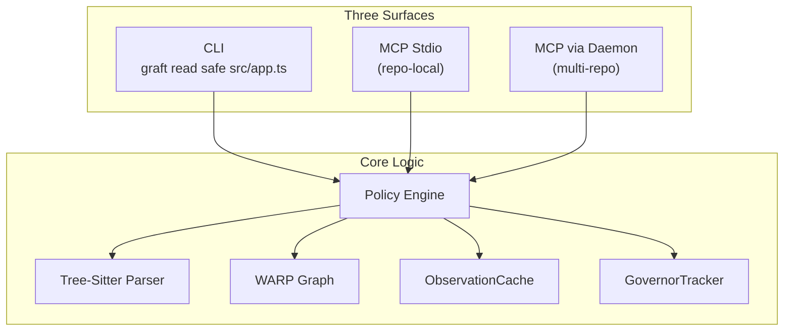
```mermaid
graph TD
    subgraph "Three Surfaces"
        CLI["CLI<br />graft read safe src/app.ts"]
        MCP_Local["MCP Stdio<br />(repo-local)"]
        MCP_Daemon["MCP via Daemon<br />(multi-repo)"]
    end

    subgraph "Core Logic"
        Policy["Policy Engine"]
        Parser["Tree-Sitter Parser"]
        WARP["WARP Graph"]
        Cache["ObservationCache"]
        Governor["GovernorTracker"]
    end

    CLI --> Policy
    MCP_Local --> Policy
    MCP_Daemon --> Policy
    Policy --> Parser
    Policy --> WARP
    Policy --> Cache
    Policy --> Governor
```

| Surface | Use Case | Persistence | Backed By |
|---------|----------|-------------|-----------|
| **CLI** | Human inspection, scripting | None (stateless) | Direct node process |
| **MCP Stdio (repo-local)** | Single-repo agent sessions | Session-scoped | In-process `GraftServer` |
| **MCP Daemon** | Multi-repo, long-running agents | Across sessions | Persistent daemon process |

**Trade-off**: The daemon is more powerful (keeps WARP graphs warm, enables multi-repo work) but requires a background process. The repo-local server is zero-setup but cold-starts on every session. The CLI is stateless by design — it prints and exits.

---

## 4. Bootstrapping vs. Runtime

It is important to distinguish between two phases of Graft's lifecycle:

### Bootstrapping Phase

This happens **once at startup** and sets up the infrastructure that will serve all future tool calls.

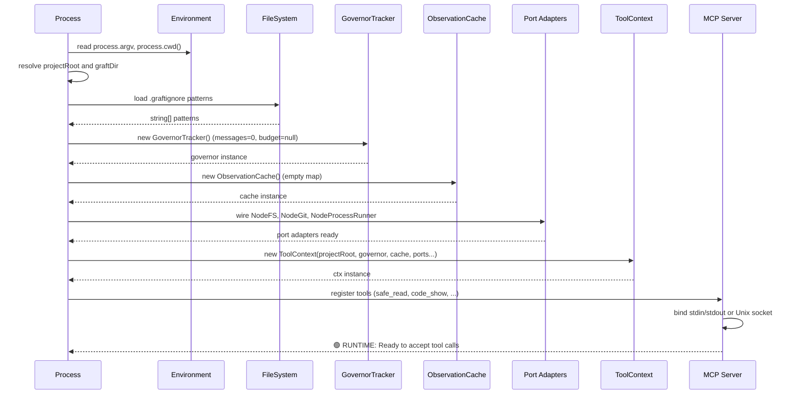
```mermaid
sequenceDiagram
    participant Proc as Process
    participant Env as Environment
    participant FS as FileSystem
    participant Gov as GovernorTracker
    participant Cache as ObservationCache
    participant Ports as Port Adapters
    participant Ctx as ToolContext
    participant MCP as MCP Server

    Proc->>Env: read process.argv, process.cwd()
    Proc->>Proc: resolve projectRoot and graftDir
    Proc->>FS: load .graftignore patterns
    FS-->>Proc: string[] patterns
    Proc->>Gov: new GovernorTracker() (messages=0, budget=null)
    Gov-->>Proc: governor instance
    Proc->>Cache: new ObservationCache() (empty map)
    Cache-->>Proc: cache instance
    Proc->>Ports: wire NodeFS, NodeGit, NodeProcessRunner
    Ports-->>Proc: port adapters ready
    Proc->>Ctx: new ToolContext(projectRoot, governor, cache, ports...)
    Ctx-->>Proc: ctx instance
    Proc->>MCP: register tools (safe_read, code_show, ...)
    MCP->>MCP: bind stdin/stdout or Unix socket
    MCP-->>Proc: 🟢 RUNTIME: Ready to accept tool calls
```

In daemon mode, bootstrapping also includes:
- Creating the **WARP pool** (one WARP graph per repo, loaded lazily)
- Initializing the **DaemonJobScheduler** (work queue)
- Spawning the **DaemonWorkerPool** (child processes for CPU-bound work)
- Starting the **PersistentMonitorRuntime** (watches repos for changes)

### Runtime Phase

This is the hot path: responding to individual tool calls. The bootstrapping infrastructure is already in place; the runtime phase is purely about processing one request and returning a result.

**The critical distinction**: loading `.graftignore` is bootstrapping (done once); evaluating whether a specific file matches `.graftignore` patterns is runtime (done per call).

---

## 5. The Entry Point: Following `int main()`

Graft's equivalent of `int main()` lives in two places depending on how it is invoked.

### CLI Entry: `bin/graft.js` → `src/cli/entrypoint.ts`

```
bin/graft.js          (thin shell shim, just imports)
    └── src/cli/entrypoint.ts   runCliEntrypoint()
            └── src/cli/main.ts  runCli()
                    └── dispatch to command handlers
```

`runCliEntrypoint()` does the following before any business logic runs:

```typescript
// src/cli/entrypoint.ts (simplified)
export async function runCliEntrypoint(options: CliEntrypointOptions = {}): Promise<void> {
  // 1. Check git version >= 2.39.0 (throws if too old)
  await ensureGitVersionSupportsGraft();

  // 2. Detect "auto-serve" mode: if stdin/stdout are piped (not TTY),
  //    assume we're being used as an MCP server and start serving.
  const argv = options.argv ?? process.argv.slice(2);
  const isAutoServe = !process.stdin.isTTY && !process.stdout.isTTY && argv.length === 0;

  if (isAutoServe) {
    // An MCP client (agent) connected via stdio — switch to serve mode.
    await startStdioServer(cwd);
    return;
  }

  // 3. Otherwise, parse args and dispatch to CLI handler.
  await runCli(cwd, argv, writer);
}
```

**Why the auto-serve detection?** This allows the same `graft` binary to be used both interactively (`graft read safe src/app.ts`) and as an MCP server (an agent launches `graft` as a subprocess and pipes JSON-RPC through stdin/stdout). The binary detects which mode it's in automatically.

### MCP Entry: `src/mcp/stdio-server.ts`

When running as a repo-local MCP server:

```typescript
// src/mcp/stdio-server.ts (simplified)
export async function startStdioServer(cwd = process.cwd()): Promise<void> {
  const server = createGraftServer({
    mode: "repo_local",
    projectRoot: cwd,
    graftDir: path.join(cwd, ".graft"),
  });

  const transport = new StdioServerTransport(); // From @modelcontextprotocol/sdk
  await server.connect(transport);
  // Now blocking: reads JSON-RPC from stdin, writes to stdout
}
```

### Command Dispatch in `runCli()`

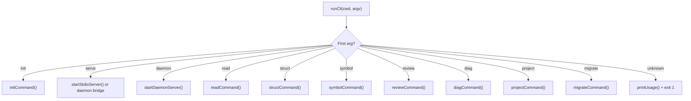
```mermaid
flowchart TD
    A["runCli(cwd, argv)"] --> B{"First arg?"}
    B -->|"init"| C["initCommand()"]
    B -->|"serve"| D["startStdioServer() or daemon bridge"]
    B -->|"daemon"| E["startDaemonServer()"]
    B -->|"read"| F["readCommand()"]
    B -->|"struct"| G["structCommand()"]
    B -->|"symbol"| H["symbolCommand()"]
    B -->|"review"| I["reviewCommand()"]
    B -->|"diag"| J["diagCommand()"]
    B -->|"project"| K["projectCommand()"]
    B -->|"migrate"| L["migrateCommand()"]
    B -->|"unknown"| M["printUsage() + exit 1"]
```

---

## 6. Golden Path 1: `safe_read` — A Policy-Governed File Read

This is Graft's most important operation. Everything else is secondary.

### Overview Sequence

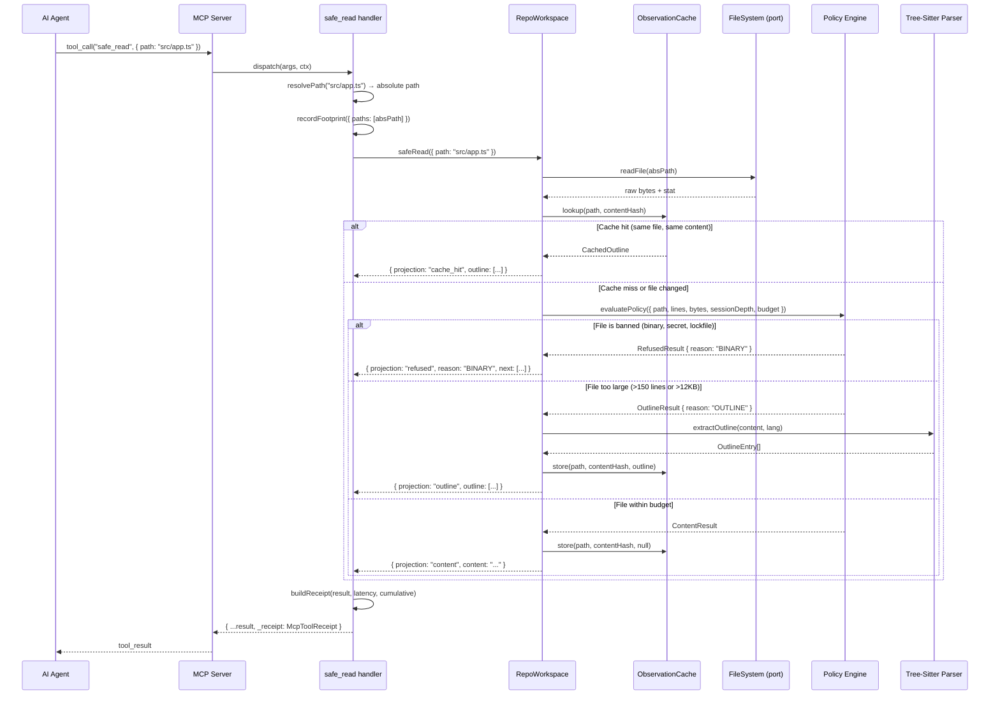
```mermaid
sequenceDiagram
    participant Agent as AI Agent
    participant MCP as MCP Server
    participant Tool as safe_read handler
    participant WS as RepoWorkspace
    participant Cache as ObservationCache
    participant FS as FileSystem (port)
    participant Policy as Policy Engine
    participant Parser as Tree-Sitter Parser

    Agent->>MCP: tool_call("safe_read", { path: "src/app.ts" })
    MCP->>Tool: dispatch(args, ctx)
    Tool->>Tool: resolvePath("src/app.ts") → absolute path
    Tool->>Tool: recordFootprint({ paths: [absPath] })
    Tool->>WS: safeRead({ path: "src/app.ts" })
    WS->>FS: readFile(absPath)
    FS-->>WS: raw bytes + stat
    WS->>Cache: lookup(path, contentHash)

    alt Cache hit (same file, same content)
        Cache-->>WS: CachedOutline
        WS-->>Tool: { projection: "cache_hit", outline: [...] }
    else Cache miss or file changed
        WS->>Policy: evaluatePolicy({ path, lines, bytes, sessionDepth, budget })

        alt File is banned (binary, secret, lockfile)
            Policy-->>WS: RefusedResult { reason: "BINARY" }
            WS-->>Tool: { projection: "refused", reason: "BINARY", next: [...] }
        else File too large (>150 lines or >12KB)
            Policy-->>WS: OutlineResult { reason: "OUTLINE" }
            WS->>Parser: extractOutline(content, lang)
            Parser-->>WS: OutlineEntry[]
            WS->>Cache: store(path, contentHash, outline)
            WS-->>Tool: { projection: "outline", outline: [...] }
        else File within budget
            Policy-->>WS: ContentResult
            WS->>Cache: store(path, contentHash, null)
            WS-->>Tool: { projection: "content", content: "..." }
        end
    end

    Tool->>Tool: buildReceipt(result, latency, cumulative)
    Tool-->>MCP: { ...result, _receipt: McpToolReceipt }
    MCP-->>Agent: tool_result
```

### The Data: What `src/app.ts` Looks Like at Each Stage

**Stage 1: Raw file bytes (never returned to agent)**
```
2,400 bytes  |  87 lines  |  TypeScript
```

**Stage 2: Policy evaluation input**
```typescript
// PolicyInput — what the policy engine receives
{
  path: "src/app.ts",
  lines: 87,
  bytes: 2400,
  patterns: ["*.generated.ts", "dist/**"],  // from .graftignore
  sessionDepth: "early",                    // < 100 messages in session
  budget: null                              // no byte cap set
}
```

**Stage 3: Policy decision**

Since 87 lines < 150 (the threshold), and the file is not banned:

```typescript
// ContentResult
{
  projection: "content",
  reason: "CONTENT",
  thresholds: { lines: 150, bytes: 12288 },
  actual: { lines: 87, bytes: 2400 }
}
```

**Stage 4: Tool result (what the agent actually receives)**
```json
{
  "path": "src/app.ts",
  "projection": "content",
  "reason": "CONTENT",
  "content": "import { createServer } from './server.js';\n...",
  "actual": { "lines": 87, "bytes": 2400 },
  "thresholds": { "lines": 150, "bytes": 12288 },
  "_receipt": {
    "sessionId": "sess_abc123",
    "traceId": "trace_xyz",
    "seq": 3,
    "ts": "2025-05-27T14:23:01.042Z",
    "tool": "safe_read",
    "projection": "content",
    "reason": "CONTENT",
    "latencyMs": 12,
    "fileBytes": 2400,
    "returnedBytes": 2400,
    "burden": { "kind": "read", "nonRead": false },
    "cumulative": {
      "reads": 3,
      "outlines": 1,
      "refusals": 0,
      "cacheHits": 0,
      "bytesReturned": 6821,
      "bytesAvoided": 18400,
      "nonReadBytesReturned": 0,
      "burdenByKind": { "read": 3, "compute": 0, "non_read": 0 }
    }
  }
}
```

Notice `bytesAvoided: 18400` — that's how many bytes Graft saved the agent's context window by returning outlines instead of full content on previous calls.

### Receipt Entity Relationship

Every tool call produces one receipt that accumulates session-wide stats:

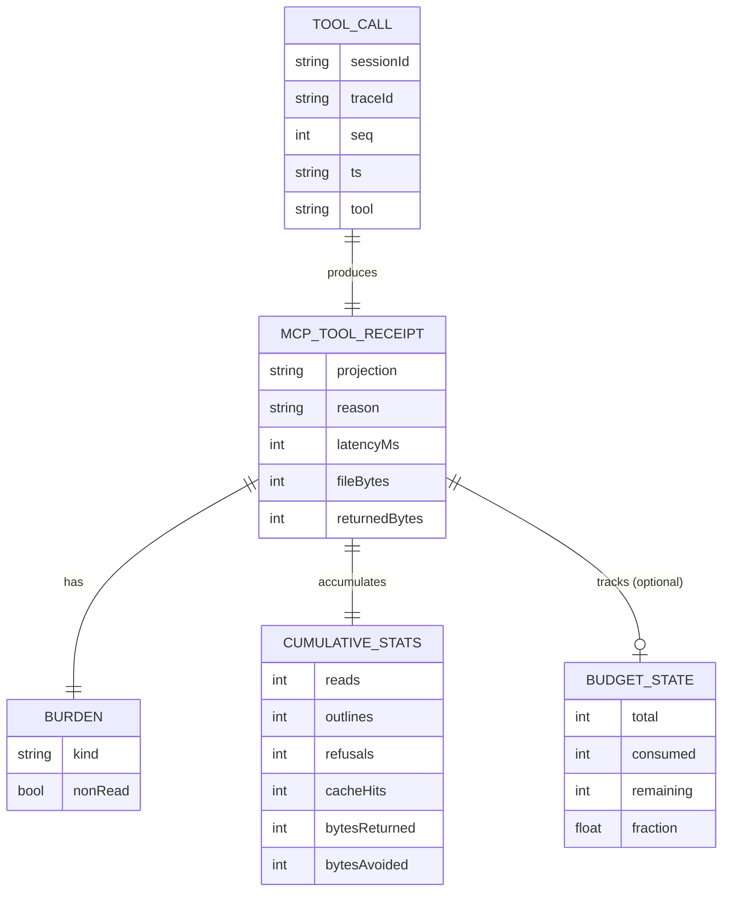
```mermaid
erDiagram
    TOOL_CALL {
        string sessionId
        string traceId
        int seq
        string ts
        string tool
    }
    MCP_TOOL_RECEIPT {
        string projection
        string reason
        int latencyMs
        int fileBytes
        int returnedBytes
    }
    BURDEN {
        string kind
        bool nonRead
    }
    CUMULATIVE_STATS {
        int reads
        int outlines
        int refusals
        int cacheHits
        int bytesReturned
        int bytesAvoided
    }
    BUDGET_STATE {
        int total
        int consumed
        int remaining
        float fraction
    }
    TOOL_CALL ||--|| MCP_TOOL_RECEIPT : "produces"
    MCP_TOOL_RECEIPT ||--|| BURDEN : "has"
    MCP_TOOL_RECEIPT ||--|| CUMULATIVE_STATS : "accumulates"
    MCP_TOOL_RECEIPT ||--o| BUDGET_STATE : "tracks (optional)"
```

### The Policy Thresholds in Detail

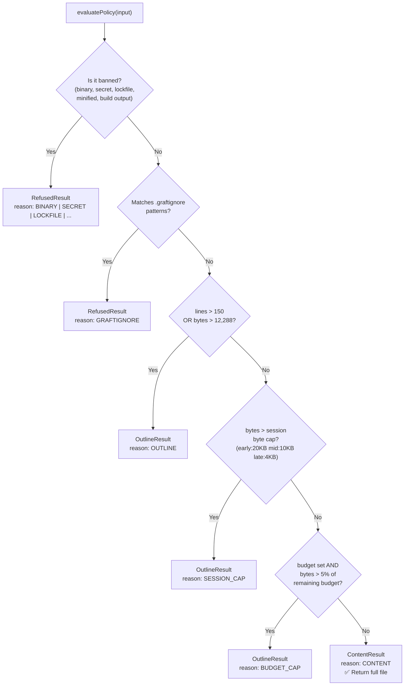
```mermaid
flowchart TD
    A["evaluatePolicy(input)"] --> B{"Is it banned?<br />(binary, secret, lockfile,<br />minified, build output)"}
    B -->|"Yes"| C["RefusedResult<br />reason: BINARY | SECRET | LOCKFILE | ..."]
    B -->|"No"| D{"Matches .graftignore<br />patterns?"}
    D -->|"Yes"| E["RefusedResult<br />reason: GRAFTIGNORE"]
    D -->|"No"| F{"lines > 150<br />OR bytes > 12,288?"}
    F -->|"Yes"| G["OutlineResult<br />reason: OUTLINE"]
    F -->|"No"| H{"bytes > session<br />byte cap?<br />(early:20KB mid:10KB late:4KB)"}
    H -->|"Yes"| I["OutlineResult<br />reason: SESSION_CAP"]
    H -->|"No"| J{"budget set AND<br />bytes > 5% of<br />remaining budget?"}
    J -->|"Yes"| K["OutlineResult<br />reason: BUDGET_CAP"]
    J -->|"No"| L["ContentResult<br />reason: CONTENT<br />✅ Return full file"]
```

### `safe_read` Contract Matrix (Implementation-backed)

The following outputs are directly supported by current implementation branches:

1. Content contract

```json
{
  "projection": "content",
  "reason": "CONTENT",
  "path": "/abs/path/src/app.ts",
  "content": "...",
  "actual": { "lines": 87, "bytes": 2400 },
  "thresholds": { "lines": 150, "bytes": 12288 }
}
```

Evidence: [policy returns content](../src/policy/evaluate.ts#L152-L160), [safe-read returns content payload](../src/operations/safe-read.ts#L79-L81), [tool handler](../src/mcp/tools/safe-read.ts#L33-L44).

2. Outline contract

```json
{
  "projection": "outline",
  "reason": "OUTLINE",
  "path": "/abs/path/src/operations/repo-workspace.ts",
  "outline": [{ "kind": "class", "name": "RepoWorkspace", "signature": "class RepoWorkspace" }],
  "jumpTable": [{ "symbol": "safeRead", "start": 89, "end": 201 }],
  "estimatedBytesAvoided": 23450
}
```

Evidence: [outline reason path](../src/policy/evaluate.ts#L164-L177), [outline extraction branch](../src/operations/safe-read.ts#L91-L117), [safe-read result type](../src/operations/safe-read.ts#L11-L21).

3. Refusal contract

```json
{
  "projection": "refused",
  "reason": "LOCKFILE",
  "reasonDetail": "Lockfile package-lock.json is machine-generated and not useful to read",
  "next": ["Read package.json for dependency info instead"],
  "actual": { "lines": 500, "bytes": 620000 }
}
```

Evidence: [ban and reason generation](../src/policy/evaluate.ts#L45-L93), [RefusedResult constructor usage](../src/policy/types.ts#L66-L83), [refusal return path](../src/operations/repo-workspace.ts#L125-L152).

4. Cache-hit contract

```json
{
  "projection": "cache_hit",
  "reason": "REREAD_UNCHANGED",
  "path": "/abs/path/src/operations/safe-read.ts",
  "outline": [{ "kind": "function", "name": "safeRead" }],
  "jumpTable": [{ "symbol": "safeRead", "start": 34, "end": 118 }],
  "readCount": 4
}
```

Evidence: [cache checks + hit response](../src/operations/observation-cache.ts#L133-L138), [cache-hit return](../src/operations/repo-workspace.ts#L166-L183), [cache metric wiring](../src/mcp/tools/safe-read.ts#L8-L17).

5. Diff contract (changed content + cached outline)

```json
{
  "projection": "diff",
  "reason": "CHANGED_SINCE_LAST_READ",
  "path": "/abs/path/src/operations/repo-workspace.ts",
  "diff": [{ "kind": "function", "name": "safeRead", "operation": "modified" }],
  "outline": [{ "kind": "class", "name": "RepoWorkspace" }],
  "jumpTable": [{ "symbol": "safeRead", "start": 89, "end": 201 }]
}
```

Evidence: [stale cache branch](../src/operations/repo-workspace.ts#L185-L203), [diff computation](../src/operations/repo-workspace.ts#L197), [cache result type](../src/operations/repo-workspace.ts#L38-L53).

---

## 7. Golden Path 2: `code_show` — Precision Symbol Lookup

`code_show` answers the question: *"Where exactly is this function defined?"* It returns the precise line range for a named symbol — without necessarily reading the whole file.

### The Three Search Layers

Before tracing the path, understand the three layers `code_show` can search:

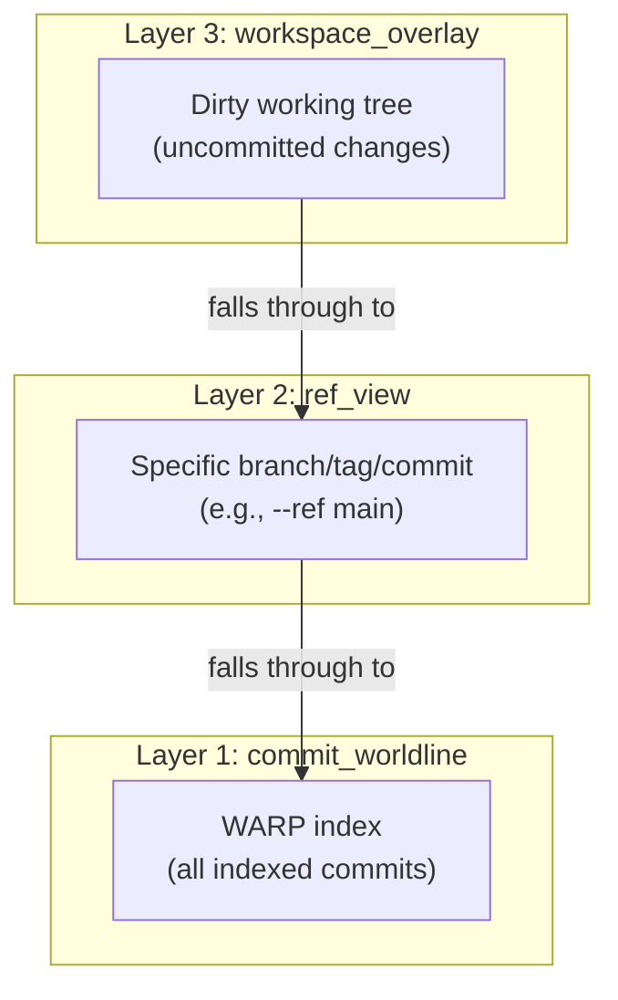
```mermaid
graph TD
    subgraph "Layer 3: workspace_overlay"
        WO["Dirty working tree<br />(uncommitted changes)"]
    end
    subgraph "Layer 2: ref_view"
        RV["Specific branch/tag/commit<br />(e.g., --ref main)"]
    end
    subgraph "Layer 1: commit_worldline"
        CW["WARP index<br />(all indexed commits)"]
    end

    WO -->|"falls through to"| RV
    RV -->|"falls through to"| CW
```

### Sequence Diagram

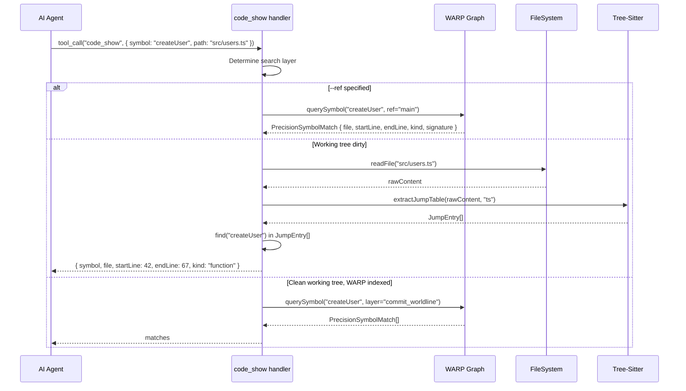
```mermaid
sequenceDiagram
    participant Agent as AI Agent
    participant Tool as code_show handler
    participant WARP as WARP Graph
    participant FS as FileSystem
    participant Parser as Tree-Sitter

    Agent->>Tool: tool_call("code_show", { symbol: "createUser", path: "src/users.ts" })
    Tool->>Tool: Determine search layer

    alt --ref specified
        Tool->>WARP: querySymbol("createUser", ref="main")
        WARP-->>Tool: PrecisionSymbolMatch { file, startLine, endLine, kind, signature }
    else Working tree dirty
        Tool->>FS: readFile("src/users.ts")
        FS-->>Tool: rawContent
        Tool->>Parser: extractJumpTable(rawContent, "ts")
        Parser-->>Tool: JumpEntry[]
        Tool->>Tool: find("createUser") in JumpEntry[]
        Tool-->>Agent: { symbol, file, startLine: 42, endLine: 67, kind: "function" }
    else Clean working tree, WARP indexed
        Tool->>WARP: querySymbol("createUser", layer="commit_worldline")
        WARP-->>Tool: PrecisionSymbolMatch[]
        Tool-->>Agent: matches
    end
```

### What a Symbol Result Looks Like

```json
{
  "symbol": "createUser",
  "file": "src/users.ts",
  "startLine": 42,
  "endLine": 67,
  "kind": "function",
  "signature": "async function createUser(opts: CreateUserOptions): Promise<User>",
  "layer": "workspace_overlay",
  "_receipt": { "...": "..." }
}
```

### `code_show` Contract Matrix (Implementation-backed)

1. Single-match contract

```json
{
  "symbol": "createUser",
  "kind": "function",
  "path": "src/users.ts",
  "startLine": 42,
  "endLine": 67,
  "signature": "async function createUser(opts: CreateUserOptions): Promise<User>",
  "source": "live",
  "layer": "workspace_overlay"
}
```

Evidence: [single location branch](../src/mcp/tools/code-show.ts#L221-L271), [layer selection](../src/mcp/tools/code-show.ts#L56-L63), [search path with exact symbol](../src/mcp/tools/code-show.ts#L46-L74).

2. Ambiguous-match contract

```json
{
  "symbol": "createUser",
  "ambiguous": true,
  "matches": [
    { "path": "src/users.ts", "startLine": 42, "endLine": 67 },
    { "path": "src/admin.ts", "startLine": 10, "endLine": 20 }
  ],
  "source": "warp",
  "layer": "commit_worldline"
}
```

Evidence: [ambiguous branch](../src/mcp/tools/code-show.ts#L206-L219), [multiple match accumulation](../src/mcp/tools/code-show.ts#L166-L182).

3. Refusal contract

```json
{
  "projection": "refused",
  "path": "src/secret.ts",
  "reason": "SECRET",
  "reasonDetail": "src/secret.ts may contain secrets and should not be read",
  "next": ["Check for a .example or template version"],
  "actual": { "lines": 120, "bytes": 12000 },
  "source": "live",
  "layer": "workspace_overlay"
}
```

Evidence: [policy refuse in code_show](../src/mcp/tools/code-show.ts#L175-L179), [refusal response](../src/mcp/tools/code-show.ts#L184-L195), [reason catalogue](../src/policy/evaluate.ts#L45-L93).

4. Not-found contract

```json
{
  "symbol": "doesNotExist",
  "error": "Symbol 'doesNotExist' not found",
  "source": "warp",
  "layer": "commit_worldline"
}
```

Evidence: [not found branch](../src/mcp/tools/code-show.ts#L198-L204), [search layer selection](../src/mcp/tools/code-show.ts#L143-L151).

**Why is this valuable?** An agent that wants to read a specific function can call `code_show` first (cheap — parses the jump table only) and then call `safe_read` with a `--range 42:67` argument, reading exactly 26 lines instead of the entire file.

## Contract Ledger (Golden Path)

Use this as a compact, machine-checkable onboarding checklist.

| Tool | Contract | Trigger | Expected Output | Evidence |
| --- | --- | --- | --- | --- |
| `safe_read` | `content` | File is small / under policy threshold | `projection: "content"` + `content` body | [policy content branch](../src/policy/evaluate.ts#L152-L160), [safe-read content branch](../src/operations/safe-read.ts#L79-L81), [tool pass-through](../src/mcp/tools/safe-read.ts#L33-L44) |
| `safe_read` | `outline` | File is large or exceeds session caps | `projection: "outline"` + `outline` + `jumpTable` | [outline branch](../src/operations/safe-read.ts#L91-L117), [policy reasons](../src/policy/evaluate.ts#L164-L177) |
| `safe_read` | `cache_hit` | File re-read with unchanged hash | `projection: "cache_hit"` + `reason: "REREAD_UNCHANGED"` | [cache lookup](../src/operations/observation-cache.ts#L133-L138), [cache-hit return](../src/operations/repo-workspace.ts#L166-L183), [tool return metric](../src/mcp/tools/safe-read.ts#L8-L17) |
| `safe_read` | `diff` | Cached observation stale vs current file state | `projection: "diff"` + `diff` payload | [stale path branch](../src/operations/repo-workspace.ts#L185-L203), [diff computation](../src/operations/repo-workspace.ts#L197), [cache result type](../src/operations/repo-workspace.ts#L38-L53) |
| `safe_read` | `refused` | Ban/budget/session policy blocks read | `projection: "refused"` + `reason` + `next` | [ban rules](../src/policy/evaluate.ts#L45-L93), [result union](../src/policy/types.ts#L66-L84), [workspace refusal](../src/operations/repo-workspace.ts#L125-L152) |
| `code_show` | `single_match` | Exactly one symbol match | One symbol object with `startLine`/`endLine` and `file` | [single-match path](../src/mcp/tools/code-show.ts#L221-L271), [lookup pipeline](../src/mcp/tools/code-show.ts#L46-L74) |
| `code_show` | `ambiguous` | Multiple symbol matches for request | `ambiguous: true` + `matches` array | [match accumulation](../src/mcp/tools/code-show.ts#L166-L182), [ambiguous return](../src/mcp/tools/code-show.ts#L206-L219) |
| `code_show` | `refused` | All candidate symbols blocked by policy | `projection: "refused"` + `next` guidance | [policy filter](../src/mcp/tools/code-show.ts#L175-L179), [refusal return](../src/mcp/tools/code-show.ts#L184-L195) |
| `code_show` | `not_found` | Requested symbol unavailable | `error` + missing symbol name | [not found](../src/mcp/tools/code-show.ts#L198-L204) |
| `code_show` | `line_range` | Match has line metadata | `startLine`/`endLine` and `content` when available | [range extraction](../src/mcp/tools/code-show.ts#L248-L250), [full response](../src/mcp/tools/code-show.ts#L259-L271) |

---

## 8. Golden Path 3: The Daemon Lifecycle

The daemon is Graft's persistent process for power users and long-running agent sessions.

### Startup Sequence

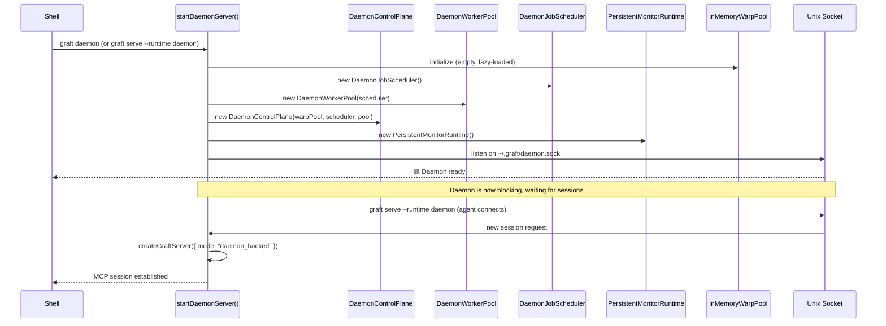
```mermaid
sequenceDiagram
    participant Shell as Shell
    participant Daemon as startDaemonServer()
    participant CP as DaemonControlPlane
    participant Pool as DaemonWorkerPool
    participant Sched as DaemonJobScheduler
    participant Monitor as PersistentMonitorRuntime
    participant WARP as InMemoryWarpPool
    participant Socket as Unix Socket

    Shell->>Daemon: graft daemon (or graft serve --runtime daemon)
    Daemon->>WARP: initialize (empty, lazy-loaded)
    Daemon->>Sched: new DaemonJobScheduler()
    Daemon->>Pool: new DaemonWorkerPool(scheduler)
    Daemon->>CP: new DaemonControlPlane(warpPool, scheduler, pool)
    Daemon->>Monitor: new PersistentMonitorRuntime()
    Daemon->>Socket: listen on ~/.graft/daemon.sock
    Socket-->>Shell: 🟢 Daemon ready

    Note over Daemon,Socket: Daemon is now blocking, waiting for sessions

    Shell->>Socket: graft serve --runtime daemon (agent connects)
    Socket->>Daemon: new session request
    Daemon->>Daemon: createGraftServer({ mode: "daemon_backed" })
    Daemon-->>Shell: MCP session established
```

### Multi-Repo Authorization Flow

The daemon's control plane enforces a **nonce-based authorization** model to prevent one repo's agent from touching another repo's files.

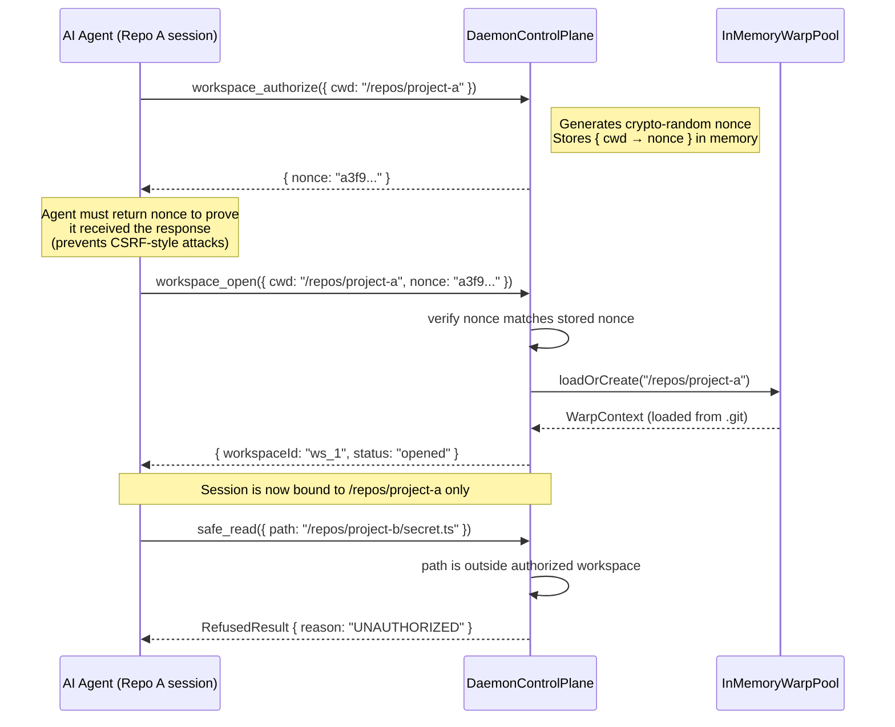
```mermaid
sequenceDiagram
    participant Agent as AI Agent (Repo A session)
    participant CP as DaemonControlPlane
    participant WARP as InMemoryWarpPool

    Agent->>CP: workspace_authorize({ cwd: "/repos/project-a" })
    Note right of CP: Generates crypto-random nonce<br />Stores { cwd → nonce } in memory
    CP-->>Agent: { nonce: "a3f9..." }

    Note over Agent: Agent must return nonce to prove<br />it received the response<br />(prevents CSRF-style attacks)

    Agent->>CP: workspace_open({ cwd: "/repos/project-a", nonce: "a3f9..." })
    CP->>CP: verify nonce matches stored nonce
    CP->>WARP: loadOrCreate("/repos/project-a")
    WARP-->>CP: WarpContext (loaded from .git)
    CP-->>Agent: { workspaceId: "ws_1", status: "opened" }

    Note over Agent,CP: Session is now bound to /repos/project-a only

    Agent->>CP: safe_read({ path: "/repos/project-b/secret.ts" })
    CP->>CP: path is outside authorized workspace
    CP-->>Agent: RefusedResult { reason: "UNAUTHORIZED" }
```

---

## 9. The Policy Engine: Where Decisions Are Made

The policy engine (`src/policy/evaluate.ts`) is the heart of Graft. It is deliberately small (~150 lines) and has **no side effects** — it is a pure function from `PolicyInput` to `PolicyResult`.

### Class Architecture

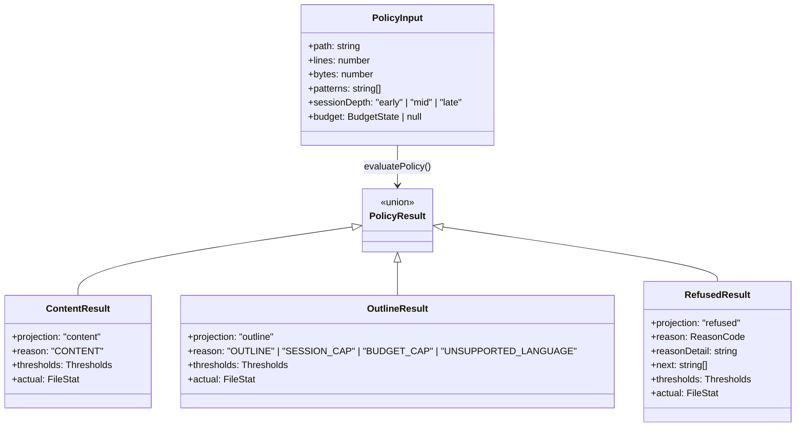
```mermaid
classDiagram
    class PolicyInput {
        +path: string
        +lines: number
        +bytes: number
        +patterns: string[]
        +sessionDepth: "early" | "mid" | "late"
        +budget: BudgetState | null
    }

    class PolicyResult {
        <<union>>
    }

    class ContentResult {
        +projection: "content"
        +reason: "CONTENT"
        +thresholds: Thresholds
        +actual: FileStat
    }

    class OutlineResult {
        +projection: "outline"
        +reason: "OUTLINE" | "SESSION_CAP" | "BUDGET_CAP" | "UNSUPPORTED_LANGUAGE"
        +thresholds: Thresholds
        +actual: FileStat
    }

    class RefusedResult {
        +projection: "refused"
        +reason: ReasonCode
        +reasonDetail: string
        +next: string[]
        +thresholds: Thresholds
        +actual: FileStat
    }

    PolicyResult <|-- ContentResult
    PolicyResult <|-- OutlineResult
    PolicyResult <|-- RefusedResult
    PolicyInput --> PolicyResult : evaluatePolicy()
```

### Ban Detection

Before any size check, the engine runs `checkBan(path)` — a set of filename/extension matchers that return a hard `"refused"` immediately:

```typescript
// Conceptual ban rules (from src/policy/evaluate.ts)
const BAN_RULES = [
  // Binary files
  { ext: [".png", ".jpg", ".gif", ".webp", ".ico", ".wasm", ".zip", ".sqlite", ".db"], reason: "BINARY" },
  // Lockfiles (huge, useless to agents)
  { name: ["package-lock.json", "pnpm-lock.yaml", "yarn.lock", "Cargo.lock"], reason: "LOCKFILE" },
  // Secrets
  { match: (n) => n === ".env" || (n.startsWith(".env.") && !n.endsWith(".example")), reason: "SECRET" },
  { ext: [".pem", ".key"], reason: "SECRET" },
  { name: ["credentials.json"], reason: "SECRET" },
  // Minified output
  { match: (n) => n.endsWith(".min.js") || n.endsWith(".min.css"), reason: "MINIFIED" },
];
```

**Why refuse lockfiles?** A `pnpm-lock.yaml` can be 50,000+ lines. It carries zero semantic information an agent can act on. Returning it would consume the entire context window instantly. The agent should instead read `package.json`.

### Session Byte Caps

The policy engine uses three per-call byte caps based on session depth:

```typescript
const SESSION_BYTE_CAPS = {
  early:  20_480,   // ~20KB — generous for early exploration
  mid:    10_240,   // ~10KB — more conservative mid-session
  late:    4_096,   // ~4KB  — very tight; session is getting long
};
```

**Why step down?** Early in a session, an agent is legitimately exploring — reading many files for orientation. Late in a session (hundreds of messages), the agent should already have context; a large read late is almost always wasteful or a sign of a loop.

---

## 10. The Parser Layer: Tree-Sitter and Structural Outlines

Tree-Sitter is Graft's parsing backbone. It produces concrete syntax trees from source code using **WebAssembly grammars** — one per language.

### Architecture

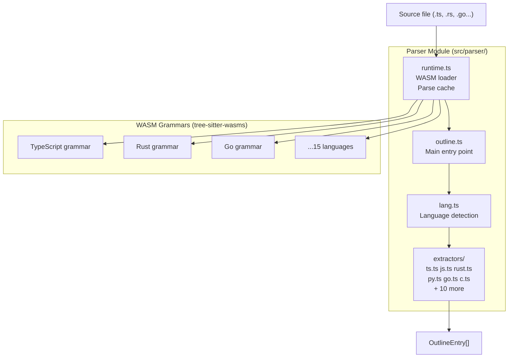
```mermaid
graph TD
    subgraph "Parser Module (src/parser/)"
        Runtime["runtime.ts<br />WASM loader<br />Parse cache"]
        OutlineEntry["outline.ts<br />Main entry point"]
        Lang["lang.ts<br />Language detection"]
        Extractors["extractors/<br />ts.ts js.ts rust.ts<br />py.ts go.ts c.ts<br />+ 10 more"]
    end

    subgraph "WASM Grammars (tree-sitter-wasms)"
        TSGram["TypeScript grammar"]
        RustGram["Rust grammar"]
        GoGram["Go grammar"]
        Etc["...15 languages"]
    end

    Source["Source file (.ts, .rs, .go...)"] --> Runtime
    Runtime --> TSGram
    Runtime --> RustGram
    Runtime --> GoGram
    Runtime --> Etc
    Runtime --> OutlineEntry
    OutlineEntry --> Lang
    Lang --> Extractors
    Extractors --> OutlineResult["OutlineEntry[]"]
```

### The Outline Extraction Flow

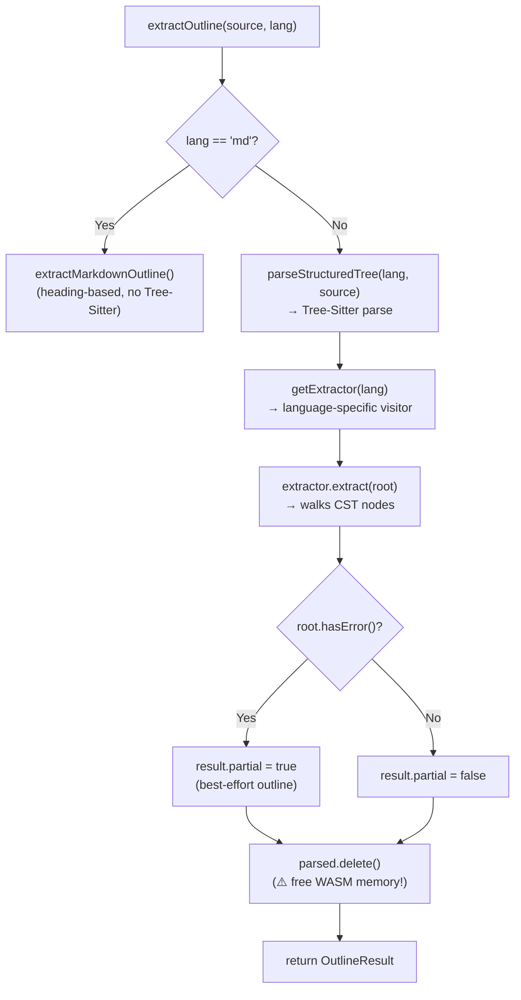
```mermaid
flowchart TD
    A["extractOutline(source, lang)"] --> B{"lang == 'md'?"}
    B -->|"Yes"| C["extractMarkdownOutline()<br />(heading-based, no Tree-Sitter)"]
    B -->|"No"| D["parseStructuredTree(lang, source)<br />→ Tree-Sitter parse"]
    D --> E["getExtractor(lang)<br />→ language-specific visitor"]
    E --> F["extractor.extract(root)<br />→ walks CST nodes"]
    F --> G{"root.hasError()?"}
    G -->|"Yes"| H["result.partial = true<br />(best-effort outline)"]
    G -->|"No"| I["result.partial = false"]
    H --> J["parsed.delete()<br />(⚠️ free WASM memory!)"]
    I --> J
    J --> K["return OutlineResult"]
```

**Critical detail — memory management**: Tree-Sitter's WASM runtime allocates memory outside of V8's garbage collector. If you forget to call `parsed.delete()`, you **leak WASM heap**. Graft always wraps this in a `try/finally`:

```typescript
const parsed = parseStructuredTree(lang, source);
try {
  return extractOutlineFromParsedTree(parsed);
} finally {
  parsed.delete(); // always runs, even if extraction throws
}
```

**Trade-off**: Synchronous parse (good for responsiveness, blocks event loop for large files). The `extractOutlineAsync` variant uses a microtask-based approach for daemon use where responsiveness is critical.

### What an Outline Entry Looks Like

For a TypeScript file containing:

```typescript
export async function createUser(opts: CreateUserOptions): Promise<User> {
  // ... 25 lines of implementation
}

export class UserRepository {
  async findById(id: string): Promise<User | null> { ... }
  async delete(id: string): Promise<void> { ... }
}
```

Graft produces:

```json
{
  "entries": [
    {
      "kind": "function",
      "name": "createUser",
      "exported": true,
      "signature": "async function createUser(opts: CreateUserOptions): Promise<User>",
      "children": []
    },
    {
      "kind": "class",
      "name": "UserRepository",
      "exported": true,
      "signature": "class UserRepository",
      "children": [
        { "kind": "method", "name": "findById", "exported": false, "signature": "async findById(id: string): Promise<User | null>" },
        { "kind": "method", "name": "delete", "exported": false, "signature": "async delete(id: string): Promise<void>" }
      ]
    }
  ],
  "jumpTable": [
    { "symbol": "createUser", "kind": "function", "start": 1, "end": 27 },
    { "symbol": "UserRepository", "kind": "class", "start": 29, "end": 45 },
    { "symbol": "findById", "kind": "method", "start": 30, "end": 35 },
    { "symbol": "delete", "kind": "method", "start": 36, "end": 38 }
  ],
  "partial": false
}
```

This 400-byte outline replaces ~2,000 bytes of source. The agent knows exactly where `findById` lives (line 30–35) and can request only that range next.

### Outline Data Model

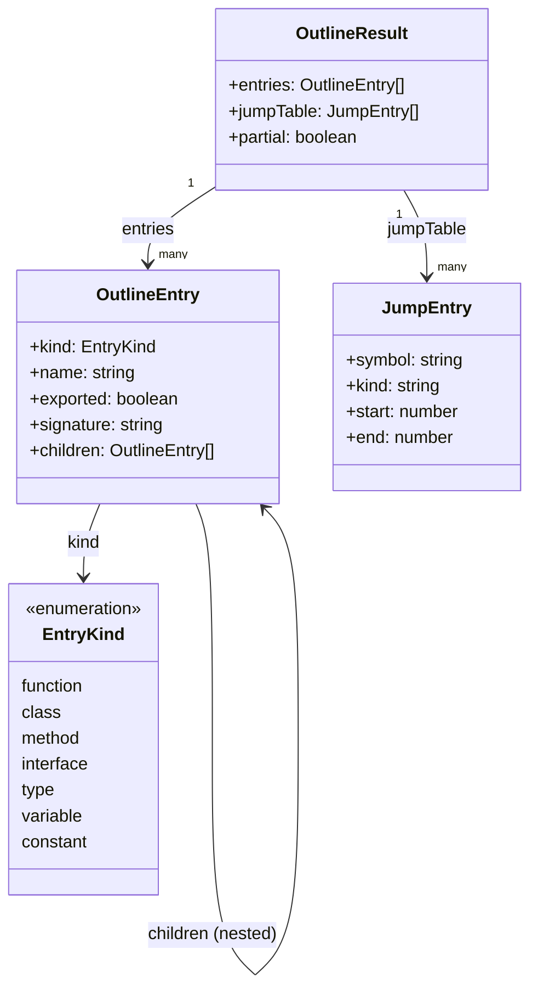
```mermaid
classDiagram
    class OutlineResult {
        +entries: OutlineEntry[]
        +jumpTable: JumpEntry[]
        +partial: boolean
    }
    class OutlineEntry {
        +kind: EntryKind
        +name: string
        +exported: boolean
        +signature: string
        +children: OutlineEntry[]
    }
    class JumpEntry {
        +symbol: string
        +kind: string
        +start: number
        +end: number
    }
    class EntryKind {
        <<enumeration>>
        function
        class
        method
        interface
        type
        variable
        constant
    }
    OutlineResult "1" --> "many" OutlineEntry : entries
    OutlineResult "1" --> "many" JumpEntry : jumpTable
    OutlineEntry --> OutlineEntry : children (nested)
    OutlineEntry --> EntryKind : kind
```

---

## 11. WARP: Structural Worldline Memory

WARP is the most novel component in Graft. It transforms the Git history of a repository into a **queryable structural graph** — without ever having to re-parse old commits.

### The Problem WARP Solves

"What functions existed in this file three months ago?" Naively, you'd have to:
1. `git checkout <old-commit>`
2. Read the file
3. Parse it with Tree-Sitter
4. Extract the outline

That is slow, destructive to the working tree, and not amenable to background indexing.

WARP pre-computes and stores AST outlines **per commit**, indexed in a Git-backed graph structure (using `@git-stunts/git-warp`).

### The Three Worldline Layers

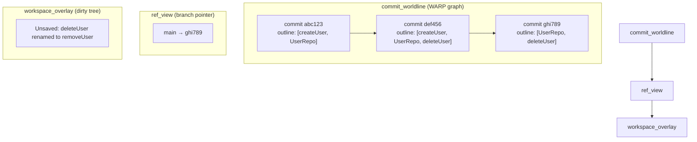
```mermaid
graph TD
    subgraph "commit_worldline (WARP graph)"
        C1["commit abc123<br />outline: [createUser, UserRepo]"]
        C2["commit def456<br />outline: [createUser, UserRepo, deleteUser]"]
        C3["commit ghi789<br />outline: [UserRepo, deleteUser]"]
        C1 --> C2 --> C3
    end

    subgraph "ref_view (branch pointer)"
        Main["main → ghi789"]
    end

    subgraph "workspace_overlay (dirty tree)"
        Dirty["Unsaved: deleteUser renamed to removeUser"]
    end

    commit_worldline --> ref_view
    ref_view --> workspace_overlay
```

### Indexing Flow (Background)

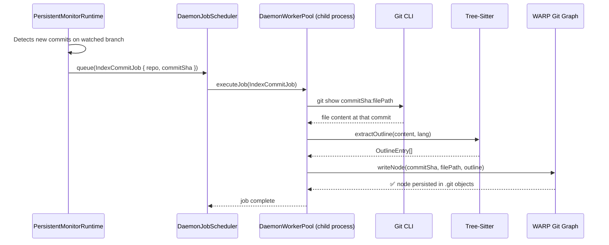
```mermaid
sequenceDiagram
    participant Monitor as PersistentMonitorRuntime
    participant Sched as DaemonJobScheduler
    participant Worker as DaemonWorkerPool (child process)
    participant Git as Git CLI
    participant Parser as Tree-Sitter
    participant Graph as WARP Git Graph

    Monitor->>Monitor: Detects new commits on watched branch
    Monitor->>Sched: queue(IndexCommitJob { repo, commitSha })
    Sched->>Worker: executeJob(IndexCommitJob)
    Worker->>Git: git show commitSha:filePath
    Git-->>Worker: file content at that commit
    Worker->>Parser: extractOutline(content, lang)
    Parser-->>Worker: OutlineEntry[]
    Worker->>Graph: writeNode(commitSha, filePath, outline)
    Graph-->>Worker: ✅ node persisted in .git objects
    Worker-->>Sched: job complete
```

**Why a child process?** Parsing many files with Tree-Sitter is CPU-bound. Running it in a child process (`ChildProcessDaemonWorkerPool`) prevents the main event loop from stalling — agents continue to receive responses while indexing happens in the background.

**Trade-off**: Child process overhead (~30ms spawn time) vs. unblocked main thread. For bulk indexing of 100+ commits, the trade-off strongly favors child processes.

### Querying the WARP Graph

Once indexed, structural queries are fast:

```typescript
// "Did createUser exist at main~10?"
const result = await warpCtx.querySymbol("createUser", {
  ref: "main~10",
  path: "src/users.ts",
});

// "Which files changed the most in the last 30 commits?"
const churn = await warpCtx.structuralChurn({ commits: 30 });

// "Are there any symbols defined but never referenced?"
const dead = await warpCtx.deadSymbols({ ref: "HEAD" });
```

---

## 12. Session Governance: The Governor and Tripwires

The `GovernorTracker` (`src/session/tracker.ts`) is Graft's behavioral watchdog. It tracks every tool call in a session and fires **tripwires** when it detects anti-patterns.

### State the Governor Tracks

```typescript
class GovernorTracker {
  totalMessages: number;         // All messages in the session (user + agent)
  toolCallsSinceUser: number;    // Consecutive tool calls without user input
  editBashTransitions: number;   // Times agent has alternated edit → bash → edit
  budgetBytes: number | null;    // Optional total byte cap for this session
  consumedBytes: number;         // Bytes returned to agent so far
}
```

### GovernorTracker Class Diagram

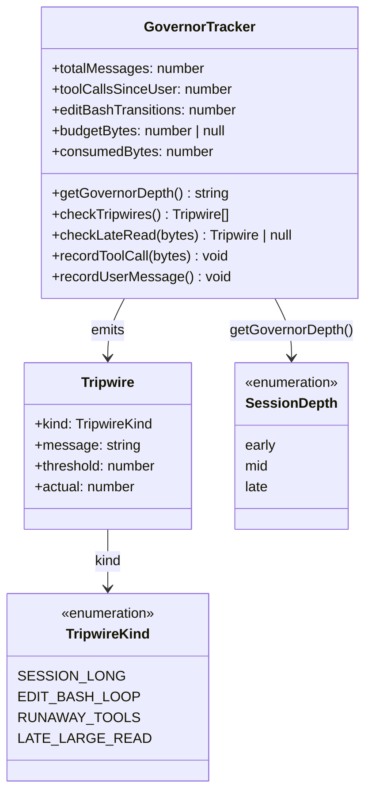
```mermaid
classDiagram
    class GovernorTracker {
        +totalMessages: number
        +toolCallsSinceUser: number
        +editBashTransitions: number
        +budgetBytes: number | null
        +consumedBytes: number
        +getGovernorDepth() string
        +checkTripwires() Tripwire[]
        +checkLateRead(bytes) Tripwire | null
        +recordToolCall(bytes) void
        +recordUserMessage() void
    }
    class Tripwire {
        +kind: TripwireKind
        +message: string
        +threshold: number
        +actual: number
    }
    class TripwireKind {
        <<enumeration>>
        SESSION_LONG
        EDIT_BASH_LOOP
        RUNAWAY_TOOLS
        LATE_LARGE_READ
    }
    class SessionDepth {
        <<enumeration>>
        early
        mid
        late
    }
    GovernorTracker --> Tripwire : emits
    GovernorTracker --> SessionDepth : getGovernorDepth()
    Tripwire --> TripwireKind : kind
```

### Session Depth Calculation

```typescript
getGovernorDepth(): "early" | "mid" | "late" {
  if (this.totalMessages < 100) return "early";
  if (this.totalMessages < 500) return "mid";
  return "late";
}
```

This depth feeds directly into the policy engine's byte cap selection.

### Tripwire Logic

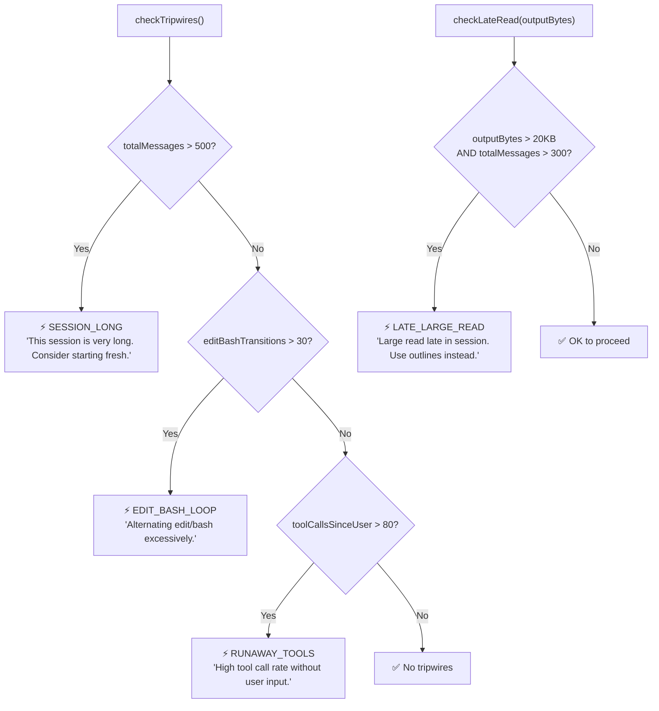
```mermaid
flowchart TD
    A["checkTripwires()"] --> B{"totalMessages > 500?"}
    B -->|"Yes"| C["⚡ SESSION_LONG<br />'This session is very long. Consider starting fresh.'"]
    B -->|"No"| D{"editBashTransitions > 30?"}
    D -->|"Yes"| E["⚡ EDIT_BASH_LOOP<br />'Alternating edit/bash excessively.'"]
    D -->|"No"| F{"toolCallsSinceUser > 80?"}
    F -->|"Yes"| G["⚡ RUNAWAY_TOOLS<br />'High tool call rate without user input.'"]
    F -->|"No"| H["✅ No tripwires"]

    I["checkLateRead(outputBytes)"] --> J{"outputBytes > 20KB<br />AND totalMessages > 300?"}
    J -->|"Yes"| K["⚡ LATE_LARGE_READ<br />'Large read late in session. Use outlines instead.'"]
    J -->|"No"| L["✅ OK to proceed"]
```

Tripwires are **advisory, not blocking**. They appear in the `_receipt` attached to the tool result. The agent can read them and self-correct. Graft does not forcibly prevent the read — it trusts the agent to respond to the signal.

**Trade-off**: A hard block would be more authoritative but would break agent workflows unexpectedly. An advisory signal is gentler and allows the agent to contextualize (maybe that large read was intentional and justified).

---

## 13. Anatomy of a Payload: Data Schemas In Motion

Let's trace a complete payload lifecycle for a single `safe_read` call on a large file (triggering an outline response).

### ToolContext: The Dependency Injection Container

Every tool handler receives a `ToolContext`. It is the single object that carries all session state and infrastructure.

```mermaid
classDiagram
    class ToolContext {
        +projectRoot: string
        +graftDir: string
        +graftignorePatterns: string[]
        +governor: GovernorTracker
        +cache: ObservationCache
        +metrics: Metrics
        +fs: FileSystem
        +codec: JsonCodec
        +process: ProcessRunner
        +git: GitClient
        +respond(tool, data) McpToolResult
        +resolvePath(relative) string
        +recordFootprint(entry) void
        +getWarp() Promise~WarpContext~
        +getRepoState() RepoObservation
        +getCausalContext() RuntimeCausalContext
    }
    class GovernorTracker {
        +totalMessages: number
        +consumedBytes: number
    }
    class ObservationCache {
        +lookup(path, hash) CachedOutline | null
        +store(path, hash, outline) void
        +size: number
    }
    class Metrics {
        +reads: number
        +outlines: number
        +refusals: number
    }
    ToolContext --> GovernorTracker : governor
    ToolContext --> ObservationCache : cache
    ToolContext --> Metrics : metrics
```

### Step 1: Agent Request (JSON-RPC over stdio)

```json
{
  "jsonrpc": "2.0",
  "id": 7,
  "method": "tools/call",
  "params": {
    "name": "safe_read",
    "arguments": {
      "path": "src/operations/repo-workspace.ts",
      "intent": "understand the safeRead method signature"
    }
  }
}
```

### Step 2: ToolContext at Handler Entry

```typescript
// What ctx looks like at the start of the handler
{
  projectRoot: ".",
  graftDir: "./.graft",
  graftignorePatterns: ["node_modules/**", "dist/**", "*.generated.ts"],
  governor: GovernorTracker { totalMessages: 47, toolCallsSinceUser: 3, consumedBytes: 84320 },
  cache: ObservationCache { size: 12 },  // 12 files cached this session
  metrics: Metrics { reads: 12, outlines: 4, refusals: 1 }
}
```

### Step 3: Policy Input

```typescript
{
  path: "src/operations/repo-workspace.ts",
  lines: 612,          // far exceeds 150-line threshold
  bytes: 24891,
  patterns: ["node_modules/**", "dist/**", "*.generated.ts"],
  sessionDepth: "early",
  budget: null
}
```

### Step 4: Policy Decision → OutlineResult

```typescript
// 612 lines > 150 → forced to outline
OutlineResult {
  projection: "outline",
  reason: "OUTLINE",
  thresholds: { lines: 150, bytes: 12288 },
  actual: { lines: 612, bytes: 24891 }
}
```

### Step 5: Tree-Sitter Outline (abbreviated)

```json
{
  "entries": [
    { "kind": "interface", "name": "RepoWorkspaceSafeReadResult", "exported": true, "children": [] },
    { "kind": "interface", "name": "RepoWorkspaceOptions", "exported": true, "children": [] },
    { "kind": "class", "name": "RepoWorkspace", "exported": true, "children": [
      { "kind": "method", "name": "safeRead", "signature": "async safeRead(opts: SafeReadOptions): Promise<RepoWorkspaceSafeReadResult>" },
      { "kind": "method", "name": "loadGraftignorePatterns", "signature": "static async loadGraftignorePatterns(fs: FileSystem, root: string): Promise<string[]>" },
      { "kind": "method", "name": "getRepoState", "signature": "getRepoState(): RepoObservation" }
    ]}
  ],
  "jumpTable": [
    { "symbol": "RepoWorkspaceSafeReadResult", "kind": "interface", "start": 18, "end": 32 },
    { "symbol": "RepoWorkspace", "kind": "class", "start": 48, "end": 612 },
    { "symbol": "safeRead", "kind": "method", "start": 89, "end": 201 }
  ],
  "partial": false
}
```

### Step 6: Agent Response (JSON-RPC)

```json
{
  "jsonrpc": "2.0",
  "id": 7,
  "result": {
    "content": [{
      "type": "text",
      "text": "{\"path\":\"src/operations/repo-workspace.ts\",\"projection\":\"outline\",\"reason\":\"OUTLINE\",\"actual\":{\"lines\":612,\"bytes\":24891},\"thresholds\":{\"lines\":150,\"bytes\":12288},\"outline\":[...],\"jumpTable\":[...],\"estimatedBytesAvoided\":24891,\"_receipt\":{\"seq\":8,\"latencyMs\":34,\"returnedBytes\":1240,\"cumulative\":{\"bytesAvoided\":49782,...}}}"
    }]
  }
}
```

`estimatedBytesAvoided: 24891` — the outline is 1,240 bytes. The original file is 24,891 bytes. Graft saved ~23KB of context window on this single call.

---

## 14. The Unhappy Paths: Error Handling and Refusals

Graft distinguishes between **structured refusals** (expected, handled as data) and **exceptional errors** (unexpected, handled as exceptions).

### Category 1: Structured Refusals

These are not errors — they are **intentional policy decisions** returned as typed values. The agent is expected to read the `reason` and `next` fields and adapt.

```mermaid
flowchart TD
    A["safe_read('package-lock.json')"] --> B["checkBan()"]
    B --> C["RefusedResult {<br />  reason: 'LOCKFILE',<br />  reasonDetail: 'Lockfiles are noise; read package.json instead.',<br />  next: ['Try reading package.json for dependency info']<br />}"]
    C --> D["Agent receives refusal + next steps"]
    D --> E["Agent calls safe_read('package.json') ✅"]
```

Full set of refusal reasons:

| Reason Code | Meaning | Suggested Next |
|-------------|---------|----------------|
| `BINARY` | Image, archive, binary blob | N/A — no text equivalent |
| `LOCKFILE` | `package-lock.json`, `yarn.lock`, etc. | Read `package.json` instead |
| `SECRET` | `.env`, `.pem`, `.key` | Never read secrets |
| `MINIFIED` | `.min.js`, `.min.css` | Read the source, not the output |
| `GRAFTIGNORE` | Matches `.graftignore` pattern | Check `.graftignore` for alternatives |
| `UNSUPPORTED_LANGUAGE` | Graft can't parse this language | Read content only if small |
| `UNAUTHORIZED` | Path outside authorized workspace | Re-authorize with correct path |

### Category 2: Version Guard Failures

```typescript
// src/git/version-guard.ts
async function ensureGitVersionSupportsGraft(): Promise<void> {
  const version = await getGitVersion();
  if (!meetsMinimum(version, [2, 39, 0])) {
    throw new Error(
      `Graft requires Git >= 2.39.0. You have ${version}. Please upgrade.`
    );
  }
}
```

This runs at startup (bootstrapping phase). If it throws, the process exits before any tool calls are accepted.

### Category 3: CLI Error Formatting

When a CLI command fails (wrong args, missing file), Graft does not just print a stack trace:

```typescript
// src/cli/cli-error.ts
function writeCliError(writer, message, details) {
  writer.writeLine(`❌ ${message}`);
  if (details.usage) writer.writeLine(`Usage: ${details.usage}`);
  if (details.example) writer.writeLine(`Example: ${details.example}`);
  if (details.hint) writer.writeLine(`Hint: ${details.hint}`);
}
```

A user running `graft read safe` (missing path) sees:

```
❌ Missing required argument: path
Usage: graft read safe <path>
Example: graft read safe src/app.ts
```

### Category 4: MCP Tool Errors

MCP tool errors use the protocol's error shape:

```typescript
// src/mcp/context.ts
respondWithError(tool: McpToolName, message: string): McpToolResult {
  return {
    isError: true,
    content: [{ type: "text", text: JSON.stringify({ error: message, tool }) }]
  };
}
```

The agent receives `isError: true` and must handle it — typically by trying a different approach.

### What Happens When the Daemon Crashes?

The repo-local stdio server is unaffected — it is a separate process entirely. Agents in repo-local mode continue working. Agents that were connected to the daemon via the Unix socket receive a connection-refused error on their next tool call and must reconnect (or fall back to repo-local mode).

---

## 15. Concurrency and Asynchronous Flows

Graft runs on Node.js, which is single-threaded with an event loop. Here is how it handles concurrency.

### Main Thread: Event Loop + Async/Await

All MCP tool handlers are `async` functions. They `await` I/O (file reads, git commands) without blocking the event loop. Multiple tool calls from different sessions can interleave on the main thread:

```mermaid
sequenceDiagram
    participant EL as Node.js Event Loop
    participant S1 as Session 1 (safe_read)
    participant S2 as Session 2 (code_show)
    participant FS as Filesystem

    EL->>S1: dispatch tool call
    S1->>FS: readFile() [async, non-blocking]
    EL->>S2: dispatch tool call (while S1 awaits)
    S2->>S2: parse jump table [sync, fast]
    S2-->>EL: result ready
    FS-->>S1: file contents ready
    S1->>S1: evaluate policy [sync]
    S1-->>EL: result ready
```

### Child Process Pool: CPU-Bound Work

Heavy lifting (bulk WARP indexing, parsing many files) is offloaded to child processes:

```mermaid
graph TD
    Main["Main Process<br />(event loop)"] -->|"executeJob(job)"| Pool["DaemonWorkerPool"]
    Pool --> W1["Child Process 1<br />(indexing project-a)"]
    Pool --> W2["Child Process 2<br />(indexing project-b)"]
    Pool --> W3["Child Process 3<br />(idle)"]
    W1 -->|"job result"| Pool
    W2 -->|"job result"| Pool
    Pool -->|"callback"| Main
```

**Why not worker_threads?** Child processes provide stronger isolation — a crash in a child process does not take down the daemon. `worker_threads` shares memory, which risks heap corruption from WASM operations.

### The Job Scheduler: Fair Queuing

The `DaemonJobScheduler` ensures that one active session doesn't monopolize the worker pool:

```typescript
class DaemonJobScheduler {
  private queue: DaemonJob[] = [];

  queue(job: DaemonJob): void {
    this.queue.push(job);
    this.tryDispatch();
  }

  private tryDispatch(): void {
    if (this.running >= this.maxConcurrent) return; // respect pool size
    const next = this.queue.shift();
    if (next) this.dispatch(next);
  }
}
```

### Job Scheduler and Worker Pool Class Diagram

```mermaid
classDiagram
    class DaemonJobScheduler {
        -queue: DaemonJob[]
        -running: number
        -maxConcurrent: number
        +queue(job) void
        +dequeue() DaemonJob | null
        +getCounts() JobCounts
        -tryDispatch() void
    }
    class DaemonJob {
        +id: string
        +repo: string
        +type: JobType
        +payload: unknown
    }
    class DaemonWorkerPool {
        <<abstract>>
        +executeJob(job) Promise~void~
    }
    class InlineDaemonWorkerPool {
        +executeJob(job) Promise~void~
    }
    class ChildProcessDaemonWorkerPool {
        -childProcesses: ChildProcess[]
        +executeJob(job) Promise~void~
    }
    DaemonJobScheduler --> DaemonJob : queues
    DaemonJobScheduler --> DaemonWorkerPool : dispatches to
    DaemonWorkerPool <|-- InlineDaemonWorkerPool : extends
    DaemonWorkerPool <|-- ChildProcessDaemonWorkerPool : extends
```

**Trade-off**: Simple FIFO queue. Does not prioritize interactive requests over background indexing. This can cause slight latency spikes if a large indexing job is running. The alternative (priority queue) adds complexity for a case that is rare in practice.

### Background Monitoring

The `PersistentMonitorRuntime` watches repos for new commits using a polling model (periodic `git log` calls) rather than `inotify`/`FSEvents`.

**Why polling over filesystem events?** `inotify`/`FSEvents` watch the *working tree*, not the Git object store. A `git fetch` that pulls new commits does not touch working tree files — only the `.git/` directory. Polling `git log` is the reliable cross-platform approach.

---

## 16. External Dependencies and System Borders

Here is where *Graft's code ends* and *external systems begin*:

```mermaid
graph TD
    subgraph "Graft's Code"
        Core["Core Business Logic"]
        Ports["Ports (interfaces)"]
    end

    subgraph "Third-Party (npm packages)"
        MCP_SDK["@modelcontextprotocol/sdk<br />JSON-RPC transport, tool schema"]
        TreeSitter["web-tree-sitter<br />WASM parser runtime"]
        TSWasms["tree-sitter-wasms<br />Grammar binaries (15+ langs)"]
        GitWarp["@git-stunts/git-warp<br />Git-backed graph storage"]
        Plumbing["@git-stunts/plumbing<br />Low-level git command wrapper"]
        Picomatch["picomatch<br />.graftignore pattern matching"]
        Zod["zod v4.3.6<br />Runtime schema validation"]
        Bijou["@flyingrobots/bijou<br />Structured logging & tracing"]
    end

    subgraph "Operating System / Runtime"
        Git["git CLI<br />(must be >= 2.39.0)"]
        NodeJS["Node.js >= 20.11.0<br />(libuv event loop)"]
        FS_OS["Filesystem (node:fs)"]
        Sockets["Unix sockets / Named pipes"]
    end

    Core --> Ports
    Ports -->|"adapter implementations"| MCP_SDK
    Ports -->|"adapter implementations"| TreeSitter
    TreeSitter --> TSWasms
    Ports -->|"adapter implementations"| GitWarp
    GitWarp --> Plumbing
    Plumbing --> Git
    Ports -->|"adapter implementations"| Picomatch
    Core --> Zod
    Core --> Bijou
    Ports -->|"adapter implementations"| FS_OS
    Ports -->|"adapter implementations"| Sockets
    Core --> NodeJS
```

### The Hexagonal Boundary in Practice

All external I/O goes through **ports** — TypeScript interfaces defined in `src/ports/`:

```typescript
// src/ports/filesystem.ts
export interface FileSystem {
  readFile(path: string): Promise<{ content: string; bytes: number; lines: number }>;
  stat(path: string): Promise<FileStat>;
  exists(path: string): Promise<boolean>;
}

// src/ports/git.ts
export interface GitClient {
  currentBranch(cwd: string): Promise<string>;
  logCommits(cwd: string, opts: LogOptions): Promise<CommitSummary[]>;
  showFile(cwd: string, ref: string, path: string): Promise<string>;
}
```

**Why this matters for testing**: The entire test suite can swap in fake implementations of these ports, testing all business logic without touching the real filesystem or spawning git processes.

### Port and Adapter Class Diagram

```mermaid
classDiagram
    class FileSystem {
        <<interface>>
        +readFile(path) Promise~FileContent~
        +stat(path) Promise~FileStat~
        +exists(path) Promise~boolean~
    }
    class GitClient {
        <<interface>>
        +currentBranch(cwd) Promise~string~
        +logCommits(cwd, opts) Promise~CommitSummary[]~
        +showFile(cwd, ref, path) Promise~string~
    }
    class ProcessRunner {
        <<interface>>
        +run(cmd, args, opts) Promise~ProcessResult~
    }
    class NodeFileSystem {
        +readFile(path) Promise~FileContent~
        +stat(path) Promise~FileStat~
        +exists(path) Promise~boolean~
    }
    class NodeGitClient {
        +currentBranch(cwd) Promise~string~
        +logCommits(cwd, opts) Promise~CommitSummary[]~
        +showFile(cwd, ref, path) Promise~string~
    }
    class NodeProcessRunner {
        +run(cmd, args, opts) Promise~ProcessResult~
    }
    class FakeFileSystem {
        +readFile(path) Promise~FileContent~
        +stat(path) Promise~FileStat~
        +exists(path) Promise~boolean~
    }
    FileSystem <|.. NodeFileSystem : implements
    FileSystem <|.. FakeFileSystem : implements (tests)
    GitClient <|.. NodeGitClient : implements
    ProcessRunner <|.. NodeProcessRunner : implements
```

---

## 17. Security Boundaries

Graft is designed to be safely runnable in environments where an untrusted agent is making tool calls.

### Path Traversal Prevention

Every file path is confined to the project root before any I/O occurs:

```typescript
// src/adapters/repo-paths.ts
function createRepoPathResolver(projectRoot: string) {
  return (input: string): string => {
    // Resolve symlinks first, then check confinement
    const resolved = fs.realpathSync(path.resolve(projectRoot, input));
    if (!resolved.startsWith(projectRoot + path.sep) && resolved !== projectRoot) {
      throw new PathTraversalError(`Path ${input} escapes project root`);
    }
    return resolved;
  };
}
```

An agent requesting `path: "../../etc/passwd"` will receive a hard error, not the file.

### Secret Detection

```mermaid
flowchart TD
    A["safe_read('.env.production')"] --> B["checkBan('.env.production')"]
    B --> C{"name === '.env'<br />OR starts with '.env.'<br />AND not ends with '.example'?"}
    C -->|"Yes"| D["RefusedResult { reason: 'SECRET' }"]
    C -->|"No"| E["Continue to size checks"]
```

The `.env.example` exception is deliberate — example env files are safe to read (they contain no real credentials) and are often useful for understanding config structure.

### Daemon Authorization Model

The daemon requires a **two-step authorization handshake** before an agent can perform any operations on a repo:

```mermaid
sequenceDiagram
    participant Agent
    participant CP as DaemonControlPlane

    Agent->>CP: workspace_authorize({ cwd: "/repos/myapp" })
    Note right of CP: Generates crypto-random nonce<br />Stores { cwd → nonce } in memory
    CP-->>Agent: { nonce: "f7a3b9..." }

    Note over Agent: Agent must return nonce to prove<br />it received the response<br />(prevents CSRF-style attacks)

    Agent->>CP: workspace_open({ cwd: "/repos/myapp", nonce: "f7a3b9..." })
    CP->>CP: verify nonce matches stored nonce
    CP-->>Agent: { workspaceId: "ws_42", status: "opened" }

    Agent->>CP: safe_read({ path: "src/app.ts" })
    Note right of CP: Checks: is path inside ws_42's root?
    CP-->>Agent: { projection: "content", ... }
```

### No Credentials in Code

Graft uses **constructor injection** for all external dependencies. There are no global singletons, no module-level API keys, and no hardcoded credentials. All state flows through the `ToolContext` injection container, which is created fresh per session.

---

## 18. Configuration and Environment Tuning

The numeric thresholds, file paths, and defaults in this section are implementation snapshot details and can change in later releases.

### Environment Variables

| Variable | Default | Effect |
|----------|---------|--------|
| `GRAFT_PROJECT_ROOT` | `process.cwd()` | Override the detected project root. Useful in monorepos where the working directory isn't the repo root. |
| `GRAFT_DEBUG` | `"0"` | Set to `"1"` to print full stack traces on errors instead of user-friendly messages. |
| `GRAFT_WARP_CHECKPOINT_EVERY` | `128` | How many commits to index before writing a WARP checkpoint to disk. Lower values = more durable (less work lost on crash) but more I/O. |

### Policy Thresholds (Hardcoded, Configurable in Future)

```typescript
// src/policy/evaluate.ts
const STATIC_THRESHOLDS = {
  lines: 150,    // Files over this get outlined
  bytes: 12288,  // Files over 12KB get outlined (even if under 150 lines)
};
```

**Impact of tweaking `lines: 150`**:
- Lower (e.g., 80): More files are outlined, agents see less raw code, context window is preserved more aggressively. Risk: agents lose implementation detail they might need.
- Higher (e.g., 300): More files are returned as full content. Agents see more code but burn context faster.

### Tripwire Thresholds

```typescript
// src/session/tracker.ts
const THRESHOLDS = {
  SESSION_LONG: 500,          // messages before SESSION_LONG fires
  EDIT_BASH_LOOP: 30,         // edit/bash alternations
  RUNAWAY_TOOLS: 80,          // tool calls without user input
  LATE_LARGE_READ_BYTES: 20480,   // bytes
  LATE_LARGE_READ_MESSAGES: 300,  // message threshold for "late"
};
```

**Impact of tweaking `RUNAWAY_TOOLS: 80`**:
- Lower: More sensitive; fires earlier in normal agentic loops (could generate false positives for complex tasks)
- Higher: More permissive; could allow genuine runaway tool loops to continue longer before detection

### `.graftignore` (Per-Repo Configuration)

```
# .graftignore — picomatch format
dist/**
build/**
.next/**
*.generated.ts
coverage/**
*.snap
```

**Trade-off**: Patterns in `.graftignore` are loaded once at server startup (bootstrapping). Changes to `.graftignore` during a session are not reflected until the server restarts. This is a **deliberate design choice**: runtime reloading of ignore patterns introduces race conditions and inconsistencies within a session.

---

## 19. Architectural Trade-offs

Every design decision is a compromise. Here are Graft's most significant ones, stated explicitly.

### Trade-off 1: Outlines Over Full Content

**Decision**: Files over 150 lines or 12KB are returned as structural outlines, not full content.

**Gained**: Agents consume 10–50× fewer bytes per large file. Context windows are preserved for the actual work, not file exploration.

**Lost**: Agents cannot see implementation bodies of functions in large files. They must use `code_show` + range reads to drill into specific functions.

**When this hurts**: Agents that genuinely need to read large files end up making more round trips (outline → jump table → range read). This is intentional friction — it forces agents to be precise.

---

### Trade-off 2: Pure Policy Function (No Side Effects)

**Decision**: `evaluatePolicy()` is a pure function. It reads no files, makes no network calls, touches no global state.

**Gained**: Trivially testable (no mocking required), predictable, composable. The same policy logic runs on CLI, MCP, and library surfaces without modification.

**Lost**: The policy cannot adapt dynamically based on real-time feedback (e.g., "I've noticed this agent is good at digesting large files"). It is a static rule set.

---

### Trade-off 3: Tripwires Are Advisory, Not Blocking

**Decision**: Tripwire signals appear in receipts but do not prevent the tool call from completing.

**Gained**: Agent workflows are never broken unexpectedly. An agent can contextualize and decide the tripwire is a false positive for its specific task.

**Lost**: Runaway agents can ignore tripwires and continue burning context. There is no hard stop.

**Mitigation**: Future versions may add a configurable "strict mode" where tripwires block.

---

### Trade-off 4: In-Memory ObservationCache

**Decision**: File outlines are cached in memory (per session), not on disk.

**Gained**: Zero disk I/O for repeated reads. 100% fresh on every new session (no stale cache).

**Lost**: Cache is lost when the session ends. A new session will re-parse all files even if they haven't changed since the last session.

**Why not persist?** The cache key includes `contentHash` (file content). If a file changes between sessions, the cached outline is stale. Detecting staleness efficiently requires hashing the file on startup — which is the same cost as just re-parsing. So caching across sessions would add complexity with no net benefit for most workflows.

---

### Trade-off 5: Git CLI Over a Native Git Library

**Decision**: All Git operations go through child processes running the `git` CLI, not a native Node.js Git library (like `nodegit` or `isomorphic-git`).

**Gained**: Exact parity with the user's installed Git. No binary compatibility issues. Git's plumbing commands are extremely stable and well-documented. No native addon compilation required.

**Lost**: Each Git operation spawns a child process (~5–15ms overhead). High-frequency Git queries in tight loops can add latency.

**Why this is acceptable**: Graft's Git operations happen during indexing (background) or as one-time lookups. They are never in the hot path of responding to an MCP tool call for small files.

---

### Trade-off 6: Polling for New Commits (vs. Filesystem Events)

**Decision**: `PersistentMonitorRuntime` polls `git log` periodically rather than using `inotify`/`FSEvents`.

**Gained**: Cross-platform correctness. `git fetch` updates `.git/refs/`, not the working tree — filesystem event watchers would miss it. Polling catches all cases uniformly.

**Lost**: New commits are detected with a polling delay (configurable, default ~30s). Not suitable for sub-second real-time indexing.

**When this matters**: For agents that commit frequently and immediately want WARP queries on their new commits, there may be a brief indexing lag.

---

### Trade-off 7: WARP Stores Outlines, Not Full Diffs

**Decision**: WARP indexes the structural outline of each commit, not the full source diff.

**Gained**: Storage is proportional to the *number of symbols* in the codebase, not the *volume of code changed*. A 500-line file with 10 functions contributes 10 outline nodes — not 500 line-diffs. Queries like "what functions existed at this commit?" are O(1) lookups.

**Lost**: WARP cannot reconstruct full file content for arbitrary past commits. For that, you still need `git show`. WARP is structural memory, not a content archive.

---

This document is implementation-backed but non-normative. Source code and public API contracts remain authoritative.
