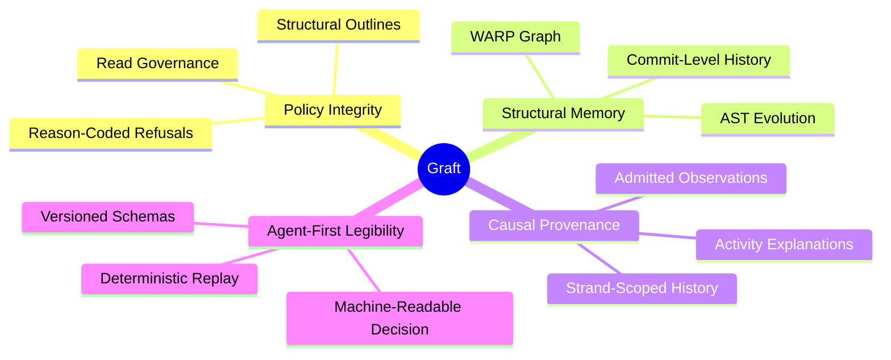

# VISION

Graft is an industrial-grade context governor for coding agents where code structure and causal activity are unified.

## Core Tenets

### 1. Policy Integrity
A strict read-governance layer that ensures agents consume only what they need. Large files are degraded to structural maps; banned files are refused with explicit, actionable reasons.

### 2. Structural Memory
A rendering foundation built on WARP (Structural Worldline Memory). Graft tracks the evolution of symbols, files, and relationships across the repository's entire history.

### 3. Causal Provenance
The "why" behind structural changes. Graft tracks observations, stages, and transitions to explain the evolution of the codebase between hard Git checkpoints.

### 4. Agent-First Legibility
The system is designed to be codable and inspectable by both humans and AI. All outputs are versioned, machine-readable JSON payloads with embedded receipts and schemas.

### 5. Empirical Governance
Session management and budgets are substrate properties. Graft tightens read caps as the context window fills, ensuring agents remain focused and cost-effective.

---
**The goal is not just smaller reads. It is the geometric lawfulness of the repository as a provenance-aware medium for agentic work.**
