# Graft as an embeddable library and a bounded local runtime

This is a proposed architecture, not a report of an implemented migration. It
covers the Graft checkout at `b7938aa9dbf274942a584fe18b21e6e635f2a369`
(package 0.13.0), the installed operator package inspected at 0.12.0, and the
jedit consumer inspected using 0.11.1. These are three different observations.
The running daemon had already disappeared when the memory investigation began;
its loaded build and allocation history were not recovered.

<details>
<summary>Reading map</summary>

- [1. The decision in one minute](#1-the-decision-in-one-minute)
- [2. One example to carry through the design](#2-one-example-to-carry-through-the-design)
- [3. Four boundaries, not five names](#3-four-boundaries-not-five-names)
- [4. What the current system actually does](#4-what-the-current-system-actually-does)
- [5. The target component map](#5-the-target-component-map)
- [6. Public contracts and the application class model](#6-public-contracts-and-the-application-class-model)
- [7. Identity, relationships, and durable evidence](#7-identity-relationships-and-durable-evidence)
- [8. The editor path: in-process, explicit, disposable](#8-the-editor-path-in-process-explicit-disposable)
- [9. Operator startup, local HTTP, and compatibility](#9-operator-startup-local-http-and-compatibility)
- [10. Routing, scheduling, and worker ownership](#10-routing-scheduling-and-worker-ownership)
- [11. Memory: ownership is part of the architecture](#11-memory-ownership-is-part-of-the-architecture)
- [12. Monitors, storage, parser assets, and the Echo direction](#12-monitors-storage-parser-assets-and-the-echo-direction)
- [13. The inspector and optional TUI](#13-the-inspector-and-optional-tui)
- [14. Process shutdown and recovery](#14-process-shutdown-and-recovery)
- [15. Lockstep build, packaging, and release](#15-lockstep-build-packaging-and-release)
- [16. Trust, failures, and diagnostic meaning](#16-trust-failures-and-diagnostic-meaning)
- [17. Independently shippable migration slices](#17-independently-shippable-migration-slices)
- [18. Acceptance, falsification, and resource experiments](#18-acceptance-falsification-and-resource-experiments)
- [19. Review questions and completion criteria](#19-review-questions-and-completion-criteria)
- [Appendix A. Source ownership inventory](#appendix-a-source-ownership-inventory)
- [Appendix B. Capability and integration inventory](#appendix-b-capability-and-integration-inventory)
- [Appendix C. Sources and related packets](#appendix-c-sources-and-related-packets)

</details>

## 1. The decision in one minute

**Keep the CLI and daemon in the same published operator package,
`@flyingrobots/graft`. Extract `@flyingrobots/graft-lib` for embedding. Keep MCP
as an internal adapter module initially. Add `@flyingrobots/graft-tui` when the
interactive inspector is delivered and can be installed independently. Version
all published members in lockstep.** A command-line interface (CLI) is a way to
invoke the system; a daemon is its long-lived process. That process boundary is
useful, but it does not automatically justify a separate npm installation.

jedit needs parsing, source projections, repository reads, and structural diffs.
It does not need to install or initialize a daemon transport. Conversely, an
operator who installs `graft` reasonably expects `graft daemon`, local commands,
and the agent bridge to work with a matching runtime. Giving those pieces five
package names would add compatibility and installation work without removing
another dependency from jedit.

The HTTP server stays in the operator runtime. It is Node's HTTP implementation
carrying local interprocess communication (IPC) over a private Unix socket, or a
named pipe on Windows. It serves MCP, the Model Context Protocol used by coding
agents, and a health endpoint. There is no public TCP listener in this
composition. Removing HTTP would break the existing bridge and require replacing
the protocol. Removing it from the library's dependency and import graph solves
the actual embedding problem.

**The reported 7 GB memory incident adds an independent requirement: long-lived
resources need owners, budgets, and release paths. A package split cannot repair
unbounded retention.** Resource containment is a focused runtime delivery of its
own, and must be possible before the monorepo migration.

| Decision | Recommendation | Consequence |
| :--- | :--- | :--- |
| Embedded installation | `@flyingrobots/graft-lib` | No MCP SDK, daemon listener, or Bijou dependency closure |
| Operator installation | Existing `@flyingrobots/graft` | Preserve both `graft` and `git-graft` executables |
| CLI versus daemon | Separate internal modules, one package | Matching bootstrap, worker assets, and build identity |
| MCP adapter | Internal `mcp/` module | Extract a package only for a demonstrated independent host |
| Interactive terminal UI | Future `@flyingrobots/graft-tui` | Optional process and dependencies; read-only inspector first |
| Versioning | One version across published workspace members | One source release, several independently verified artifacts |
| Memory | Explicit host resource ownership | No assumption that GC or package boundaries provide a budget |

The first hill is an editor installing the library alone and obtaining the same
supported results, while the existing operator installation continues to work.
The runtime containment hill is bounded retained work with explicit admission
failure; neither hill requires a dashboard, a new network protocol, or Echo
migration to be complete.

## 2. One example to carry through the design

Use one realistic case throughout: jedit opens worktree A, displays an outline of
`src/totals.ts`, and previews an unsaved edit. An agent has also opened A and a
second worktree B of the same repository. It requests a repository diff for A,
then changes its default route to B while that request remains queued.

The example source is deliberately small and illustrative, not a claimed live
user document. The unsaved buffer changes `price` to `price * quantity`:

```ts
export function total(price: number, quantity: number): number {
  return price * quantity;
}
```

For the buffer outline, the important expectation is the exported `total`
function and its two parameters. For the repository diff, the inputs are two
explicit Git references. For the daemon request, A is part of the resolved
operation identity. None of these facts establishes that every file in the
workspace is indexed or that an old index describes today's dirty files.

| Participant or fact | Example value | Meaning |
| :--- | :--- | :--- |
| Repository | R | Shared Git repository identity |
| Worktrees | A, B | Distinct checked-out working directories of R |
| Editor buffer | `src/totals.ts`, revision 12 | Unsaved bytes owned by jedit |
| Agent transport session | S | One registered MCP conversation |
| Opened membership | S opens A and B | Current admitted workspace inventory |
| Active route | Initially A, subsequently B | Default for qualifying future calls |
| Request | Q targets A | Immutable resolved route for this operation |
| Scheduled job | J originates from S and Q | Execution retains A after S changes route |
| Index evidence | A recorded file entry, if available | Evidence with its own source basis and scope |

Two foils prevent misleading conclusions. Importing Graft can load HTTP-related
modules without creating a listener; import coupling is real, but a running
server is a separate observation. Likewise, a fresh inspector frame can contain
old or mixed source evidence; updating the screen does not update source currency.

Every layer below must preserve those distinctions for this same example. The
editor owns revision 12, the runtime owns Q's admitted route, and the storage
adapter owns what it can actually establish about indexed history.

## 3. Four boundaries, not five names

A source module, a published package, an operating-system process, and a version
are different boundaries. A module separates responsibilities. A package defines
an installation and public import surface. A process gives independent lifetime
and some fault isolation. A version identifies a compatible artifact set. They
need not have a one-to-one relationship.

The proposed package dependencies are intentionally small. Arrows below mean
"depends on at installation/build time"; they do not mean a process starts.

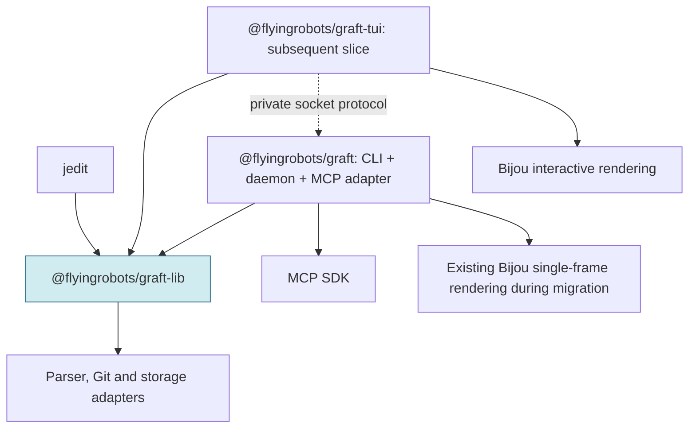

<details>
<summary>Figure 1 - Package dependencies and the optional inspector</summary>

The dotted edge is a runtime protocol dependency, not an npm dependency on the
server package. jedit's dependency closure ends below the library boundary.

</details>

| Boundary | Example | What it protects |
| :--- | :--- | :--- |
| Module | `runtime/scheduler` | Authority and dependency direction |
| Package | `graft-lib` | Editor installation and public type closure |
| Process | One daemon plus worker children | Lifetimes, responsiveness, failure containment |
| Version | Common release V | Artifact compatibility; not snapshot coherence |

The CLI should have a small dispatch entrypoint with lazy command loading, so
`--help` and version output do not load graph, parser, MCP, and rendering machinery.
It may share a package with the daemon without eagerly importing the daemon on
every invocation. Tree shaking is not an installation boundary.

| Alternative | Benefit | Cost | Decision |
| :--- | :--- | :--- | :--- |
| One package with `./lib` subpath | Small source change | jedit still installs server/UI dependencies | Insufficient |
| Library plus operator | Solves actual consumer need; preserves installation | Requires real application extraction | Adopt first |
| Library, operator, optional TUI | Independent UI dependencies and lifecycle | Third artifact and protocol consumer | Target when navigation ships |
| Add separate MCP package | Useful for external custom MCP hosts | New API/SDK compatibility surface | Defer until an independent consumer exists |
| Split CLI and daemon packages | Useful for separately deployed remote clients/services | Installer, worker asset, version and startup skew | No current justification |

A future remote service or externally embedded daemon could change the final
row. The internal interfaces below make that extraction possible without paying
for it now. The earlier five-package suggestion is therefore revised deliberately,
not implemented under different directory names.

## 4. What the current system actually does

The current package combines application behavior and process composition under
`src/mcp/`. The library facade already contains useful direct APIs, but it also
imports server startup and constructs an MCP server for repository-local tool
calls. The extraction must separate those responsibilities before moving files.

The existing call graph explains why jedit receives dependencies it does not use:

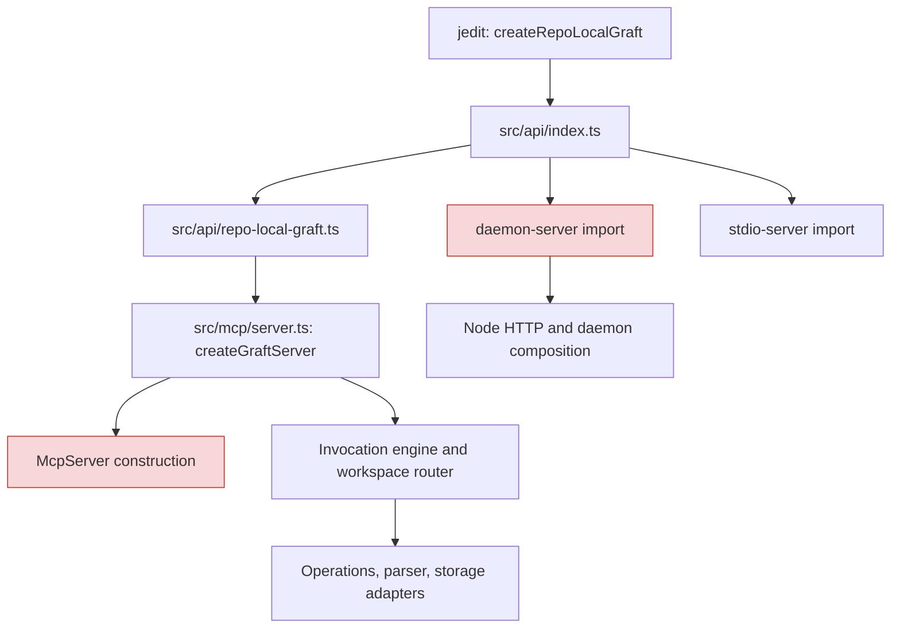

<details>
<summary>Figure 2 - Current embedded import coupling</summary>

The red nodes are unwanted dependencies for the editor use case. This diagram
shows imports and construction, not evidence of a listener starting on import.

</details>

| Source at the pinned checkout | Observed responsibility | Extraction consequence |
| :--- | :--- | :--- |
| `src/api/index.ts` | Exports buffer/workspace APIs and server factories | Library facade must stop reexporting runtime startup |
| `src/api/repo-local-graft.ts` | Delegates to `createGraftServer` | Replace with transport-independent application session |
| `src/mcp/server.ts` | Registers handlers and SDK tools together | Split application catalog from MCP registration |
| `src/mcp/server-invocation.ts` | Policy, routing, scheduling, receipts, logs | Split application invocation from daemon execution adapter |
| `src/mcp/workspace-router.ts` | Membership, active route, session slices | Separate shared route semantics from daemon admission/storage |
| `src/mcp/daemon-server.ts` | Owns HTTP, shared pools, monitors, shutdown | Keep in operator runtime composition |
| `src/cli/main.ts` | Dispatches local commands, serve modes, daemon | Keep with matching runtime; make loading deliberate |

A bounded earlier experiment imported installed Graft 0.11.1 in a fresh Node
26 process. Loader hooks recorded 788 module loads, including 18 MCP SDK modules
and the daemon server modules. Traps recorded zero HTTP server constructions and
zero listeners; both traps were subsequently exercised to establish sensitivity.
This is evidence about that import, not a cold-start benchmark or a guarantee
about every API call.

jedit's current `graft-api-session.ts` calls `file_outline` and `graft_diff` through
`callTool`; highlighting, diagnostics, and Edict projection adapters also use
Graft. Edict is the external syntax/projection provider used for appropriate live
buffer paths. Claude, the jedit agent, reported through Think that jedit does not use its
direct MCP SDK declaration and that removing it alone did not remove the
transitive dependency tree. That is a peer report, separate from the source/import
checks above. Consumer-owned removal and packed installation validation remain
necessary after Graft extraction. No jedit files were changed for this design.

The migration succeeds by separating application invocation from transport
registration. Moving the present `src/mcp/` directory into `graft-lib` would
preserve the problem.

## 5. The target component map

The target has two implementation packages initially and one later UI package.
The repository root remains a private build/release coordinator. Within the
operator package, CLI, MCP, daemon, workers, hooks, and legacy exports are explicit
modules. Within the library, contracts, operations, ports, and concrete adapters
remain distinguishable even though they ship together.

The proposed layout is a destination, not a directory tree already present:

```text
packages/
  graft-lib/
    src/
      api/                 public buffer, workspace, application APIs
      contracts/           values, capabilities, outcomes, evidence schemas
      application/         invocation, policy, session slices, tool use cases
      operations/          reads, diffs, projections, replay and analysis
      ports/               filesystem, git, storage, providers and execution
      adapters/            Node filesystem/process and provider adapters
      parser/              grammars, extractors, syntax lifetime management
      storage/warp/        current git-warp implementation
      storage/echo/        generated-contract adapter and import boundary
      generated/           Wesley-derived structural-history artifacts
  graft/
    bin/                   graft and git-graft entrypoints
    src/
      cli/                 argument parsing and command composition
      mcp/                 SDK registration and transport adaptation
      daemon/              server lifecycle and same-user access
      runtime/             sessions, authorization, scheduler, monitors
      workers/             child entrypoint, job protocol, execution adapter
      client/              local socket client and explicit bootstrap policy
      presentation/        current single-frame CLI rendering
      hooks/               editor and git integration entrypoints
      compat/              existing package-root API facade
  graft-tui/               subsequent independent delivery
    src/
      client/              read-only socket observation client
      model/               deterministic selection and display state
      render/              Bijou components and terminal adapter
      app/                 polling, input, freeze and connection lifecycle
schemas/                    canonical inputs and conformance assets
scripts/                    repository checks and release coordination
```

Concrete Node/Git adapters in `graft-lib` mean this is a Node library, not a claim
of browser portability or a dependency-free functional core. Parser-only consumers
may later justify a smaller package; that is not required to unblock jedit.
Subpath exports may provide light imports within this installation, with deliberate
support policy rather than arbitrary deep imports.

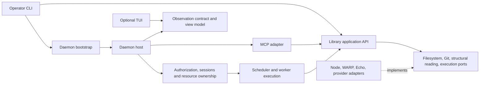

<details>
<summary>Figure 3 - Runtime composition and shared behavior</summary>

Solid arrows show calls or composition, while the adapter edge denotes interface
implementation. The daemon injects execution and authority; the library does not
import the daemon to discover them.

</details>

| Component family | Authority and responsibility | Must not own |
| :--- | :--- | :--- |
| Library API | Explicit construction and lifecycle of embedded services | Socket discovery, daemon autostart, editor identity |
| Application invocation | Input validation, operation context, policy, outcomes | MCP SDK registration or HTTP request objects |
| Parser/projection | Syntax and evidence for supplied bytes | Filesystem freshness inferred from a buffer timestamp |
| Workspace services | Root-scoped reads and declared source basis | Cross-session inventory or implicit authorization |
| Storage adapters | Actual backing reads/writes and retained evidence | Invented whole-workspace coverage |
| Operator CLI | Command grammar, exit semantics, composition | A second scheduler or business-rule implementation |
| MCP adapter | Wire schema, tool registration, protocol errors | Global daemon policy in a local handler registry |
| Daemon host | Process lifetime, connection role, limits, shared state | UI rendering or client-reported trust decisions |
| Scheduler | Admission, lanes, fairness, execution eligibility | Graph ownership inferred from path strings |
| Workers | Execute immutable admitted envelopes; return results/deltas | Rebinding sessions or granting capabilities |
| Monitor runtime | Retained intent, background scheduling, tick progress | A separate unbounded execution queue |
| TUI | Selection, polling, formatting and explicit historical frames | Workload lease renewal, indexing, control actions |
| Root tooling | Version set, artifacts, checks, provenance | Public application exports |

The source appendix assigns every tracked file in the declared production/build
manifest to these owners. Files marked "split" require semantic extraction; they
are not safe mechanical moves.

## 6. Public contracts and the application class model

The library API must express the editor's work without constructing an SDK
server. Preserve current supported buffer and workspace operations, introduce a
transport-independent application session, and make resource release explicit.
Compatibility for existing package-root callers belongs to the operator facade.

Names below describe proposed interfaces. They are not declarations already
available in the published package. A data-transfer object (DTO) is a plain,
serializable contract value; it must not leak an SDK class or graph handle.

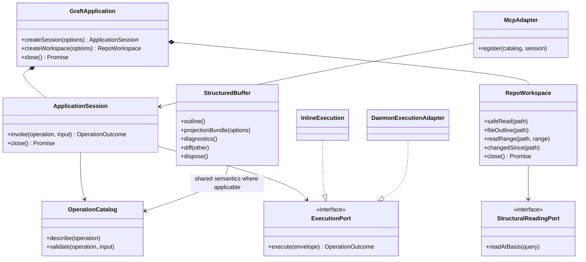

<details>
<summary>Figure 4 - Proposed application contracts</summary>

Composition owns cleanup; adapters depend on application contracts. Existing
methods need compatibility tests before renamed or consolidated APIs replace them.

</details>

| Contract | Required semantics | Compatibility treatment |
| :--- | :--- | :--- |
| Structured buffers | Supplied bytes and basis; deterministic projection inputs | Preserve existing APIs; add explicit disposal where native resources require it |
| Workspace API | Root validation, policy, observation and bounded reads | Preserve typed refusals and actual path authority |
| Operation catalog | One semantic capability inventory | MCP schemas become adapter views, not the only definition |
| Application session | Session-local governor, observations and metrics | Replace repo-local MCP construction; retain result semantics |
| Execution port | Immutable resolved request, result and deltas | Inline and worker implementations share conformance cases |
| Storage read port | Declared basis and evidence labels | Continue `StructuralReadingPort`; do not bypass it for convenience |
| Lifecycle | Idempotent close, no new work after close, released leases | New behavior requires its own RED/GREEN slice |
| Compatibility facade | Existing factories and MCP-shaped local tool results | Preserve old names in `@flyingrobots/graft` during migration |

A local compatibility `callTool` result can retain its JSON shape without using
MCP classes. The SDK-specific `getMcpServer()` cannot be part of the clean library
contract. Existing callers needing it continue through the operator facade or
an explicitly hosted MCP adapter.

## 7. Identity, relationships, and durable evidence

Identity belongs to the owner that can establish it. The daemon identifies its
incarnation; transport registration identifies a session; workspace resolution
identifies worktrees and repositories; a request records its resolved route.
Storage identifies a graph association and source basis. None can safely replace
another merely because their strings look related.

The entity-relationship model below describes the target observation contract.
An originating session ID is retained attribution, not a mandatory live database
foreign key after the session ends. The observer projects these relationships; it
does not create a second authority registry.

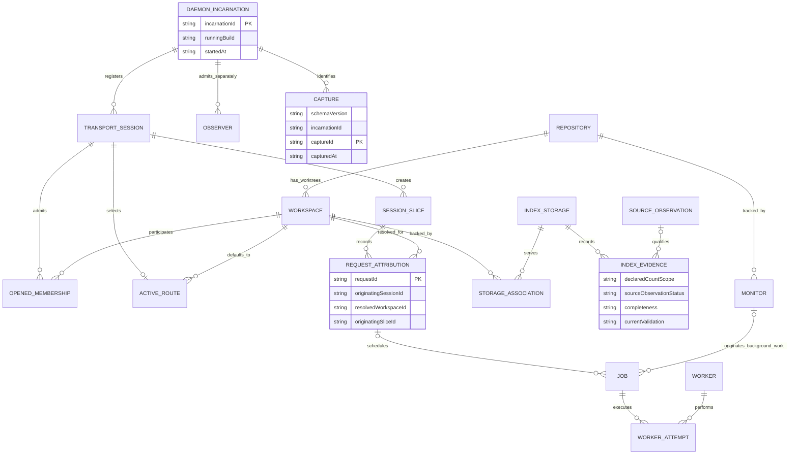

<details>
<summary>Figure 5 - Runtime relationships and independently qualified index evidence</summary>

These are conceptual relationships, not a new durable database schema. Background
jobs may have monitor attribution and no session. Imported or unavailable source
basis is represented explicitly rather than fabricating a source observation row.

</details>

| Relationship | What it establishes | What it does not establish |
| :--- | :--- | :--- |
| S opened A | Current admitted membership | Complete historical usage of A |
| S active B | Default route for future qualifying calls | Q was moved from A to B |
| Q resolved A | Authoritative route captured at admission | That S remains registered now |
| A and B belong to R | Shared repository identity | Identical files or worktree overlays |
| Workspace backed by storage | Recorded backing association | Ownership based solely on a directory name |
| Index evidence references a basis | Declared source evidence for its scope | Whole-workspace or dirty-source freshness |
| Capture belongs to incarnation | Which process produced the frame | Atomicity across separately sampled components |

A snapshot with 137 indexed entries may describe mixed source observations.
Its labels must say entries in this index, mixed or unavailable source basis,
unknown whole-workspace coverage, and unavailable current-source validation when
that is all the retained information supports. Unknown is a valid completed answer.

## 8. The editor path: in-process, explicit, disposable

For `src/totals.ts` revision 12, jedit supplies the bytes and receives structural
projections in its own process. Saved-file operations use a workspace service with
an explicit root. Neither path needs socket discovery, MCP initialization, or a
background daemon. External projection providers remain explicit optional work.

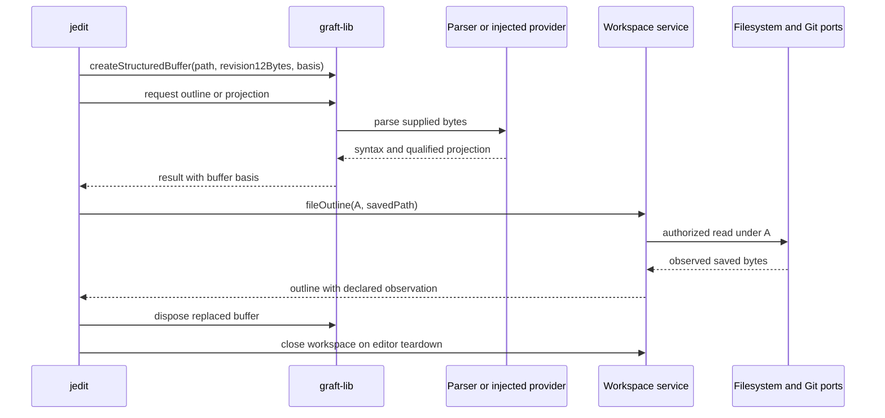

<details>
<summary>Figure 6 - Editor buffer and saved-file paths</summary>

The two sources are deliberately separate. Unsaved buffer output must not be
relabeled as an observation of the saved working tree.

</details>

| Step | Owner | Boundary |
| :--- | :--- | :--- |
| Supply revision 12 | jedit | Caller bytes and revision identity |
| Parse/project | Library/provider | No hidden workspace discovery |
| Read saved source | Workspace service | Root, policy and observation contract |
| Replace buffer | jedit and library | Release old native parse resources |
| Close workspace | Embedded host | End retained application state |

The migration retains the known jedit examples for `file_outline` and
`graft_diff`; `changedSince` is not a drop-in replacement for a two-reference Git
diff. The consumer must validate installation from a packed tarball in an isolated
project so root-workspace dependencies cannot hide leaks.

## 9. Operator startup, local HTTP, and compatibility

Keeping the CLI with the daemon ensures the command that starts a child knows
where that child's built files live and which build it is starting. It does not
entitle the CLI to replace a running daemon. Existing bootstrap behavior and
inspection's stricter no-start behavior must remain separate explicit policies.

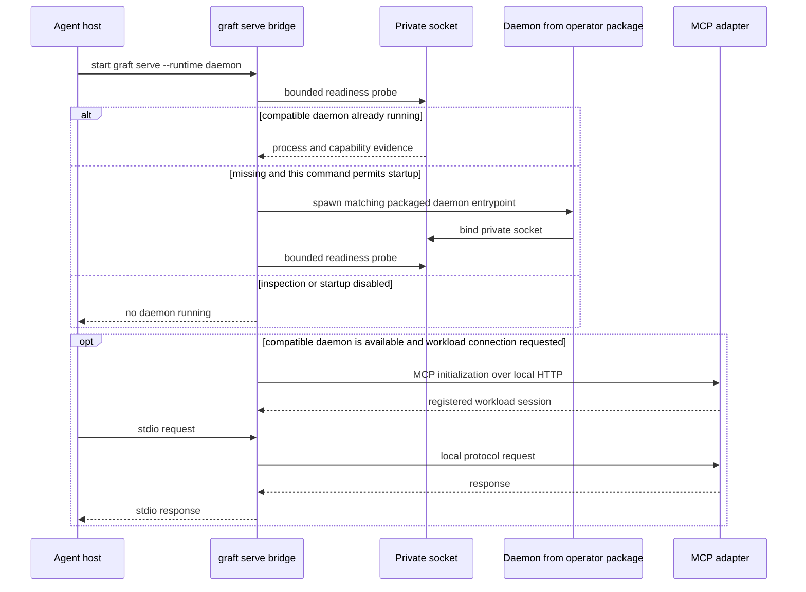

<details>
<summary>Figure 7 - Intended bootstrap policy around the existing local transport</summary>

The compatibility response is target behavior; current health does not establish
all version identities. The no-start branch terminates before MCP initialization.

</details>

| Surface | Startup policy | Scope |
| :--- | :--- | :--- |
| Local repository command | Construct local application only | Selected repository |
| `graft serve` | Repository-local stdio host | No shared daemon required |
| `graft serve --runtime daemon` | Existing explicit bootstrap policy | Same-user daemon workload session |
| `graft daemon` | Explicit daemon start | Owns listener and worker children |
| Existing `graft daemon status` | Preserve `spawnIfMissing: false` and health projection | Existing aggregate contract |
| New single-frame inspect / TUI | Never spawn, upgrade, restart, or bind a workspace | Dedicated observer role |

The Unix directory and socket permissions remain 0700 and 0600 respectively;
Windows security needs an explicit named-pipe access-control verification rather
than treating a private-looking pipe name as proof. There is no new TCP listener,
browser gateway, or remote-control surface in this design.

Version compatibility reports invoking client version, running build captured
from the loaded program, protocol/schema support, and daemon incarnation
separately. A changed installation symlink does not change the already loaded
process. Unsupported inspection returns an explicit capability result, with no
silent MCP fallback that weakens observational guarantees.

## 10. Routing, scheduling, and worker ownership

The daemon admits Q against A once, before scheduling. It records originating
session S, the session slice, resolved workspace A, capabilities, writer identity,
and operation inputs in an immutable envelope. Changing S's active route to B
cannot rewrite that envelope. Workers execute admitted work and return results;
they never rediscover authority from the current session.

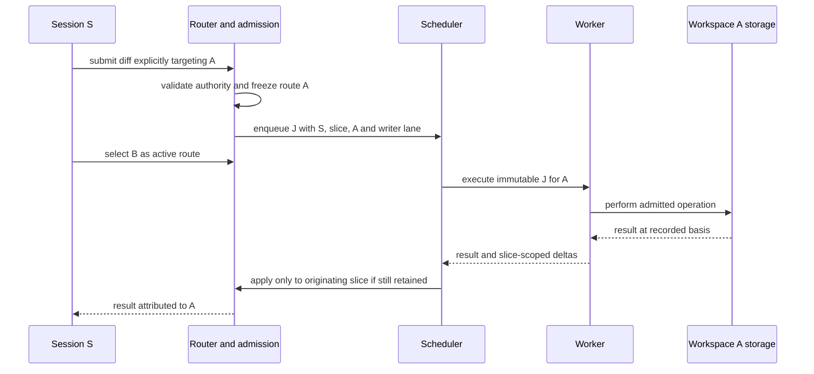

<details>
<summary>Figure 8 - Rebinding does not move an in-flight operation</summary>

Delivery can become unavailable when S ends, but operation attribution survives.
Any policy to cancel work on session end is explicit and operation-specific.

</details>

| Owner | Kept authoritative | Rejected shortcut |
| :--- | :--- | :--- |
| Router/admission | Root identity, authorization, opened membership | Trusting arbitrary client IDs |
| Envelope | Origin session/slice, target workspace, captured capability basis | Joining job to current active binding |
| Scheduler | Queue, lane exclusion, eligibility reasons | Inferring starvation from worker counts |
| Worker | One admitted attempt and bounded buffers | Updating session state directly |
| Result merge | Originating slice and causal context | Applying old deltas to a replacement slice |
| Observer | Job's retained attribution | Calling ended origin an orphan automatically |

A logical writer lane identifies provenance and exclusion for repository writes.
A worker PID is execution identity, not provenance. The current worker pool and
scheduler are separate layers; counts of failed jobs and failed tasks must never
be added into an incident total without correlation evidence.

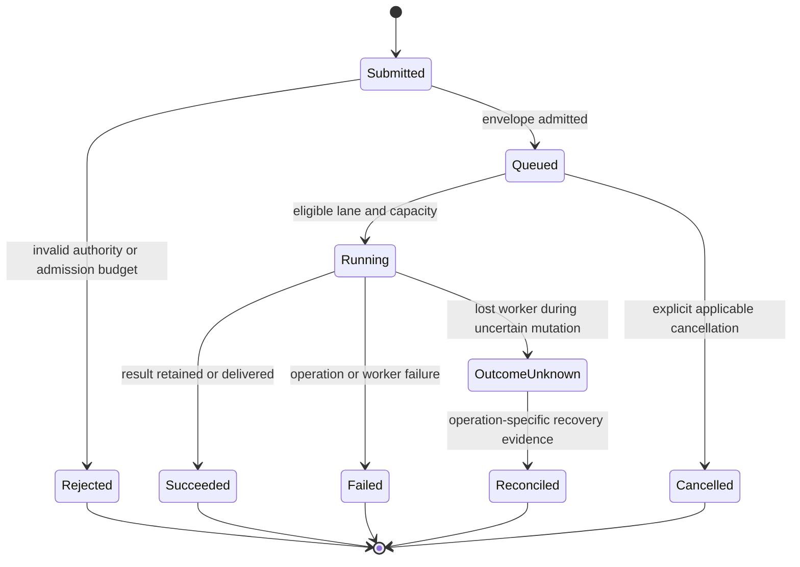

<details>
<summary>Figure 9 - Proposed job lifecycle and uncertain outcomes</summary>

The target adds explicit admission and uncertain-outcome handling. Current
in-memory job views expose queued/running with historical counters; this diagram
must not be presented as already retained lifecycle history.

</details>

| State | Resource obligation | Evidence obligation |
| :--- | :--- | :--- |
| Queued | Bounded metadata/payload reservation | Captured route and scheduler reason if available |
| Running | Leases and worker reservation | Attempt identity and immutable origin |
| Terminal | Release reservations and leases | Bounded result/history retention policy |
| Outcome unknown | Preserve reconciliation facts | Do not automatically retry a potentially committed write |

Fairness first belongs to the existing scheduler. Add admission budgets and
owned eligibility reasons there rather than introducing a competing queue in
observability or packaging code.

## 11. Memory: ownership is part of the architecture

The September 7 report was more than 7 GB attributed to Graft. The post-report
sample could not reproduce that process: the default socket was absent and
`lsof -U` found no Graft daemon listener. A sample of explicitly named Graft Node
clients showed about 179 MiB of resident memory in aggregate, with another
checkout-hosted Node process visible separately. Resident set size (RSS) is not
macOS Activity Monitor's complete accounting of compressed or swapped memory.
The host had 16 GiB RAM and approximately 8.2 GiB swap in use. These observations
support pressure and missing evidence, not retrospective blame allocation.

The code does establish several independent gaps. The installed 0.12.0
`InMemoryWarpPool` and current source both retain successful graph opens by
repository and writer until the pool itself becomes unreachable. Failure removes
an entry, but success has no release or eviction. A small isolated experiment
using the installed class and tiny fake graphs opened 128 repository keys,
retained all 128, and reused the first handle; its public methods were only
constructor, `getOrOpen`, and `size`. It did not open actual repositories or
measure real graph sizes.

| Resource | Current owner and evidence | Current bound | Required target |
| :--- | :--- | :--- | :--- |
| Open WARP handles | `src/mcp/warp-pool.ts` | No successful-entry eviction or release | Leased residency with entry/byte budgets |
| Session observations | `src/operations/observation-cache.ts` | Map of observations; no byte/entry ceiling | Per-slice and host budgets; eviction changes evidence availability explicitly |
| Transport sessions | `src/mcp/daemon-session-host.ts` | Removed on transport callbacks/close; no host idle-expiry policy here | Maximum admitted sessions and explicit disconnect/expiry lifecycle |
| Opened workspace inventory | `src/mcp/workspace-router.ts` | Separate from bounded routed-binding cache | Membership limits independent of graph residency |
| Scheduled jobs | `src/mcp/daemon-job-scheduler.ts` | Running concurrency, not queued admission size | Count and serialized-byte admission ceilings |
| Worker queue | `src/mcp/daemon-worker-child-pool.ts` | Worker count; queued closures are not byte bounded | One admission authority and bounded IPC backlog |
| Worker processes | Same source | Default up to four, no Graft-managed memory budget/recycle policy | Per-worker and aggregate budgets, idle retirement |
| Parser runtime | `src/parser/runtime.ts` | Ten grammar loads on initialization; explicit tree deletion exists | Measure native/WASM memory; verify ownership on every exit path |
| Worker graph opens | `src/mcp/repo-tool-worker-context.ts`, `monitor-tick-job.ts` | Opens per operation/tick, separate from parent pool | Bounded lifetime and measured peak; do not claim parent pooling shares heaps |
| Git output | `src/warp/open.ts` | Up to 128 MiB default per buffered operation | Account concurrent buffers and decoded/object amplification |
| Worker restart | Child pool exit handler | Replacement on exit, no restart budget here | Backoff, bounded crash loop, explicit degraded capacity |

Two existing PRs address part of this problem and must be reconciled before new
implementation: [#251](https://github.com/flyingrobots/graft/pull/251), observed
open at `ede389ae04ffc96371e92b3b58493ba88299b3b9`, introduces independently owned
binding/invocation leases with eager final-release eviction;
[#250](https://github.com/flyingrobots/graft/pull/250), observed open at
`924c59c41905a06ea966ae41f875e8874589c0f7`, addresses session inactivity and scratch
cleanup and explicitly reports a review hold. Neither is in the pinned main
baseline or the inspected 0.12.0 package. PR descriptions are not fresh review
receipts: this design did not re-audit their outstanding threads or authorize a
merge. Use those existing deliveries rather than creating competing lease/reaper
implementations. Queue/cache byte budgets and aggregate worker containment remain
separate obligations.

The list contains source-supported risks, not a ranking of which consumed the
missing 7 GB. Neither retained graph count nor worker count is a byte measurement.
Likewise, parser allocation is not evidence of a parser leak: existing outline
paths call `delete()` on native trees.

The target resource model makes every allocation family somebody's responsibility:

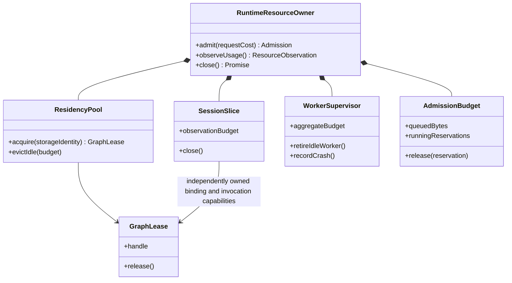

<details>
<summary>Figure 10 - Proposed memory ownership</summary>

Library hosts and daemon hosts each construct an owner appropriate to their
lifetime. A global singleton hidden in a library would defeat embedded disposal.

</details>

| Budget dimension | Enforcement point | Failure behavior |
| :--- | :--- | :--- |
| Queue count and encoded bytes | Before accepting retained work | Structured overload refusal |
| Retained observations | Before inserting/replacing cache entry | Evict eligible derived evidence or refuse; never alter durable history |
| Graph residency | Before acquisition; idle eviction after release | Wait/refuse within explicit deadline if all handles are leased |
| Worker peak/aggregate | Supervisor admission and process measurements | Stop admission, drain/retire safe workers; do not silently retry writes |
| Response/IPC bytes | Producer and receiving decoder | Bounded error with outcome semantics preserved |
| Time and retry count | Scheduler/supervisor | Deadline or degraded capability, not infinite restart |

Numeric defaults for real-memory ceilings require a controlled baseline and a
reproducible large-graph workload. This design deliberately does not bless an
invented "512 MB fixes it" number. A containment implementation cannot ship with
undefined numeric admission/cache/worker limits; selecting and validating those
limits is its first required measurement slice. Estimated graph bytes must be
labeled estimates; actual RSS, heap, external, and array-buffer measurements stay
separate to avoid double counting overlapping categories.

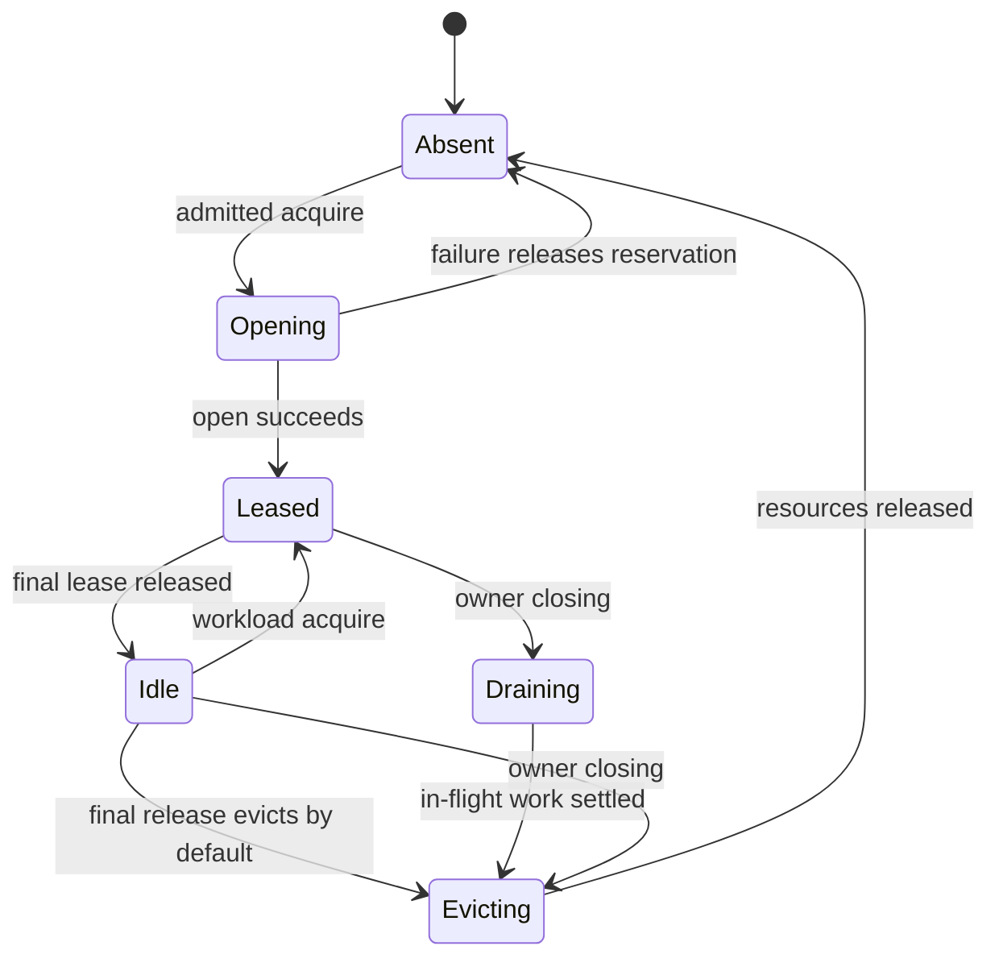

<details>
<summary>Figure 11 - Graph residency without pinning by inspection</summary>

Inspection reads retained projections and causes no state transition in this
machine. Current main `getOrOpen` has no equivalent lease lifecycle. PR #251
provides the in-flight eager-release design; bounded idle caching would be a
separately justified extension, not a requirement to delay final-release eviction.

</details>

| Event | Allowed action | Guard |
| :--- | :--- | :--- |
| Workload acquisition | Reserve and lease | Authority and budget already established |
| Last release | Evict eagerly by default; idle is a transition | No remaining binding or invocation capability owns the resident |
| Eviction | Drop/dispose derived residency | Preserve durable graph facts and in-flight writers |
| Inspection | Read existing counters/projections | No lease renewal, cache touch, opening, or pin |

Tests must exercise many acquire/release cycles with a bounded fake and real
isolated workloads, confirm cleanup after failures, and measure an eventual
memory plateau within a stated tolerance. Garbage collection timing is not a
logical lease oracle; dropping a reference also does not prove native memory was
returned to the OS. The incident needs a future reproducer or captured process
profile before a root-cause closure claim.

## 12. Monitors, storage, parser assets, and the Echo direction

Monitors retain the intent to index an authorized repository and schedule work
through the daemon's existing scheduler. They must not become owners of an
unbounded second execution system. WARP is today's Git-backed graph storage;
Echo is the planned causal-history substrate behind the existing structural read
port. Wesley derives codecs and contracts from Graft's GraphQL schema. Packaging
must preserve that migration direction rather than cementing WARP into every API.

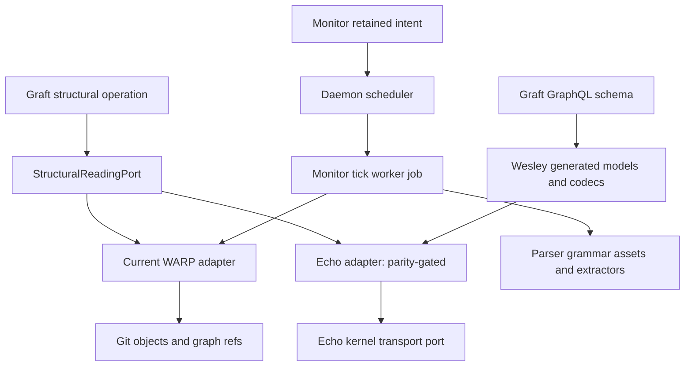

<details>
<summary>Figure 12 - Storage adapters and generated authority</summary>

The Echo edge is a migration seam, not a claim that production has completed
retained-workspace replay. Current production still uses live workspace reads.

</details>

| Subsystem | Data owned | Required migration preservation |
| :--- | :--- | :--- |
| WARP adapters | Structural facts, symbols, qualified references, provenance | Keep repository/worktree identities and writer semantics distinct |
| Echo adapters | Generated envelopes, codecs, typed kernel boundary | Preserve `echo-native`, `git-warp-imported`, `fallback-translated` labels |
| Workspace observations | Source basis, retained/admitted evidence | No mixed-time bytes presented as coherent snapshot |
| Local history | Causal attach, checkout epoch, strands and activity | No implicit conversion of transport session into causal identity |
| Parser | Syntax trees, extractors and grammars | Assets resolve inside packed library, not the monorepo source tree |
| Projection providers | Edict, Wesley and prose adapters | Explicit subprocess/provider invocation and version footing |
| Monitor | Desired lifecycle and last tick evidence | Restart recovery restores intent, not false proof of freshness |

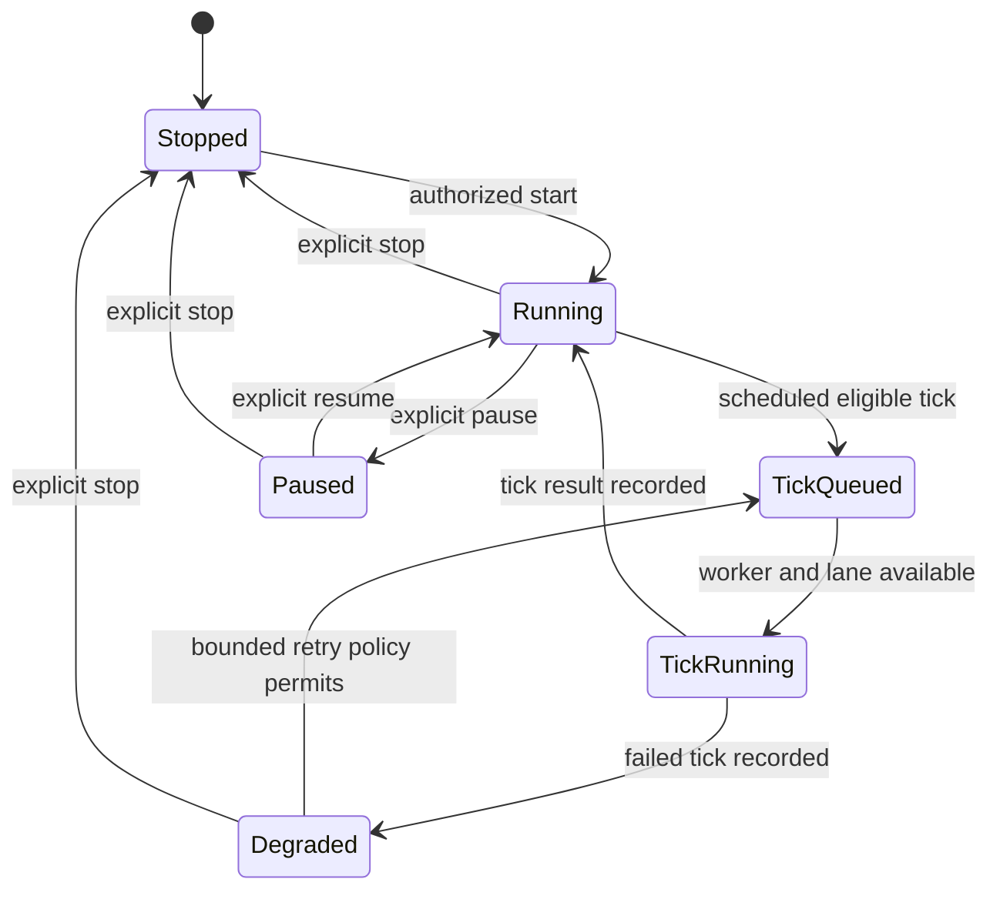

<details>
<summary>Figure 13 - Monitor behavior and subordinate tick work</summary>

This conceptual target distinguishes monitor lifecycle from job lifecycle.
Concrete existing persisted state labels must remain compatible during extraction.

</details>

| Observation | Permitted conclusion | Forbidden conclusion |
| :--- | :--- | :--- |
| Tick completed | Its declared work finished | Entire workspace now fresh |
| HEAD unchanged | Current tick may skip commit indexing | Dirty working-tree bytes unchanged |
| Monitor absent | No retained monitor in complete declared scope | Workspace is stale |
| Historical tick failure | Failure occurred in retained interval | Current indexing capability necessarily unavailable |

The existing first-retained-workspace-observation packet remains authoritative
for the Edict request → Echo retention → admitted read → restart replay vertical.
This package design must not claim those acceptance criteria are satisfied by
moving generated files.

## 13. The inspector and optional TUI

The inspector is a read surface, not an administrative console. Its first slice
is the separate PR #254, outside the pinned main checkout. It proposes a dedicated
`GET /inspect/v1` route over the same local transport, with bounded parent-owned
projections and deterministic text/JSON output. The interactive terminal user
interface (TUI) comes later and consumes that observation contract.

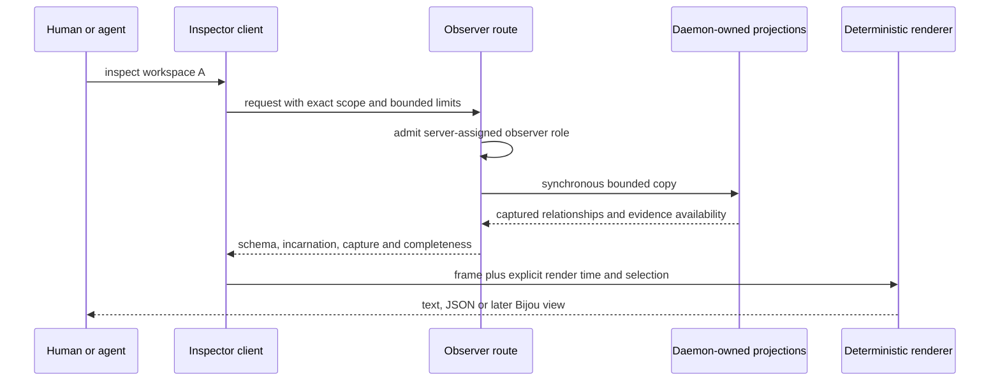

<details>
<summary>Figure 14 - Observational inspection</summary>

The path has no application session registration, workspace opening, graph
acquisition, workload cache touch, or scheduling call.

</details>

| Contract question | Required answer |
| :--- | :--- |
| What is captured together? | A short synchronous copy of daemon-owned in-memory projections where ownership permits |
| What is independent? | Worker/process samples carry their own time and available generation |
| What identifies continuity? | Daemon incarnation, separate from capture ID and schema version |
| How are limits applied? | Authorized scope and targeted filters before relevant result limit |
| What permits absence? | Complete successful result for declared authorized scope, with sufficient consistency |
| What does a partial empty array mean? | No returned rows; absence is not established |
| What can inspection change? | Bounded allocation/CPU/transport and separately accounted observer state |
| What can it never initiate? | Workload leases/activity, discovery, indexing, rebinding, cache recency or graph pinning |

Inherited first-slice proposed bounds are 4,096 scan steps, 100 rows per
collection, 500 rows total, 512-character fields, 512 KiB response, four concurrent
observers, and five-second request lifetime, with no retained snapshots. Verify
those against the eventual merged inspector contract before extraction; this
packet does not silently retune that independent PR.

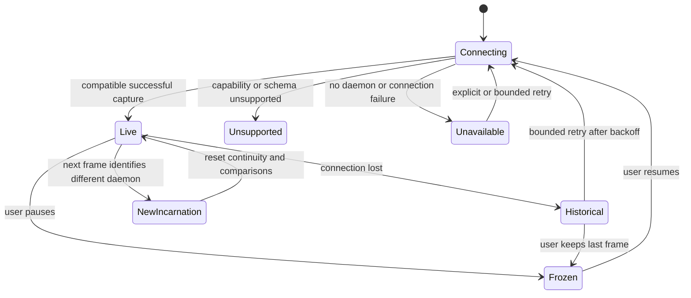

<details>
<summary>Figure 15 - TUI connection and frame state</summary>

The last successful frame remains visibly historical after failure. A retained
frame is not silently refreshed by repainting it.

</details>

| UI responsibility | Contract |
| :--- | :--- |
| Navigation | Session-first and workspace-first views use the same relationships |
| Selection | Stable identity; row disappearance in a partial set is not an ended-session event |
| Polling | One request outstanding; proposed default 2 seconds, maximum 1 request/second, bounded exponential backoff to 30 seconds |
| Pause | No background poll; show capture time and frozen state |
| Restart | Drop incarnation-sensitive comparisons, preserve old frame only as historical |
| Rendering | Explicit clock and state inputs; no filesystem or daemon calls inside row rendering |
| Health | Reachability, current capability assessment, historical counters and failed observation separated |
| Text safety | Bound fields, escape terminal controls, redact before exportable diagnostic construction |

The optional package has its own `graft-tui` executable initially; `graft` must not
silently install or download it when a command is invoked. A later `graft inspect
--tui` convenience requires an explicit adapter/discovery contract rather than an
npm dependency that pulls the full UI back into every operator installation.
Current single-frame Bijou renderers remain in the operator during migration;
removing their dependency is a separate compatibility-sensitive choice.

No cancel, restart, authorize, retry, or index-now control enters this inspector.
Failure rings, exports, evidence drawers, and end-to-end operation tracing remain
separately bounded subsequent deliveries, not monorepo release gates.

## 14. Process shutdown and recovery

The daemon owns its listener, session host, scheduler admission, monitors, and
worker children. Shutdown must stop new work before releasing resources, and it
must preserve the uncertainty of interrupted writes. Embedded library shutdown
has the same ownership discipline at a smaller scope, without process signals.

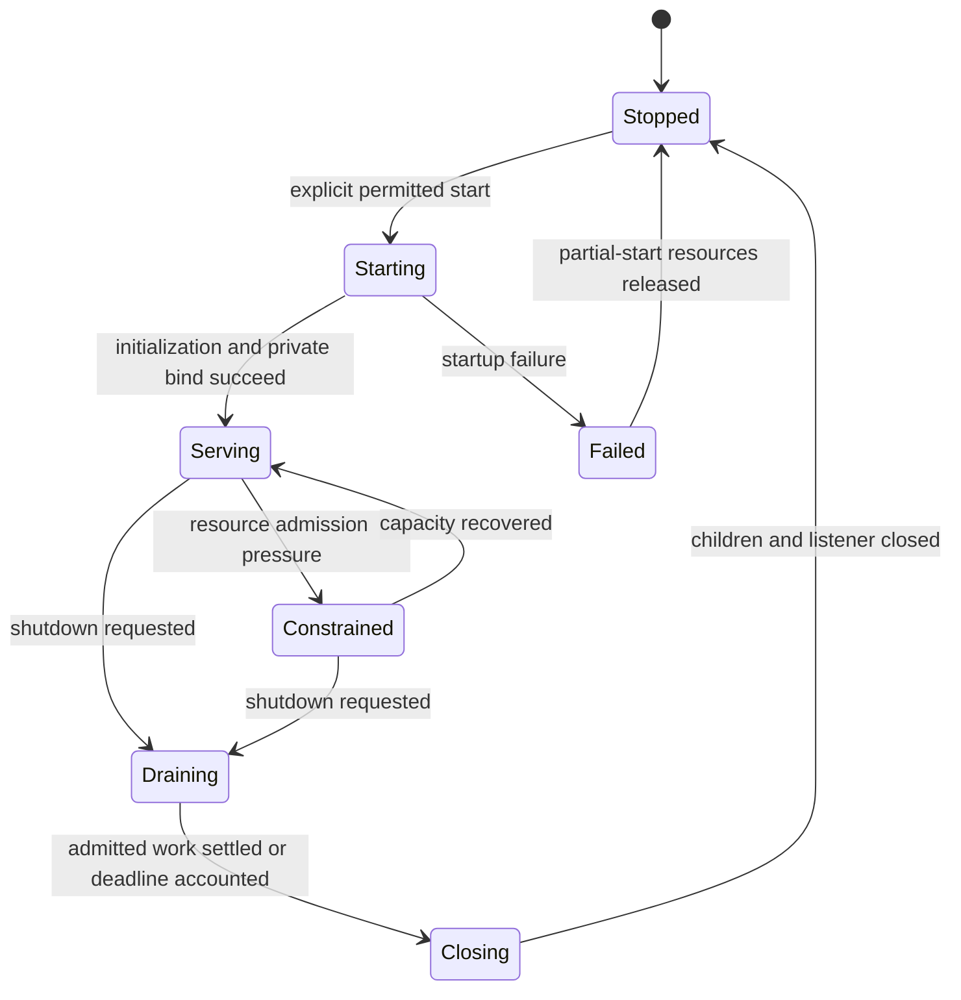

<details>
<summary>Figure 16 - Target daemon lifecycle</summary>

Constrained is a capability/admission state, not a retrospective diagnosis from
historical failures. Current startup/shutdown code needs dedicated coverage before
these stronger cleanup guarantees can be claimed.

</details>

| Phase | Required ownership action | Failure semantics |
| :--- | :--- | :--- |
| Starting | Track every acquired resource before next acquisition | Startup failure unwinds already-created workers/monitors/listener |
| Draining | Stop admission and monitor scheduling | Report queued cancellation or deadline explicitly |
| Closing | Release sessions, graph leases, providers, workers and listener | Bounded shutdown; preserve uncertain mutation outcomes |
| Restart | New incarnation and counter epochs | Never stitch old and new rates or capture continuity |

The current constructor eagerly spawns workers before later daemon initialization
steps complete. Extraction must include a startup-failure ownership review; a
folder move alone cannot guarantee cleanup of partial startup. Library imports
must not install process signal handlers. Only explicit operator roots do so.

## 15. Lockstep build, packaging, and release

Lockstep means all published members in one release have the same version. It
does not mean npm can publish several packages atomically, nor that the running
daemon automatically changes when an installation changes. The existing tag-driven
release from `main` remains the release authority; workspace machinery extends
its artifact accounting.

Use pnpm workspaces with a private root, one lockfile, per-package build outputs,
and exact internal runtime dependencies. Under the repository's pnpm 10 line,
`workspace:*` resolves locally and is rewritten to the exact workspace version in
packed manifests. This behavior is documented by the
[pnpm 10 workspace documentation](https://pnpm.io/10.x/workspaces). Test packed
manifests and installs rather than assuming source manifests equal delivered ones.

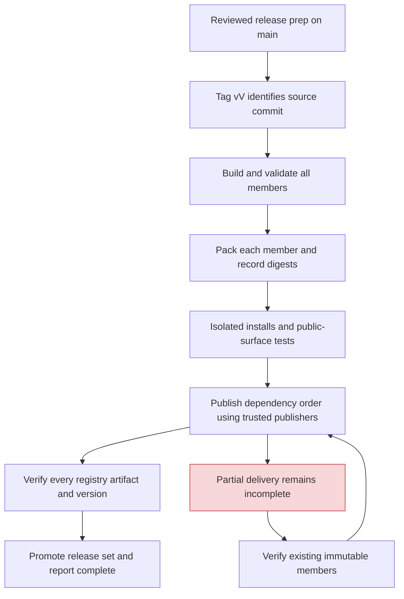

<details>
<summary>Figure 17 - A release set with explicit partial-delivery handling</summary>

Build/test success, GitHub release assets, npm publication, and registry delivery
are separate gates. An existing name/version cannot simply be overwritten, as specified by the
[npm publish contract](https://docs.npmjs.com/cli/v11/commands/npm-publish/).

</details>

| Artifact or rule | Required change from single-package workflow |
| :--- | :--- |
| Root manifest | Private coordinator; one declared version authority |
| Member manifests | Common V, explicit exports, files, engines, licenses and dependencies |
| Library build | No runtime/UI imports or declaration references; packed grammar resolution |
| Operator build | Preserve bins and match daemon/worker asset paths in the tarball |
| TUI build when added | Read client and renderer only; no server dependency |
| Schema generation | Canonical root schemas with generated outputs owned by library |
| Security policy | Audit each production dependency closure and preserve required overrides |
| Surface gate | Per-member public contracts; library must not be required to have a bin |
| Release workflow | Validate every member against tag, package all tarballs, record per-member hashes |
| npm provenance | Trusted publisher configuration and registry verification for each package name |
| Partial publish | Verify already delivered artifact integrity; publish missing members only |
| Dist tags | Stage and promote after full-set verification; promotion itself can be partially observed |
| Completion witness | Source SHA, version, artifacts/digests, Actions jobs, registry results |

The existing `@flyingrobots/graft` package is the operator distribution and
compatibility facade, not a new sixth forwarding package. Deprecating old API
exports requires an explicit versioned migration; the library package does not
silently claim every daemon-specific export. No tags, registry names, or releases
are created by approving this design document.

## 16. Trust, failures, and diagnostic meaning

The same-user local transport is a trust boundary with explicit authorization
inside it, not a license for every workspace tool to inspect every session.
Library callers supply their own process authority; daemon clients receive
server-established scope. Extracting shared query code must not widen either.

| Boundary | Enforced owner | Required failure result |
| :--- | :--- | :--- |
| Path and worktree resolution | Workspace admission/path adapter | Typed refusal for mismatch or escape |
| Capabilities and authorization | Daemon control plane | No inference from reported client name |
| Wire decoding and IPC | MCP/client/worker adapter | Bounded malformed-input error, no unbounded allocation |
| Source observation | Workspace/storage owner | Unavailable or incomplete, not fabricated zero |
| Application outcome | Operation contract | Preserve refusal, failure, and uncertain mutation distinctions |
| Display | Renderer and diagnostic construction | Escaped controls, bounded untrusted fields, secret redaction |
| Metrics | Fixed capability/outcome dimensions | No repo paths, session IDs or high-cardinality hashes as labels |
| Historical counters | Component counter epoch | No sum across layers and no rates across reset/incarnation |
| Logs and future rings | Bounded retention owner | Declared retained interval and known dropped count |

A complete empty scoped collection can establish absence only when authorization,
filter application, capture consistency, and component success all support it.
A 100-row sample from 10,000 sessions cannot establish that repository R has no
active work unless R's filter was applied before the limit and all relevant work
within that scope was successfully observed.

These rules make failures actionable without overclaiming causality. A failed
observation can block a diagnosis even when transport is reachable; a failed test
can block integration without proving which implementation, oracle, or harness
is defective.

## 17. Independently shippable migration slices

The design is comprehensive so the implementation can remain narrow. Library
extraction, runtime containment, optional navigation, and the Echo vertical have
different acceptance criteria. One enormous PR would make attribution and
compatibility evidence harder to assess.

| Slice | Deliverable | Acceptance boundary | Explicit deferral |
| :--- | :--- | :--- | :--- |
| M0: design | This map, source inventory, incident evidence and retro | Source-grounded proposal with rendered diagrams | No runtime changes |
| R1: containment measurement | Isolated workload, process-family accounting, retained-resource oracle | Reproducer or explicit incident uncertainty; numeric budget proposal | Monorepo not prerequisite |
| R2: bounded lifetime | Reconcile #251/#250; queue/cache admission and cleanup in focused sub-slices | Controlled failure/interleaving tests and measured plateau | TUI and package migration not prerequisite |
| M1: application seam | Separate invocation/catalog from MCP construction | Existing local tool semantics through transport-free core | No API renaming spree |
| M2: two-package delivery | `graft-lib` plus existing operator package | Packed isolated editor and operator consumers | No new TUI or HTTP rewrite |
| M3: consumer migration | jedit imports new library and removes unused SDK if justified | Existing saved-file and live-buffer behaviors | Other agent owns jedit changes |
| M4: release set | Lockstep build/publish/registry evidence | Every artifact validated independently and as an exact set | No release until separately authorized |
| T1: optional TUI | Independent read-only navigation package | Bounded polling, stable selection and historical states | Commands, event history, coverage measurement |

M1–M4 can be delivered in smaller commits/PRs at coherent boundaries, and each
requires its own design/RED/GREEN/retro evidence where software behavior changes.
R2 is not one blanket repair commit: graph residency, session/cache ownership,
admission, and worker supervision should each have focused acceptance evidence.
The open inspector PR is independently reviewed and must be reconciled at its
actual merged revision, not copied from this document's assumptions.

## 18. Acceptance, falsification, and resource experiments

Verification follows the adopted testing standards: claims have explicit oracles,
consequential checks demonstrate sensitivity, generated exploration names its
bounds, and known counterexamples remain guaranteed regression inputs. These are
implementation acceptance tests, not tests that assert Markdown wording.

| Claim | Narrowest useful experiment and oracle | Falsification and limits |
| :--- | :--- | :--- |
| Clean library installation | Pack tarball; install in empty consumer; inspect dependency/type closure | Deliberately add forbidden runtime/SDK dependency and require failure |
| No transport on embedded path | Import and exercise editor APIs with calibrated create/listen/spawn traps | Permit declared Git/provider subprocesses separately; forbid daemon/worker bootstrap; no claim beyond exercised APIs |
| jedit semantic parity | Named outline/diff/projection cases plus generated old/new comparisons | Preserve known cases; agreement is bounded evidence, not proof for all inputs |
| Same-worktree identity | Controlled two-session/one-workspace fixture | Distinct sessions retain shared workspace identity |
| Worktree isolation | A/B fixtures with different dirty bytes | Root mismatch fails closed; no fallback into current cwd |
| In-flight attribution | Fake clock and controlled executor: submit A, rebind B, finish A | Envelope corruption must fail the originating-route assertion |
| Ended origin | End S while J remains admitted | Retain origin ID or explicit unavailable; never reassign |
| Graph release | Controlled acquire/release/failure sequences and lease oracle | Evicting a leased handle and retaining idle entries beyond bound must fail |
| Real memory | Fixed workload, isolated processes, recorded build/OS/runtime and sampling | Report heap/native/RSS separately; bounded repeated cycles and plateau tolerance |
| Queue bounds | Generated sizes around count/byte limits | Reject before retaining payload beyond ceiling; include UTF-8/IPC amplification |
| Startup failure | Inject failure after each acquired resource | Zero unowned child/listener/lease after unwind; record fault schedule |
| Worker failure | Explicit crash and uncertain-write fixture | No blind write replay; bounded replacement/backoff |
| Observer noninterference | Quiescent controlled daemon, instrument lease/cache/open/admission transitions | Inject a getter that touches each forbidden dependency; each violation must be caught |
| Concurrent observation | Controlled rebind/finish transitions around copy boundary | Permit documented independent samples; reject false atomicity claims |
| Truncation and section failure | Generated inventories with filter matches outside initial sample | No false absence or unavailable-as-zero |
| Index evidence | Mixed observations and missing source validation | Capture clock advance must not improve source currency |
| Restart/disconnection | Fake incarnation and clock, last good frame then failure | Historical label and comparison reset required |
| Hostile text/older schema | Parser fuzz corpus and compatibility vectors | Control sequences cannot execute; unsupported result explicit |
| Operator compatibility | Packed CLI, stdio MCP, daemon socket and worker tests | Existing `ok`/`degraded` status projection preserved |
| Partial release | Fake registry with one preexisting matching/mismatching artifact | Resume only verified identical artifacts; never report incomplete set complete |

The memory incident specifically needs process-family attribution: daemon parent,
worker children, and stdio bridges sampled with PID/start identity, elapsed time,
and measurement semantics. If the process recurs, capture bounded OS process
information and low-overhead resource counters first. Heap snapshots are an
explicit heavier diagnostic with pause, disk, and secret-handling implications;
never trigger one automatically on a machine already under pressure.

Deterministic model tests establish ownership and prohibited transitions; isolated
integration tests establish actual transport and native-resource behavior within
the tested environment. Neither alone establishes a universal no-leak claim.

## 19. Review questions and completion criteria

The main design choice is settled in this proposal: CLI and daemon stay together
as one installation, with internal boundaries that permit a future split.
Review should concentrate on the public library contract and runtime resource
ownership, not the aesthetic symmetry of package names.

| Reviewer | Playback question |
| :--- | :--- |
| Human embedding Graft | Can jedit install only the library and preserve the behaviors it uses? |
| Human operating Graft | Does one operator install still provide local commands, agent bridge and matching daemon? |
| Agent implementing extraction | Is every current source file assigned, including split responsibilities? |
| Runtime reviewer | Who releases every graph, buffer, session slice, queued payload and child? |
| Inspector reviewer | Can any read path create application-state transitions or overstate evidence? |
| Release reviewer | Can a partial multi-package publish remain visibly incomplete and resume safely? |

Open implementation decisions are the measured numeric memory defaults, exact
shape of the new application session API, and the eventual timing of optional TUI
publication. The default decisions here are sufficient to begin focused design
and compatibility work; they do not require a separate CLI or MCP package.

Done for this documentation cycle means the pinned inventory is accounted for,
all Mermaid blocks render, source assertions and proposal labels are reviewed,
debt is filed, lint/diff checks pass, and the local retro records actual evidence.
Done for implementation requires the slice-specific executable evidence above;
this document, a green Markdown check, or a moved directory cannot substitute.

## Appendix A. Source ownership inventory

This inventory enumerates the tracked files returned by `git ls-files src bin
scripts schemas .github` at the pinned source revision. It is exhaustive for that
manifest, not for transitive dependency internals, untracked files, tests, or all
historical design documents. Those supporting systems are covered by their
contracts and validation responsibilities above. Ownership names are target
modules; they do not claim every file has already been decomposed or reviewed
line by line.

**Manifest coverage: 346 tracked files, each assigned once below.**

<details>
<summary>.github/ISSUE_TEMPLATE — 5 files</summary>

| Current file | Target owner / extraction action |
| :--- | :--- |
| [.github/ISSUE_TEMPLATE/00-bug-report.md](../../.github/ISSUE_TEMPLATE/00-bug-report.md) | Repository build/release or canonical schema tooling |
| [.github/ISSUE_TEMPLATE/01-feature-or-capability.md](../../.github/ISSUE_TEMPLATE/01-feature-or-capability.md) | Repository build/release or canonical schema tooling |
| [.github/ISSUE_TEMPLATE/02-bad-code.md](../../.github/ISSUE_TEMPLATE/02-bad-code.md) | Repository build/release or canonical schema tooling |
| [.github/ISSUE_TEMPLATE/03-cool-idea.md](../../.github/ISSUE_TEMPLATE/03-cool-idea.md) | Repository build/release or canonical schema tooling |
| [.github/ISSUE_TEMPLATE/config.yml](../../.github/ISSUE_TEMPLATE/config.yml) | Repository build/release or canonical schema tooling |

</details>

<details>
<summary>.github — 1 files</summary>

| Current file | Target owner / extraction action |
| :--- | :--- |
| [.github/PULL_REQUEST_TEMPLATE.md](../../.github/PULL_REQUEST_TEMPLATE.md) | Repository build/release or canonical schema tooling |

</details>

<details>
<summary>.github/workflows — 2 files</summary>

| Current file | Target owner / extraction action |
| :--- | :--- |
| [.github/workflows/ci.yml](../../.github/workflows/ci.yml) | Repository build/release or canonical schema tooling |
| [.github/workflows/release.yml](../../.github/workflows/release.yml) | Repository build/release or canonical schema tooling |

</details>

<details>
<summary>bin — 1 files</summary>

| Current file | Target owner / extraction action |
| :--- | :--- |
| [bin/graft.js](../../bin/graft.js) | Operator / bin |

</details>

<details>
<summary>schemas — 6 files</summary>

| Current file | Target owner / extraction action |
| :--- | :--- |
| [schemas/graft-structural-history.echo-package.json](../../schemas/graft-structural-history.echo-package.json) | Repository build/release or canonical schema tooling |
| [schemas/graft-structural-history.graphql](../../schemas/graft-structural-history.graphql) | Repository build/release or canonical schema tooling |
| [schemas/graft-structural-history.manifest.json](../../schemas/graft-structural-history.manifest.json) | Repository build/release or canonical schema tooling |
| [schemas/graft-workspace-store-slice0.conformance.json](../../schemas/graft-workspace-store-slice0.conformance.json) | Repository build/release or canonical schema tooling |
| [schemas/graft-workspace-store-slice0.contract.json](../../schemas/graft-workspace-store-slice0.contract.json) | Repository build/release or canonical schema tooling |
| [schemas/graft-workspace-store-slice0.vectors.json](../../schemas/graft-workspace-store-slice0.vectors.json) | Repository build/release or canonical schema tooling |

</details>

<details>
<summary>scripts — 14 files</summary>

| Current file | Target owner / extraction action |
| :--- | :--- |
| [scripts/check-agent-worktree-hygiene.ts](../../scripts/check-agent-worktree-hygiene.ts) | Repository build/release or canonical schema tooling |
| [scripts/check-anti-sludge.sh](../../scripts/check-anti-sludge.sh) | Repository build/release or canonical schema tooling |
| [scripts/check-release-security.ts](../../scripts/check-release-security.ts) | Repository build/release or canonical schema tooling |
| [scripts/check-structural-history-echo-package.ts](../../scripts/check-structural-history-echo-package.ts) | Repository build/release or canonical schema tooling |
| [scripts/check-structural-history-schema-artifacts.ts](../../scripts/check-structural-history-schema-artifacts.ts) | Repository build/release or canonical schema tooling |
| [scripts/docker-autostart.ts](../../scripts/docker-autostart.ts) | Repository build/release or canonical schema tooling |
| [scripts/docker-availability.ts](../../scripts/docker-availability.ts) | Repository build/release or canonical schema tooling |
| [scripts/generate-backlog-dependency-dag.ts](../../scripts/generate-backlog-dependency-dag.ts) | Repository build/release or canonical schema tooling |
| [scripts/gh-issues-check.sh](../../scripts/gh-issues-check.sh) | Repository build/release or canonical schema tooling |
| [scripts/gh-issues.sh](../../scripts/gh-issues.sh) | Repository build/release or canonical schema tooling |
| [scripts/isolated-test-args.ts](../../scripts/isolated-test-args.ts) | Repository build/release or canonical schema tooling |
| [scripts/isolated-test-runner.ts](../../scripts/isolated-test-runner.ts) | Repository build/release or canonical schema tooling |
| [scripts/run-isolated-tests.ts](../../scripts/run-isolated-tests.ts) | Repository build/release or canonical schema tooling |
| [scripts/update-vision-metrics.sh](../../scripts/update-vision-metrics.sh) | Repository build/release or canonical schema tooling |

</details>

<details>
<summary>scripts/hooks — 2 files</summary>

| Current file | Target owner / extraction action |
| :--- | :--- |
| [scripts/hooks/pre-commit](../../scripts/hooks/pre-commit) | Repository build/release or canonical schema tooling |
| [scripts/hooks/pre-push](../../scripts/hooks/pre-push) | Repository build/release or canonical schema tooling |

</details>

<details>
<summary>src/adapters — 11 files</summary>

| Current file | Target owner / extraction action |
| :--- | :--- |
| [src/adapters/canonical-json.ts](../../src/adapters/canonical-json.ts) | Library / explicit infrastructure adapters |
| [src/adapters/colorful-cli-prose-projector.ts](../../src/adapters/colorful-cli-prose-projector.ts) | Library / explicit infrastructure adapters |
| [src/adapters/edict-cli-projection-provider.ts](../../src/adapters/edict-cli-projection-provider.ts) | Library / explicit infrastructure adapters |
| [src/adapters/fake-echo-kernel-transport.ts](../../src/adapters/fake-echo-kernel-transport.ts) | Library / explicit infrastructure adapters |
| [src/adapters/json-text-decoder.ts](../../src/adapters/json-text-decoder.ts) | Library / explicit infrastructure adapters |
| [src/adapters/node-fs.ts](../../src/adapters/node-fs.ts) | Library / explicit infrastructure adapters |
| [src/adapters/node-git.ts](../../src/adapters/node-git.ts) | Library / explicit infrastructure adapters |
| [src/adapters/node-paths.ts](../../src/adapters/node-paths.ts) | Library / explicit infrastructure adapters |
| [src/adapters/node-process-runner.ts](../../src/adapters/node-process-runner.ts) | Library / explicit infrastructure adapters |
| [src/adapters/repo-paths.ts](../../src/adapters/repo-paths.ts) | Library / explicit infrastructure adapters |
| [src/adapters/rotating-ndjson-log.ts](../../src/adapters/rotating-ndjson-log.ts) | Library / explicit infrastructure adapters |

</details>

<details>
<summary>src/api — 4 files</summary>

| Current file | Target owner / extraction action |
| :--- | :--- |
| [src/api/index.ts](../../src/api/index.ts) | Split: clean library API and operator compatibility exports |
| [src/api/repo-local-graft.ts](../../src/api/repo-local-graft.ts) | Split: library application factory and operator legacy facade |
| [src/api/repo-workspace.ts](../../src/api/repo-workspace.ts) | Library / API |
| [src/api/tool-bridge.ts](../../src/api/tool-bridge.ts) | Library / transport-free result compatibility |

</details>

<details>
<summary>src/cli — 31 files</summary>

| Current file | Target owner / extraction action |
| :--- | :--- |
| [src/cli/activity-render.ts](../../src/cli/activity-render.ts) | Operator / single-frame presentation |
| [src/cli/cli-error.ts](../../src/cli/cli-error.ts) | Operator / CLI composition and clients |
| [src/cli/command-parser.ts](../../src/cli/command-parser.ts) | Operator / CLI composition and clients |
| [src/cli/daemon-status-model.ts](../../src/cli/daemon-status-model.ts) | Operator / single-frame presentation |
| [src/cli/daemon-status-render.ts](../../src/cli/daemon-status-render.ts) | Operator / single-frame presentation |
| [src/cli/daemon-status.ts](../../src/cli/daemon-status.ts) | Operator / CLI composition and clients |
| [src/cli/dead-symbols-render.ts](../../src/cli/dead-symbols-render.ts) | Operator / single-frame presentation |
| [src/cli/doctor-render.ts](../../src/cli/doctor-render.ts) | Operator / single-frame presentation |
| [src/cli/entrypoint.ts](../../src/cli/entrypoint.ts) | Operator / CLI composition and clients |
| [src/cli/git-graft-enhance-model.ts](../../src/cli/git-graft-enhance-model.ts) | Operator / single-frame presentation |
| [src/cli/git-graft-enhance-render.ts](../../src/cli/git-graft-enhance-render.ts) | Operator / single-frame presentation |
| [src/cli/git-graft-enhance.ts](../../src/cli/git-graft-enhance.ts) | Operator / CLI composition and clients |
| [src/cli/index-cmd.ts](../../src/cli/index-cmd.ts) | Operator / CLI composition and clients |
| [src/cli/index-model.ts](../../src/cli/index-model.ts) | Operator / single-frame presentation |
| [src/cli/init-bootstrap.ts](../../src/cli/init-bootstrap.ts) | Operator / CLI composition and clients |
| [src/cli/init-client-config.ts](../../src/cli/init-client-config.ts) | Operator / CLI composition and clients |
| [src/cli/init-model.ts](../../src/cli/init-model.ts) | Operator / single-frame presentation |
| [src/cli/init-render.ts](../../src/cli/init-render.ts) | Operator / single-frame presentation |
| [src/cli/init-target-hooks.ts](../../src/cli/init-target-hooks.ts) | Operator / CLI composition and clients |
| [src/cli/init.ts](../../src/cli/init.ts) | Operator / CLI composition and clients |
| [src/cli/json-document.ts](../../src/cli/json-document.ts) | Operator / single-frame presentation |
| [src/cli/local-history-dag-model.ts](../../src/cli/local-history-dag-model.ts) | Operator / single-frame presentation |
| [src/cli/local-history-dag-render.ts](../../src/cli/local-history-dag-render.ts) | Operator / single-frame presentation |
| [src/cli/local-history-dag.ts](../../src/cli/local-history-dag.ts) | Operator / CLI composition and clients |
| [src/cli/main.ts](../../src/cli/main.ts) | Operator / CLI composition and clients |
| [src/cli/migrate-local-history.ts](../../src/cli/migrate-local-history.ts) | Operator / CLI composition and clients |
| [src/cli/peer-command.ts](../../src/cli/peer-command.ts) | Operator / CLI composition and clients |
| [src/cli/review-cooldown.ts](../../src/cli/review-cooldown.ts) | Operator / CLI composition and clients |
| [src/cli/structural-blame-render.ts](../../src/cli/structural-blame-render.ts) | Operator / single-frame presentation |
| [src/cli/structural-review-render.ts](../../src/cli/structural-review-render.ts) | Operator / single-frame presentation |
| [src/cli/structural-test-coverage-render.ts](../../src/cli/structural-test-coverage-render.ts) | Operator / single-frame presentation |

</details>

<details>
<summary>src/contracts — 11 files</summary>

| Current file | Target owner / extraction action |
| :--- | :--- |
| [src/contracts/capabilities.ts](../../src/contracts/capabilities.ts) | Library / contracts |
| [src/contracts/causal-ontology.ts](../../src/contracts/causal-ontology.ts) | Library / contracts |
| [src/contracts/causal-surface-next-action.ts](../../src/contracts/causal-surface-next-action.ts) | Library / contracts |
| [src/contracts/json-object.ts](../../src/contracts/json-object.ts) | Library / contracts |
| [src/contracts/mcp-runtime.ts](../../src/contracts/mcp-runtime.ts) | Split: application DTOs in library; protocol envelopes in operator |
| [src/contracts/output-schema-cli.ts](../../src/contracts/output-schema-cli.ts) | Split: application DTOs in library; protocol envelopes in operator |
| [src/contracts/output-schema-fragments.ts](../../src/contracts/output-schema-fragments.ts) | Split: application DTOs in library; protocol envelopes in operator |
| [src/contracts/output-schema-mcp.ts](../../src/contracts/output-schema-mcp.ts) | Split: application DTOs in library; protocol envelopes in operator |
| [src/contracts/output-schema-meta.ts](../../src/contracts/output-schema-meta.ts) | Split: application DTOs in library; protocol envelopes in operator |
| [src/contracts/output-schemas.ts](../../src/contracts/output-schemas.ts) | Split: application DTOs in library; protocol envelopes in operator |
| [src/contracts/review-digest.ts](../../src/contracts/review-digest.ts) | Library / contracts |

</details>

<details>
<summary>src/echo — 6 files</summary>

| Current file | Target owner / extraction action |
| :--- | :--- |
| [src/echo/canonical-cbor.ts](../../src/echo/canonical-cbor.ts) | Library / storage Echo adapter |
| [src/echo/codec-runtime.ts](../../src/echo/codec-runtime.ts) | Library / storage Echo adapter |
| [src/echo/structural-history-client.ts](../../src/echo/structural-history-client.ts) | Library / storage Echo adapter |
| [src/echo/structural-history-envelope-codec.ts](../../src/echo/structural-history-envelope-codec.ts) | Library / storage Echo adapter |
| [src/echo/structural-reading-adapter.ts](../../src/echo/structural-reading-adapter.ts) | Library / storage Echo adapter |
| [src/echo/structural-reading-generated-model.ts](../../src/echo/structural-reading-generated-model.ts) | Library / storage Echo adapter |

</details>

<details>
<summary>src/generated — 2 files</summary>

| Current file | Target owner / extraction action |
| :--- | :--- |
| [src/generated/graft-structural-history.codec.generated.ts](../../src/generated/graft-structural-history.codec.generated.ts) | Library / generated contracts (Wesley owns generation) |
| [src/generated/graft-structural-history.ts](../../src/generated/graft-structural-history.ts) | Library / generated contracts (Wesley owns generation) |

</details>

<details>
<summary>src/git — 3 files</summary>

| Current file | Target owner / extraction action |
| :--- | :--- |
| [src/git/diff.ts](../../src/git/diff.ts) | Library / Git application and compatibility guard |
| [src/git/target-git-hook-bootstrap.ts](../../src/git/target-git-hook-bootstrap.ts) | Operator / Git hook integration |
| [src/git/version-guard.ts](../../src/git/version-guard.ts) | Library / Git application and compatibility guard |

</details>

<details>
<summary>src/guards — 1 files</summary>

| Current file | Target owner / extraction action |
| :--- | :--- |
| [src/guards/stream-boundary.ts](../../src/guards/stream-boundary.ts) | Library / guards |

</details>

<details>
<summary>src/hooks — 5 files</summary>

| Current file | Target owner / extraction action |
| :--- | :--- |
| [src/hooks/posttooluse-read.ts](../../src/hooks/posttooluse-read.ts) | Operator / hooks |
| [src/hooks/pretooluse-read.ts](../../src/hooks/pretooluse-read.ts) | Operator / hooks |
| [src/hooks/read-governor.ts](../../src/hooks/read-governor.ts) | Operator / hooks |
| [src/hooks/read-messages.ts](../../src/hooks/read-messages.ts) | Operator / hooks |
| [src/hooks/shared.ts](../../src/hooks/shared.ts) | Operator / hooks |

</details>

<details>
<summary>src — 2 files</summary>

| Current file | Target owner / extraction action |
| :--- | :--- |
| [src/index.ts](../../src/index.ts) | Operator / compatibility facade; library gets a new clean root |
| [src/version.ts](../../src/version.ts) | Split: generated per-artifact loaded build identity |

</details>

<details>
<summary>src/mcp — 128 files</summary>

| Current file | Target owner / extraction action |
| :--- | :--- |
| [src/mcp/burden.ts](../../src/mcp/burden.ts) | Library / application state and evidence; inject host dependencies |
| [src/mcp/cache.ts](../../src/mcp/cache.ts) | Split: library semantics; operator protocol compatibility where needed |
| [src/mcp/cached-file.ts](../../src/mcp/cached-file.ts) | Split: library semantics; operator protocol compatibility where needed |
| [src/mcp/context.ts](../../src/mcp/context.ts) | Split: library application contract and operator composition/execution |
| [src/mcp/control-plane/authz-storage.ts](../../src/mcp/control-plane/authz-storage.ts) | Operator / runtime authorization and session projections |
| [src/mcp/control-plane/session-registry.ts](../../src/mcp/control-plane/session-registry.ts) | Operator / runtime authorization and session projections |
| [src/mcp/control-plane/status-projection.ts](../../src/mcp/control-plane/status-projection.ts) | Operator / runtime authorization and session projections |
| [src/mcp/control-plane/types.ts](../../src/mcp/control-plane/types.ts) | Operator / runtime authorization and session projections |
| [src/mcp/daemon-bootstrap.ts](../../src/mcp/daemon-bootstrap.ts) | Operator / bounded runtime services |
| [src/mcp/daemon-control-plane.ts](../../src/mcp/daemon-control-plane.ts) | Operator / bounded runtime services |
| [src/mcp/daemon-job-scheduler.ts](../../src/mcp/daemon-job-scheduler.ts) | Operator / bounded runtime services |
| [src/mcp/daemon-repos.ts](../../src/mcp/daemon-repos.ts) | Operator / bounded runtime services |
| [src/mcp/daemon-scheduler-config.ts](../../src/mcp/daemon-scheduler-config.ts) | Operator / bounded runtime services |
| [src/mcp/daemon-server.ts](../../src/mcp/daemon-server.ts) | Operator / bounded runtime services |
| [src/mcp/daemon-session-host.ts](../../src/mcp/daemon-session-host.ts) | Operator / bounded runtime services |
| [src/mcp/daemon-stdio-bridge.ts](../../src/mcp/daemon-stdio-bridge.ts) | Operator / client bootstrap and MCP bridge |
| [src/mcp/daemon-worker-child-pool.ts](../../src/mcp/daemon-worker-child-pool.ts) | Operator / worker supervisor and child entrypoint |
| [src/mcp/daemon-worker-inline-pool.ts](../../src/mcp/daemon-worker-inline-pool.ts) | Operator / worker supervisor and child entrypoint |
| [src/mcp/daemon-worker-pool.ts](../../src/mcp/daemon-worker-pool.ts) | Operator / worker supervisor and child entrypoint |
| [src/mcp/daemon-worker-process.ts](../../src/mcp/daemon-worker-process.ts) | Operator / worker supervisor and child entrypoint |
| [src/mcp/daemon-worker-types.ts](../../src/mcp/daemon-worker-types.ts) | Operator / worker supervisor and child entrypoint |
| [src/mcp/metrics.ts](../../src/mcp/metrics.ts) | Split: library semantics; operator protocol compatibility where needed |
| [src/mcp/monitor-health.ts](../../src/mcp/monitor-health.ts) | Operator / bounded runtime services |
| [src/mcp/monitor-persistence.ts](../../src/mcp/monitor-persistence.ts) | Operator / bounded runtime services |
| [src/mcp/monitor-tick-job.ts](../../src/mcp/monitor-tick-job.ts) | Operator / bounded runtime services |
| [src/mcp/monitor-types.ts](../../src/mcp/monitor-types.ts) | Operator / bounded runtime services |
| [src/mcp/persisted-local-history-graph.ts](../../src/mcp/persisted-local-history-graph.ts) | Library / application state and evidence; inject host dependencies |
| [src/mcp/persisted-local-history-policy.ts](../../src/mcp/persisted-local-history-policy.ts) | Library / application state and evidence; inject host dependencies |
| [src/mcp/persisted-local-history-views.ts](../../src/mcp/persisted-local-history-views.ts) | Library / application state and evidence; inject host dependencies |
| [src/mcp/persisted-local-history.ts](../../src/mcp/persisted-local-history.ts) | Library / application state and evidence; inject host dependencies |
| [src/mcp/persistent-monitor-runtime.ts](../../src/mcp/persistent-monitor-runtime.ts) | Operator / bounded runtime services |
| [src/mcp/policy.ts](../../src/mcp/policy.ts) | Split: library semantics; operator protocol compatibility where needed |
| [src/mcp/receipt.ts](../../src/mcp/receipt.ts) | Split: library semantics; operator protocol compatibility where needed |
| [src/mcp/repo-concurrency.ts](../../src/mcp/repo-concurrency.ts) | Library / application state and evidence; inject host dependencies |
| [src/mcp/repo-overview/filter.ts](../../src/mcp/repo-overview/filter.ts) | Operator / runtime scoped projections |
| [src/mcp/repo-overview/types.ts](../../src/mcp/repo-overview/types.ts) | Operator / runtime scoped projections |
| [src/mcp/repo-overview/view-projection.ts](../../src/mcp/repo-overview/view-projection.ts) | Operator / runtime scoped projections |
| [src/mcp/repo-state-git.ts](../../src/mcp/repo-state-git.ts) | Library / application state and evidence; inject host dependencies |
| [src/mcp/repo-state-observation.ts](../../src/mcp/repo-state-observation.ts) | Library / application state and evidence; inject host dependencies |
| [src/mcp/repo-state-transition.ts](../../src/mcp/repo-state-transition.ts) | Library / application state and evidence; inject host dependencies |
| [src/mcp/repo-state-types.ts](../../src/mcp/repo-state-types.ts) | Library / application state and evidence; inject host dependencies |
| [src/mcp/repo-state.ts](../../src/mcp/repo-state.ts) | Library / application state and evidence; inject host dependencies |
| [src/mcp/repo-tool-job.ts](../../src/mcp/repo-tool-job.ts) | Operator / bounded runtime services |
| [src/mcp/repo-tool-worker-context.ts](../../src/mcp/repo-tool-worker-context.ts) | Operator / bounded runtime services |
| [src/mcp/repo-workspace.ts](../../src/mcp/repo-workspace.ts) | Split: library workspace semantics and operator admission/lifetime |
| [src/mcp/run-capture-config.ts](../../src/mcp/run-capture-config.ts) | Library / application state and evidence; inject host dependencies |
| [src/mcp/runtime-causal-context.ts](../../src/mcp/runtime-causal-context.ts) | Library / application state and evidence; inject host dependencies |
| [src/mcp/runtime-observability.ts](../../src/mcp/runtime-observability.ts) | Library / application state and evidence; inject host dependencies |
| [src/mcp/runtime-staged-target.ts](../../src/mcp/runtime-staged-target.ts) | Library / application state and evidence; inject host dependencies |
| [src/mcp/runtime-workspace-overlay.ts](../../src/mcp/runtime-workspace-overlay.ts) | Library / application state and evidence; inject host dependencies |
| [src/mcp/secret-scrub.ts](../../src/mcp/secret-scrub.ts) | Library / application state and evidence; inject host dependencies |
| [src/mcp/semantic-transition-guidance.ts](../../src/mcp/semantic-transition-guidance.ts) | Library / application state and evidence; inject host dependencies |
| [src/mcp/semantic-transition-summary.ts](../../src/mcp/semantic-transition-summary.ts) | Library / application state and evidence; inject host dependencies |
| [src/mcp/server-context.ts](../../src/mcp/server-context.ts) | Split: library application contract and operator composition/execution |
| [src/mcp/server-invocation.ts](../../src/mcp/server-invocation.ts) | Split: library application contract and operator composition/execution |
| [src/mcp/server-tool-access.ts](../../src/mcp/server-tool-access.ts) | Split: library application contract and operator composition/execution |
| [src/mcp/server.ts](../../src/mcp/server.ts) | Split: library application contract and operator composition/execution |
| [src/mcp/stdio-server.ts](../../src/mcp/stdio-server.ts) | Operator / MCP stdio entrypoint |
| [src/mcp/stdio.ts](../../src/mcp/stdio.ts) | Operator / MCP stdio entrypoint |
| [src/mcp/tool-registry.ts](../../src/mcp/tool-registry.ts) | Split: library application contract and operator composition/execution |
| [src/mcp/tools/activity-view.ts](../../src/mcp/tools/activity-view.ts) | Split: library use case and operator MCP wrapper |
| [src/mcp/tools/budget.ts](../../src/mcp/tools/budget.ts) | Split: library use case and operator MCP wrapper |
| [src/mcp/tools/causal-attach.ts](../../src/mcp/tools/causal-attach.ts) | Split: library use case and operator MCP wrapper |
| [src/mcp/tools/causal-status.ts](../../src/mcp/tools/causal-status.ts) | Split: library use case and operator MCP wrapper |
| [src/mcp/tools/changed-since.ts](../../src/mcp/tools/changed-since.ts) | Split: library use case and operator MCP wrapper |
| [src/mcp/tools/code-find.ts](../../src/mcp/tools/code-find.ts) | Split: library use case and operator MCP wrapper |
| [src/mcp/tools/code-refs.ts](../../src/mcp/tools/code-refs.ts) | Split: library use case and operator MCP wrapper |
| [src/mcp/tools/code-show.ts](../../src/mcp/tools/code-show.ts) | Split: library use case and operator MCP wrapper |
| [src/mcp/tools/daemon-monitors.ts](../../src/mcp/tools/daemon-monitors.ts) | Operator / MCP wrapper over runtime authority |
| [src/mcp/tools/daemon-repos.ts](../../src/mcp/tools/daemon-repos.ts) | Operator / MCP wrapper over runtime authority |
| [src/mcp/tools/daemon-sessions.ts](../../src/mcp/tools/daemon-sessions.ts) | Operator / MCP wrapper over runtime authority |
| [src/mcp/tools/daemon-status.ts](../../src/mcp/tools/daemon-status.ts) | Operator / MCP wrapper over runtime authority |
| [src/mcp/tools/dead-symbols.ts](../../src/mcp/tools/dead-symbols.ts) | Split: library use case and operator MCP wrapper |
| [src/mcp/tools/diagnostic-models.ts](../../src/mcp/tools/diagnostic-models.ts) | Split: library use case and operator MCP wrapper |
| [src/mcp/tools/doctor.ts](../../src/mcp/tools/doctor.ts) | Split: library use case and operator MCP wrapper |
| [src/mcp/tools/explain.ts](../../src/mcp/tools/explain.ts) | Split: library use case and operator MCP wrapper |
| [src/mcp/tools/export-surface-diff.ts](../../src/mcp/tools/export-surface-diff.ts) | Split: library use case and operator MCP wrapper |
| [src/mcp/tools/file-outline.ts](../../src/mcp/tools/file-outline.ts) | Split: library use case and operator MCP wrapper |
| [src/mcp/tools/git-files.ts](../../src/mcp/tools/git-files.ts) | Split: library use case and operator MCP wrapper |
| [src/mcp/tools/graft-diff.ts](../../src/mcp/tools/graft-diff.ts) | Split: library use case and operator MCP wrapper |
| [src/mcp/tools/graft-edit.ts](../../src/mcp/tools/graft-edit.ts) | Split: library use case and operator MCP wrapper |
| [src/mcp/tools/import-diagnostics.ts](../../src/mcp/tools/import-diagnostics.ts) | Split: library use case and operator MCP wrapper |
| [src/mcp/tools/knowledge-map.ts](../../src/mcp/tools/knowledge-map.ts) | Split: library use case and operator MCP wrapper |
| [src/mcp/tools/map-collector.ts](../../src/mcp/tools/map-collector.ts) | Split: library use case and operator MCP wrapper |
| [src/mcp/tools/map.ts](../../src/mcp/tools/map.ts) | Split: library use case and operator MCP wrapper |
| [src/mcp/tools/monitor-nudge.ts](../../src/mcp/tools/monitor-nudge.ts) | Operator / MCP wrapper over runtime authority |
| [src/mcp/tools/monitor-pause.ts](../../src/mcp/tools/monitor-pause.ts) | Operator / MCP wrapper over runtime authority |
| [src/mcp/tools/monitor-resume.ts](../../src/mcp/tools/monitor-resume.ts) | Operator / MCP wrapper over runtime authority |
| [src/mcp/tools/monitor-start.ts](../../src/mcp/tools/monitor-start.ts) | Operator / MCP wrapper over runtime authority |
| [src/mcp/tools/monitor-stop.ts](../../src/mcp/tools/monitor-stop.ts) | Operator / MCP wrapper over runtime authority |
| [src/mcp/tools/precision-live.ts](../../src/mcp/tools/precision-live.ts) | Split: library use case and operator MCP wrapper |
| [src/mcp/tools/precision-match.ts](../../src/mcp/tools/precision-match.ts) | Split: library use case and operator MCP wrapper |
| [src/mcp/tools/precision-paths.ts](../../src/mcp/tools/precision-paths.ts) | Split: library use case and operator MCP wrapper |
| [src/mcp/tools/precision-query.ts](../../src/mcp/tools/precision-query.ts) | Split: library use case and operator MCP wrapper |
| [src/mcp/tools/precision-show.ts](../../src/mcp/tools/precision-show.ts) | Split: library use case and operator MCP wrapper |
| [src/mcp/tools/precision-visibility.ts](../../src/mcp/tools/precision-visibility.ts) | Split: library use case and operator MCP wrapper |
| [src/mcp/tools/precision-warp.ts](../../src/mcp/tools/precision-warp.ts) | Split: library use case and operator MCP wrapper |
| [src/mcp/tools/precision.ts](../../src/mcp/tools/precision.ts) | Split: library use case and operator MCP wrapper |
| [src/mcp/tools/read-range.ts](../../src/mcp/tools/read-range.ts) | Split: library use case and operator MCP wrapper |
| [src/mcp/tools/refactor-difficulty.ts](../../src/mcp/tools/refactor-difficulty.ts) | Split: library use case and operator MCP wrapper |
| [src/mcp/tools/run-capture.ts](../../src/mcp/tools/run-capture.ts) | Split: library use case and operator MCP wrapper |
| [src/mcp/tools/safe-read.ts](../../src/mcp/tools/safe-read.ts) | Split: library use case and operator MCP wrapper |
| [src/mcp/tools/since.ts](../../src/mcp/tools/since.ts) | Split: library use case and operator MCP wrapper |
| [src/mcp/tools/state.ts](../../src/mcp/tools/state.ts) | Split: library use case and operator MCP wrapper |
| [src/mcp/tools/stats.ts](../../src/mcp/tools/stats.ts) | Split: library use case and operator MCP wrapper |
| [src/mcp/tools/structural-blame.ts](../../src/mcp/tools/structural-blame.ts) | Split: library use case and operator MCP wrapper |
| [src/mcp/tools/structural-churn.ts](../../src/mcp/tools/structural-churn.ts) | Split: library use case and operator MCP wrapper |
| [src/mcp/tools/structural-log.ts](../../src/mcp/tools/structural-log.ts) | Split: library use case and operator MCP wrapper |
| [src/mcp/tools/structural-review.ts](../../src/mcp/tools/structural-review.ts) | Split: library use case and operator MCP wrapper |
| [src/mcp/tools/structural-test-coverage.ts](../../src/mcp/tools/structural-test-coverage.ts) | Split: library use case and operator MCP wrapper |
| [src/mcp/tools/workspace-authorizations.ts](../../src/mcp/tools/workspace-authorizations.ts) | Operator / MCP wrapper over runtime authority |
| [src/mcp/tools/workspace-authorize.ts](../../src/mcp/tools/workspace-authorize.ts) | Operator / MCP wrapper over runtime authority |
| [src/mcp/tools/workspace-bind.ts](../../src/mcp/tools/workspace-bind.ts) | Operator / MCP wrapper over runtime authority |
| [src/mcp/tools/workspace-list-opened.ts](../../src/mcp/tools/workspace-list-opened.ts) | Operator / MCP wrapper over runtime authority |
| [src/mcp/tools/workspace-open.ts](../../src/mcp/tools/workspace-open.ts) | Operator / MCP wrapper over runtime authority |
| [src/mcp/tools/workspace-rebind.ts](../../src/mcp/tools/workspace-rebind.ts) | Operator / MCP wrapper over runtime authority |
| [src/mcp/tools/workspace-revoke.ts](../../src/mcp/tools/workspace-revoke.ts) | Operator / MCP wrapper over runtime authority |
| [src/mcp/tools/workspace-status.ts](../../src/mcp/tools/workspace-status.ts) | Operator / MCP wrapper over runtime authority |
| [src/mcp/warp-pool.ts](../../src/mcp/warp-pool.ts) | Operator / bounded runtime services |
| [src/mcp/workspace-read-observation-model.ts](../../src/mcp/workspace-read-observation-model.ts) | Library / application state and evidence; inject host dependencies |
| [src/mcp/workspace-read-observation.ts](../../src/mcp/workspace-read-observation.ts) | Library / application state and evidence; inject host dependencies |
| [src/mcp/workspace-registry.ts](../../src/mcp/workspace-registry.ts) | Split: library workspace semantics and operator admission/lifetime |
| [src/mcp/workspace-router-capability.ts](../../src/mcp/workspace-router-capability.ts) | Split: library workspace semantics and operator admission/lifetime |
| [src/mcp/workspace-router-history.ts](../../src/mcp/workspace-router-history.ts) | Split: library workspace semantics and operator admission/lifetime |
| [src/mcp/workspace-router-model.ts](../../src/mcp/workspace-router-model.ts) | Split: library workspace semantics and operator admission/lifetime |
| [src/mcp/workspace-router-resolution.ts](../../src/mcp/workspace-router-resolution.ts) | Split: library workspace semantics and operator admission/lifetime |
| [src/mcp/workspace-router-runtime.ts](../../src/mcp/workspace-router-runtime.ts) | Split: library workspace semantics and operator admission/lifetime |
| [src/mcp/workspace-router.ts](../../src/mcp/workspace-router.ts) | Split: library workspace semantics and operator admission/lifetime |

</details>

<details>
<summary>src/metrics — 2 files</summary>

| Current file | Target owner / extraction action |
| :--- | :--- |
| [src/metrics/logger.ts](../../src/metrics/logger.ts) | Library / bounded metrics contract and explicit logger adapter |
| [src/metrics/types.ts](../../src/metrics/types.ts) | Library / bounded metrics contract and explicit logger adapter |

</details>

<details>
<summary>src/operations — 41 files</summary>

| Current file | Target owner / extraction action |
| :--- | :--- |
| [src/operations/adaptive-projection.ts](../../src/operations/adaptive-projection.ts) | Library / application operations |
| [src/operations/agent-handoff.ts](../../src/operations/agent-handoff.ts) | Library / application operations |
| [src/operations/cached-file.ts](../../src/operations/cached-file.ts) | Library / application operations |
| [src/operations/capture-range.ts](../../src/operations/capture-range.ts) | Library / application operations |
| [src/operations/colorful-prose-projection.ts](../../src/operations/colorful-prose-projection.ts) | Library / application operations |
| [src/operations/conversation-primer.ts](../../src/operations/conversation-primer.ts) | Library / application operations |
| [src/operations/cross-session-resume.ts](../../src/operations/cross-session-resume.ts) | Library / application operations |
| [src/operations/deterministic-replay.ts](../../src/operations/deterministic-replay.ts) | Library / application operations |
| [src/operations/diff-identity.ts](../../src/operations/diff-identity.ts) | Library / application operations |
| [src/operations/edict-projection.ts](../../src/operations/edict-projection.ts) | Library / application operations |
| [src/operations/export-surface-diff.ts](../../src/operations/export-surface-diff.ts) | Library / application operations |
| [src/operations/file-outline.ts](../../src/operations/file-outline.ts) | Library / application operations |
| [src/operations/footprint-parallelism.ts](../../src/operations/footprint-parallelism.ts) | Library / application operations |
| [src/operations/graft-diff.ts](../../src/operations/graft-diff.ts) | Library / application operations |
| [src/operations/horizon-of-readability.ts](../../src/operations/horizon-of-readability.ts) | Library / application operations |
| [src/operations/knowledge-map.ts](../../src/operations/knowledge-map.ts) | Library / application operations |
| [src/operations/observation-cache.ts](../../src/operations/observation-cache.ts) | Library / application operations |
| [src/operations/projection-profile-resolver.ts](../../src/operations/projection-profile-resolver.ts) | Library / application operations |
| [src/operations/projection-provider-registry.ts](../../src/operations/projection-provider-registry.ts) | Library / application operations |
| [src/operations/projection-safety.ts](../../src/operations/projection-safety.ts) | Library / application operations |
| [src/operations/read-range.ts](../../src/operations/read-range.ts) | Library / application operations |
| [src/operations/repo-workspace.ts](../../src/operations/repo-workspace.ts) | Library / application operations |
| [src/operations/result-dto.ts](../../src/operations/result-dto.ts) | Library / application operations |
| [src/operations/review-cooldown-status.ts](../../src/operations/review-cooldown-status.ts) | Library / application operations |
| [src/operations/safe-read.ts](../../src/operations/safe-read.ts) | Library / application operations |
| [src/operations/semantic-drift.ts](../../src/operations/semantic-drift.ts) | Library / application operations |
| [src/operations/session-filtration.ts](../../src/operations/session-filtration.ts) | Library / application operations |
| [src/operations/session-replay.ts](../../src/operations/session-replay.ts) | Library / application operations |
| [src/operations/sludge-detector.ts](../../src/operations/sludge-detector.ts) | Library / application operations |
| [src/operations/state.ts](../../src/operations/state.ts) | Library / application operations |
| [src/operations/structural-blame.ts](../../src/operations/structural-blame.ts) | Library / application operations |
| [src/operations/structural-review.ts](../../src/operations/structural-review.ts) | Library / application operations |
| [src/operations/structural-test-coverage-map.ts](../../src/operations/structural-test-coverage-map.ts) | Library / application operations |
| [src/operations/structured-buffer-compare.ts](../../src/operations/structured-buffer-compare.ts) | Library / application operations |
| [src/operations/structured-buffer-model.ts](../../src/operations/structured-buffer-model.ts) | Library / application operations |
| [src/operations/structured-buffer-query.ts](../../src/operations/structured-buffer-query.ts) | Library / application operations |
| [src/operations/structured-buffer.ts](../../src/operations/structured-buffer.ts) | Library / application operations |
| [src/operations/teaching-hints.ts](../../src/operations/teaching-hints.ts) | Library / application operations |
| [src/operations/wesley-projection.ts](../../src/operations/wesley-projection.ts) | Library / application operations |
| [src/operations/workspace-read-view.ts](../../src/operations/workspace-read-view.ts) | Library / application operations |
| [src/operations/xml-syntax.ts](../../src/operations/xml-syntax.ts) | Library / application operations |

</details>

<details>
<summary>src/parser — 16 files</summary>

| Current file | Target owner / extraction action |
| :--- | :--- |
| [src/parser/diff.ts](../../src/parser/diff.ts) | Library / parser runtime, grammar and extraction |
| [src/parser/extractors/common.ts](../../src/parser/extractors/common.ts) | Library / parser runtime, grammar and extraction |
| [src/parser/extractors/go.ts](../../src/parser/extractors/go.ts) | Library / parser runtime, grammar and extraction |
| [src/parser/extractors/graphql.ts](../../src/parser/extractors/graphql.ts) | Library / parser runtime, grammar and extraction |
| [src/parser/extractors/index.ts](../../src/parser/extractors/index.ts) | Library / parser runtime, grammar and extraction |
| [src/parser/extractors/json.ts](../../src/parser/extractors/json.ts) | Library / parser runtime, grammar and extraction |
| [src/parser/extractors/python.ts](../../src/parser/extractors/python.ts) | Library / parser runtime, grammar and extraction |
| [src/parser/extractors/rust.ts](../../src/parser/extractors/rust.ts) | Library / parser runtime, grammar and extraction |
| [src/parser/extractors/toml.ts](../../src/parser/extractors/toml.ts) | Library / parser runtime, grammar and extraction |
| [src/parser/extractors/typescript.ts](../../src/parser/extractors/typescript.ts) | Library / parser runtime, grammar and extraction |
| [src/parser/extractors/yaml.ts](../../src/parser/extractors/yaml.ts) | Library / parser runtime, grammar and extraction |
| [src/parser/lang.ts](../../src/parser/lang.ts) | Library / parser runtime, grammar and extraction |
| [src/parser/markdown.ts](../../src/parser/markdown.ts) | Library / parser runtime, grammar and extraction |
| [src/parser/outline.ts](../../src/parser/outline.ts) | Library / parser runtime, grammar and extraction |
| [src/parser/runtime.ts](../../src/parser/runtime.ts) | Library / parser runtime, grammar and extraction |
| [src/parser/types.ts](../../src/parser/types.ts) | Library / parser runtime, grammar and extraction |

</details>

<details>
<summary>src/policy — 3 files</summary>

| Current file | Target owner / extraction action |
| :--- | :--- |
| [src/policy/evaluate.ts](../../src/policy/evaluate.ts) | Library / policy |
| [src/policy/graftignore.ts](../../src/policy/graftignore.ts) | Library / policy |
| [src/policy/types.ts](../../src/policy/types.ts) | Library / policy |

</details>

<details>
<summary>src/ports — 11 files</summary>

| Current file | Target owner / extraction action |
| :--- | :--- |
| [src/ports/codec.ts](../../src/ports/codec.ts) | Library / ports |
| [src/ports/echo-kernel-transport.ts](../../src/ports/echo-kernel-transport.ts) | Library / ports |
| [src/ports/filesystem.ts](../../src/ports/filesystem.ts) | Library / ports |
| [src/ports/git.ts](../../src/ports/git.ts) | Library / ports |
| [src/ports/guards.ts](../../src/ports/guards.ts) | Library / ports |
| [src/ports/paths.ts](../../src/ports/paths.ts) | Library / ports |
| [src/ports/process-runner.ts](../../src/ports/process-runner.ts) | Library / ports |
| [src/ports/provenance-timeline.ts](../../src/ports/provenance-timeline.ts) | Library / ports |
| [src/ports/semantic-enrichment.ts](../../src/ports/semantic-enrichment.ts) | Library / ports |
| [src/ports/structural-history.ts](../../src/ports/structural-history.ts) | Library / ports |
| [src/ports/structural-reading.ts](../../src/ports/structural-reading.ts) | Library / ports |

</details>

<details>
<summary>src/release — 1 files</summary>

| Current file | Target owner / extraction action |
| :--- | :--- |
| [src/release/security-gate.ts](../../src/release/security-gate.ts) | Repository build/release or canonical schema tooling |

</details>

<details>
<summary>src/session — 2 files</summary>

| Current file | Target owner / extraction action |
| :--- | :--- |
| [src/session/tracker.ts](../../src/session/tracker.ts) | Library / session-local governance |
| [src/session/types.ts](../../src/session/types.ts) | Library / session-local governance |

</details>

<details>
<summary>src/warp — 35 files</summary>

| Current file | Target owner / extraction action |
| :--- | :--- |
| [src/warp/ast-emitter.ts](../../src/warp/ast-emitter.ts) | Library / storage WARP adapter |
| [src/warp/ast-import-resolver.ts](../../src/warp/ast-import-resolver.ts) | Library / storage WARP adapter |
| [src/warp/commit-meta.ts](../../src/warp/commit-meta.ts) | Library / storage WARP adapter |
| [src/warp/committed-reference-scan.ts](../../src/warp/committed-reference-scan.ts) | Library / storage WARP adapter |
| [src/warp/context.ts](../../src/warp/context.ts) | Library / storage WARP adapter |
| [src/warp/dead-symbols.ts](../../src/warp/dead-symbols.ts) | Library / storage WARP adapter |
| [src/warp/drift-sentinel.ts](../../src/warp/drift-sentinel.ts) | Library / storage WARP adapter |
| [src/warp/go-reference-context.ts](../../src/warp/go-reference-context.ts) | Library / storage WARP adapter |
| [src/warp/import-diagnostic.ts](../../src/warp/import-diagnostic.ts) | Library / storage WARP adapter |
| [src/warp/index-head.ts](../../src/warp/index-head.ts) | Library / storage WARP adapter |
| [src/warp/observers.ts](../../src/warp/observers.ts) | Library / storage WARP adapter |
| [src/warp/open.ts](../../src/warp/open.ts) | Library / storage WARP adapter |
| [src/warp/outline-diff-trailer.ts](../../src/warp/outline-diff-trailer.ts) | Library / storage WARP adapter |
| [src/warp/plumbing.d.ts](../../src/warp/plumbing.d.ts) | Library / storage WARP adapter |
| [src/warp/python-import-resolver.ts](../../src/warp/python-import-resolver.ts) | Library / storage WARP adapter |
| [src/warp/qualified-reference-bindings.ts](../../src/warp/qualified-reference-bindings.ts) | Library / storage WARP adapter |
| [src/warp/qualified-reference-contract.ts](../../src/warp/qualified-reference-contract.ts) | Library / storage WARP adapter |
| [src/warp/qualified-reference-language-adapters.ts](../../src/warp/qualified-reference-language-adapters.ts) | Library / storage WARP adapter |
| [src/warp/qualified-reference-resolver.ts](../../src/warp/qualified-reference-resolver.ts) | Library / storage WARP adapter |
| [src/warp/qualified-reference-shadows.ts](../../src/warp/qualified-reference-shadows.ts) | Library / storage WARP adapter |
| [src/warp/refactor-difficulty.ts](../../src/warp/refactor-difficulty.ts) | Library / storage WARP adapter |
| [src/warp/references.ts](../../src/warp/references.ts) | Library / storage WARP adapter |
| [src/warp/semantic-enrichment.ts](../../src/warp/semantic-enrichment.ts) | Library / storage WARP adapter |
| [src/warp/stale-docs.ts](../../src/warp/stale-docs.ts) | Library / storage WARP adapter |
| [src/warp/structural-drift-detection.ts](../../src/warp/structural-drift-detection.ts) | Library / storage WARP adapter |
| [src/warp/structural-queries.ts](../../src/warp/structural-queries.ts) | Library / storage WARP adapter |
| [src/warp/structural-reading-adapter.ts](../../src/warp/structural-reading-adapter.ts) | Library / storage WARP adapter |
| [src/warp/sym-id-codec.ts](../../src/warp/sym-id-codec.ts) | Library / storage WARP adapter |
| [src/warp/symbol-timeline.ts](../../src/warp/symbol-timeline.ts) | Library / storage WARP adapter |
| [src/warp/traverse-hydrate.ts](../../src/warp/traverse-hydrate.ts) | Library / storage WARP adapter |
| [src/warp/warp-reference-count.ts](../../src/warp/warp-reference-count.ts) | Library / storage WARP adapter |
| [src/warp/warp-structural-blame.ts](../../src/warp/warp-structural-blame.ts) | Library / storage WARP adapter |
| [src/warp/warp-structural-churn.ts](../../src/warp/warp-structural-churn.ts) | Library / storage WARP adapter |
| [src/warp/warp-structural-log.ts](../../src/warp/warp-structural-log.ts) | Library / storage WARP adapter |
| [src/warp/writer-id.ts](../../src/warp/writer-id.ts) | Library / storage WARP adapter |

</details>

The inventory is a migration checklist rather than a proposed public export
list. The critical splits are the mixed API/MCP application shell, the invocation
engine's daemon execution dependency, the workspace router, and output contracts
that currently encode both application semantics and adapter envelopes.

## Appendix B. Capability and integration inventory

The registry below is the existing declared capability inventory, not a promise
of new parity between every surface. CLI operator dispatch also includes daemon
and serve modes outside the peer-command list. Extraction preserves intentional
API-only, MCP-only, CLI-only, and composed-operator distinctions.

**Declared registry coverage: 55 capabilities.**

| Capability | Existing description | CLI / MCP |
| :--- | :--- | :--- |
| `init` | Initialize graft in a repo | `init` / `—` |
| `index` | Explicit WARP indexing | `index` / `—` |
| `migrate_local_history` | Import legacy JSON local history into the WARP graph | `migrate local-history` / `—` |
| `safe_read` | Policy-enforced file read | `read safe` / `safe_read` |
| `graft_edit` | Governed exact replacement edit | `—` / `graft_edit` |
| `file_outline` | Structural file outline | `read outline` / `file_outline` |
| `read_range` | Bounded range read | `read range` / `read_range` |
| `changed_since` | Change since last observation | `read changed` / `changed_since` |
| `graft_diff` | Structural diff between refs | `struct diff` / `graft_diff` |
| `graft_since` | Structural changes since ref | `struct since` / `graft_since` |
| `graft_map` | Structural directory map | `struct map` / `graft_map` |
| `code_show` | Focus on a symbol by name | `symbol show` / `code_show` |
| `code_find` | Search symbols by name or kind | `symbol find` / `code_find` |
| `code_refs` | Search import sites, callsites, property access, or text references | `—` / `code_refs` |
| `daemon_repos` | List authorized canonical repos with bounded daemon-wide summary | `—` / `daemon_repos` |
| `daemon_status` | Inspect daemon-wide health and control-plane posture | `daemon status` / `daemon_status` |
| `daemon_sessions` | List active daemon sessions | `—` / `daemon_sessions` |
| `daemon_monitors` | List daemon-managed persistent repo monitors | `—` / `daemon_monitors` |
| `monitor_start` | Start a repo-scoped persistent monitor | `—` / `monitor_start` |
| `monitor_pause` | Pause a repo-scoped persistent monitor | `—` / `monitor_pause` |
| `monitor_resume` | Resume a repo-scoped persistent monitor | `—` / `monitor_resume` |
| `monitor_nudge` | Trigger immediate re-index for a running monitor | `—` / `monitor_nudge` |
| `monitor_stop` | Stop a repo-scoped persistent monitor | `—` / `monitor_stop` |
| `workspace_authorize` | Authorize a workspace for daemon binding | `—` / `workspace_authorize` |
| `workspace_authorizations` | List daemon-authorized workspaces | `—` / `workspace_authorizations` |
| `workspace_revoke` | Revoke daemon authorization for a workspace | `—` / `workspace_revoke` |
| `workspace_open` | Open a git worktree path in this MCP session | `—` / `workspace_open` |
| `workspace_list_opened` | List workspaces opened in this MCP session | `—` / `workspace_list_opened` |
| `workspace_bind` | Bind a daemon session to a workspace | `—` / `workspace_bind` |
| `workspace_status` | Inspect daemon workspace binding state | `—` / `workspace_status` |
| `activity_view` | Inspect recent bounded local artifact history for the active workspace, anchored to the current commit when possible | `diag activity` / `activity_view` |
| `local_history_dag` | Render a bounded debug DAG from WARP-backed local history | `diag local-history-dag` / `—` |
| `causal_status` | Inspect the active causal workspace and persisted local-history posture | `—` / `causal_status` |
| `causal_attach` | Explicitly declare lawful continuation or handoff for the current causal workspace | `—` / `causal_attach` |
| `workspace_rebind` | Rebind a daemon session to a different workspace | `—` / `workspace_rebind` |
| `run_capture` | Structured shell-output capture | `diag capture` / `run_capture` |
| `explain` | Explain a reason code | `diag explain` / `explain` |
| `doctor` | Runtime health and repo state | `diag doctor` / `doctor` |
| `stats` | Decision metrics summary | `diag stats` / `stats` |
| `set_budget` | Session byte budget control | `—` / `set_budget` |
| `state_save` | Session bookmark save | `—` / `state_save` |
| `state_load` | Session bookmark load | `—` / `state_load` |
| `graft_churn` | Structural churn report — symbol change frequency hotspots | `struct churn` / `graft_churn` |
| `graft_exports` | Export surface diff — public API changes between refs | `struct exports` / `graft_exports` |
| `graft_log` | Structural git log — symbol-level changes per commit | `struct log` / `graft_log` |
| `graft_blame` | Symbol-level blame — creation, signature history, and references | `symbol blame` / `graft_blame` |
| `graft_difficulty` | Refactor difficulty score — churn curvature times reference friction | `symbol difficulty` / `graft_difficulty` |
| `graft_review` | Zero-noise structural PR review with breaking change detection | `struct review` / `graft_review` |
| `graft_import_diagnostics` | Import binding shadow diagnostics for qualified reference inference | `struct import-diagnostics` / `graft_import_diagnostics` |
| `graft_test_coverage` | Structural/reference test coverage map over source and test directories | `struct test-coverage` / `graft_test_coverage` |
| `graft_dead_symbols` | Dead symbol detection over indexed WARP history | `struct dead-symbols` / `graft_dead_symbols` |
| `review_cooldown` | Review bot cooldown readiness from PR comments | `review cooldown` / `—` |
| `git_graft_enhance` | Git-facing structural review summary over a ref range | `enhance` / `—` |
| `knowledge_map` | Session knowledge map — observed files, symbols, staleness, and coverage | `—` / `knowledge_map` |
| `structured_buffer` | Dirty-buffer structural editor surface for in-process integrations | `—` / `—` |

Existing hooks, installer/bootstrap behavior, schema generation, packaging and
release scripts remain part of the operator/repository contract even where they
are not user-callable capabilities. Integration ownership stays with the module
that actually performs the effect.

## Appendix C. Sources and related packets

The pinned code is the baseline for current-behavior claims; other packets explain
intent and independently delivered work. In particular, the inspector and
retained-workspace vertical are not merged into this design's implementation
status merely because they are linked here.

- [Repository topology](../repo-topology.md)
- [Architecture](../../ARCHITECTURE.md)
- [Current bearing](../BEARING.md)
- [Composition-root extraction](CORE_composition-roots-for-cli-mcp-daemon-and-hooks.md)
- [Resource pressure and fairness](system-wide-resource-pressure-and-fairness.md)
- [First retained workspace observation](CORE_first-retained-workspace-observation.md)
- [Graph lease PR #251](https://github.com/flyingrobots/graft/pull/251)
- [Session reaper PR #250](https://github.com/flyingrobots/graft/pull/250)
- [Inspector PR #254](https://github.com/flyingrobots/graft/pull/254)
- [Larger observability backlog](../method/backlog/cool-ideas/SURFACE_daemon-observability-api-and-bijou-dashboard.md)
- [Testing policy](../../TESTING_STANDARDS.md)
- [Testing adoption and enforcement](../testing/adoption.md)
- [Release workflow at the baseline](https://github.com/flyingrobots/graft/blob/b7938aa9dbf274942a584fe18b21e6e635f2a369/.github/workflows/release.yml)
- [Pinned source tree](https://github.com/flyingrobots/graft/tree/b7938aa9dbf274942a584fe18b21e6e635f2a369/src)

Future edits must update the observed source revision and regenerate/review the
inventory when the code changes. Historical runtime observations retain their
own versions and limits rather than being relabeled with the new checkout SHA.
