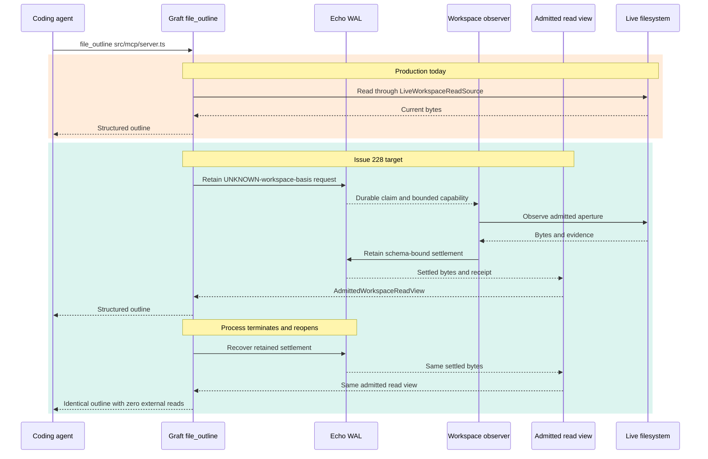

# Graft's Two Roadmaps: Causal Proof and Managed Product

## The sixty-second orientation

Graft has two roadmaps because it is solving two different-sized problems. The
short Echo-hosting campaign proves that one real Graft operation can be
requested, observed, settled, analyzed, recovered, and replayed through Edict
and Echo. The larger G0-G12 program turns that substrate into a safe
daemon-managed product across workspaces, caches, history, policy, lifecycle,
and rollout. They overlap around structural history, but neither plan can
honestly substitute for the other.

The immediate execution frontier is issue #228, **First Retained Workspace
Observation**. Its design is complete and its implementation has not started.
The managed product frontier is G1, **Secure State and Identity Foundation**:
the roadmap records a partial increment, while all eight G1 task issues remain
open. G0's six task issues are closed, although the milestone itself remains
administratively open.

In summary, Graft is not choosing between two competing futures. It is pursuing
a deep causal proof and a broad product program at different planning
altitudes, with #228 as the next narrow action.

## One real request, shown before the theory

The best way to understand both plans is to follow the same user-visible
operation through them. A real checkout run against the 416-line MCP server
uses this input:

```text
graft read outline src/mcp/server.ts
```

The output contains structured outline and jump-table entries, including the
`GraftServer` interface at lines 44-51 and the exported `createGraftServer`
function at lines 312-416. That product surface already works. The unresolved
question is which authority produced the bytes and whether the result can be
replayed after restart without observing the workspace again.

Production currently makes that authority explicit with this load-bearing
line:

```ts
readView: new LiveWorkspaceReadSource(ctx.fs, ctx.projectRoot)
```

The line is honest: the internal `AdmittedWorkspaceReadView` seam exists, but
the MCP composition root still supplies live filesystem authority. Issue #228
replaces the causal plumbing around this same operation without requiring a
different outline format.

The sequence shows both paths. The orange band is current production; the green
band is the target proof.



<details>
<summary>Figure 1 - The same file_outline call before and after #228</summary>

The current path reads live bytes. The target path retains the request before
observation, retains the settlement before analysis, and recovers the same
admitted bytes without reopening the filesystem or git-warp.

</details>

| Turn | Production today | Issue #228 target |
|---|---|---|
| Request | Tool invocation reaches Graft. | Edict-derived request is retained. |
| Read | Graft holds live filesystem authority. | Observer receives a durable claim and bounded capability. |
| Evidence | Current bytes are parsed in-process. | Schema-bound settlement is retained before parsing. |
| Analysis | `file_outline` parses the live read. | It parses `AdmittedWorkspaceReadView`. |
| Restart | A later run reads again. | Echo reconstructs the view with zero external reads. |

> **Intuition to carry forward:** the request authorizes the effect; the
> settlement witnesses its result. Dirty workspace bytes cannot have an honest
> expected digest before the authorized observation.

In summary, the parser is not the missing architecture. The missing vertical is
the durable causal order that turns a live read into retained, attributable,
replayable evidence.

## The cast and the intended architecture

Five components own different parts of the system, and the roadmap only makes
sense when their ownership is kept separate. Graft owns user-facing structural
semantics; Edict owns declarative operation source and compilation; Echo owns
causal retention, execution order, recovery, and replay; the daemon owns
product-level authorization and workspace management; git-warp supplies
legacy committed history during the transition.

| Component | Owns | Does not own |
|---|---|---|
| Graft | `file_outline`, policies, receipts, structural meaning | Echo durability or Edict compilation |
| Edict | Declared operation source and compiler-derived artifacts | Filesystem authority or native application callbacks |
| Echo | Request/settlement retention, WAL order, recovery, replay | Graft structural semantics |
| Managed daemon | Sessions, grants, workspace identity, cache and lifecycle | The meaning of Echo causal evidence |
| git-warp | Current legacy history and later import/fallback provenance | The future canonical Graft schema |

The landed authority seam is a useful foil. `AdmittedWorkspaceReadView` proves
that Graft analysis can consume immutable admitted bytes and refuse a silent
fallback. It does not prove that production obtains those bytes from a retained
Echo settlement. The source says no production decoder or settled composition
root exists yet.

In summary, the architecture is a stack, not a collection of interchangeable
adapters. The short roadmap completes one vertical through the stack; the long
roadmap builds the product control plane around many such verticals.

## Why two roadmaps are legitimate

The Echo campaign and the managed-workspace program have different hills,
gates, and dependency authorities. The Echo campaign asks whether a real
operation is causally sound. The managed roadmap asks whether a daemon can
offer safe, durable, multi-workspace capabilities to users. Their shared future
provider does not erase that difference.

| Dimension | Echo-hosting campaign | Managed-workspace program |
|---|---|---|
| Altitude | One complete causal round trip | Full daemon-owned product lifecycle |
| Current frontier | #228 design complete; RED proof next | G0 tasks complete; G1 partially landed |
| Dependency truth | Native GitHub blockers plus BEARING | Normative G0-G12 roadmap sequence |
| First major gate | #232 real retained read/write vertical | G3 multi-workspace Current-state Alpha |
| Later convergence | #231 history-provider cutover | G6 bindings and G7 truthful queries |

The near Echo sequence is #228 → #229 → #236/#237 → #232. The later
structural-history path branches from #229 into #230 → #231. The managed
critical path is G0 → G1 → G2 → G3 → G4 → G5 → G6 → G7 → G8 → G12,
with G3 → G10, G4 → G11, and G5+G6 → G9 as parallel branches.

The interactive site renders both task DAGs with a Sugiyama layout. Its Echo
view distinguishes native blockers from completed stale prerequisites and
documented-only context. Its managed task view expands all 105 GitHub issues
while representing goalpost membership separately from blocker semantics.

> **Intuition to carry forward:** #228 can be the immediate priority while G1
> remains the next managed-product goalpost. That is parallel planning at two
> altitudes, not duplicated implementation.

In summary, Road 01 earns the causal substrate and Road 02 spends it safely.
They converge around Echo-backed managed structural history, but the trackers
do not yet encode that join as one mechanically enforced graph.

## Where tracker claims diverge from reality

No single Graft status surface is authoritative for every kind of claim. Source
code tells us what executes; BEARING and the active packet tell us current
gravity; GitHub dependency endpoints tell us native blockers; the managed
roadmap tells us normative product sequence. Reading any one of those as the
whole truth creates false progress.

| Surface claim | Current evidence | Reading |
|---|---|---|
| `AdmittedWorkspaceReadView` exists | Production still constructs `LiveWorkspaceReadSource` | Seam landed; settlement plumbing missing |
| #228 says “expected basis” | Newer design requires `workspaceBasisPosture: UNKNOWN` | Issue prose is stale |
| G0 milestone is open | All six G0 task issues are closed | Task-complete, administratively open |
| G1 is in progress | Partial registry increment exists; 0/8 task issues closed | Partial implementation, no slice closure |
| Echo-native milestone has five open items | Direct enumeration exposes #230 and #231 | Aggregate drift retained |
| #230 is “the migration” | Its body says intentionally shelved | Later project, not current work |

The false-positive foil is #230. Its title sounds like the central Echo move,
but its own body correctly defers it until ordinary Graft operations execute
through real Edict output on Echo. Starting there would make the legacy model
shape the new architecture.

In summary, current state is a ledger, not a percentage. The authority seam and
G0 contracts are real; #228 production composition and nearly all of G1-G12
remain open.

## How the map was audited

The audit reconstructed the graphs from independent evidence surfaces so that
every arrow could retain its provenance. It first read the repository planning
map, then inspected source composition, enumerated all managed task issues, and
finally queried GitHub's blocked-by and blocking endpoints for the Echo issues.
That order prevented stale prose from becoming an invented dependency.

1. Read `docs/BEARING.md`, METHOD, the active #228 packet, and the G0-G12 roadmap.
2. Verified branch state and the production `LiveWorkspaceReadSource` construction.
3. Mapped 105 managed issues (#97-#201) and 15 formal milestones.
4. Queried native dependency edges for #228, #229, #230, #231, #232, #236, and #237.
5. Preserved rather than normalized the G0, G1, #228, and milestone-count discrepancies.

Two dead ends changed the final model. First, the Echo-native milestone's
aggregate count did not match direct issue enumeration, so the graph uses the
enumerated issues and exposes the aggregate as drift. Second, #228's issue body
still described an expected basis, but that would require a circular pre-read;
the newer unknown-basis packet therefore takes precedence.

In summary, the graph is reproducible because edge type is data. Future status
refreshes can change node color without silently changing what an arrow means.

## What mature looks like

Maturity requires both roads to meet without a fallback-shaped hole between
them. The first bell is narrow: one real `file_outline` request must survive
restart with a retained request, retained settlement, identical output, and no
external reread. The later product gates add safe multi-workspace routing,
scoped derived state, managed history, truthful query coverage, lifecycle, and
a reversible daemon-first rollout.

The next executable proof is complete only when all of these are true:

- `requestWalPosition < firstFilesystemReadPosition`
- `settlementWalPosition < firstGraftAnalysisReadPosition`
- `settlement.requestIdentity == request.requestIdentity`
- `settlement.admittedAperture ⊆ request.aperture`
- `liveFileOutlineResult == restartedFileOutlineResult`
- `restartedFilesystemReads == 0`
- `restartedGitWarpOpens == 0`

The managed release ladder then builds outward: G0-G3 yields Current-state
Alpha; G0-G4 yields Current-state Beta; G0-G6 yields Managed History Alpha;
G0-G7 yields truthful Managed History Beta; and G0-G8 plus G10 and G12 yields
Daemon-first GA.

> **Intuition to carry forward:** the immediate move is small and deep—write
> the #228 RED proof. The long roadmap remains visible so that proof lands as a
> product foundation rather than an isolated demonstration.

In summary, Graft currently has a real inner authority seam and a designed
causal vertical, but not production retained observation. The short road rings
that first bell; the long road turns its sound into a governed product.
